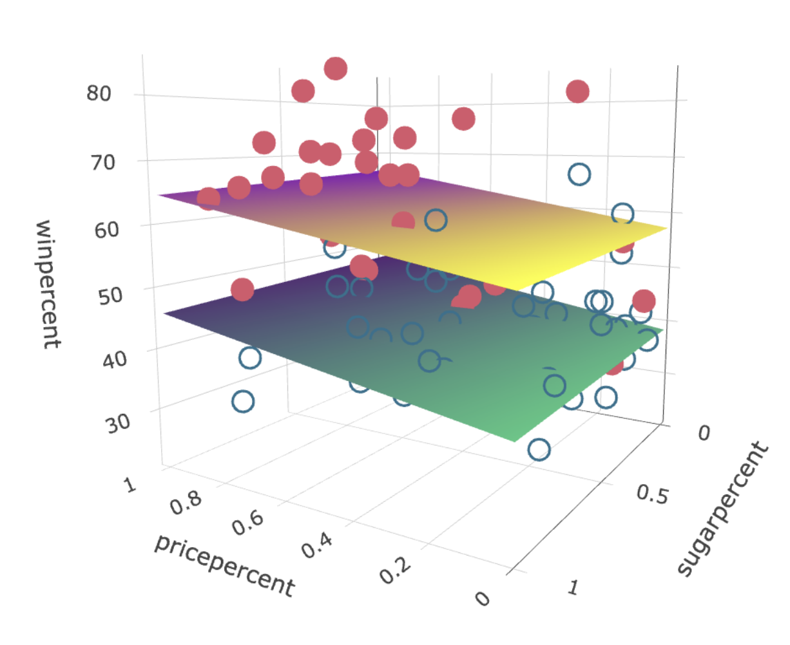
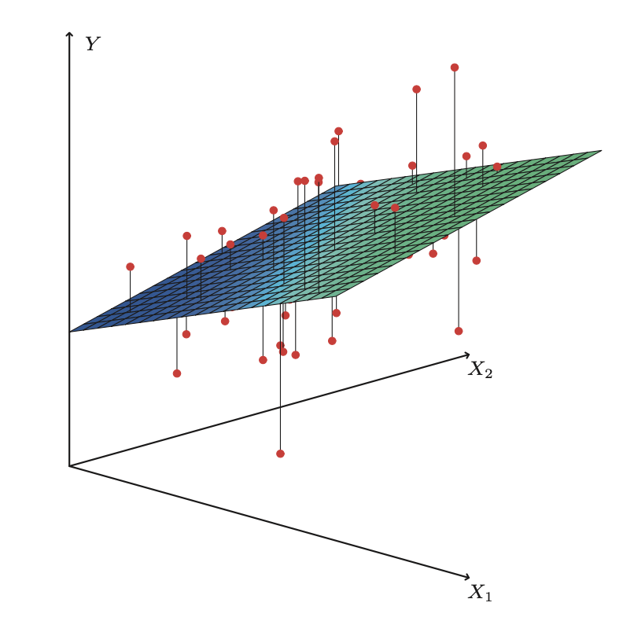

class: inverse

```{r setup, include=FALSE}
options(htmltools.dir.version = FALSE)
knitr::opts_chunk$set(fig.retina = 3, warning = FALSE, message = FALSE)
options(knitr.table.format = "html")
```

```{r xaringan-themer, include=FALSE, warning=FALSE}
library(xaringanthemer)
style_duo_accent(
  primary_color = "#2d708e",
  secondary_color = "#230433",
  link_color = "#55c667",
  text_bold_color = '#f68f46',
  title_slide_background_color = "#ffffff", #"#042333",
  title_slide_background_image = "./../../../files/theme/ceres.jpg",
  title_slide_background_size = "cover",
  ) #or contain
```

```{r xaringanextra, include=FALSE, warning=FALSE}
library(xaringanExtra)
```

```{r tidyverse, include=FALSE, warning=FALSE}
library(tidyverse)
library(knitr)
theme_set(theme_minimal(base_size = 22))
```

<style type="text/css">
.remark-slide-content {
    font-size: 1.2rem;
    padding: 1em 4em 1em 4em;
}
</style>

# It's the year 1801

## There is no Google Maps

How do you travel? With the original GPS: **astronomy**

--

- Relatively mature science
- Millennia of observations and evolving theories
- About 2 centuries of observations *with telescopes*
- Similar time since Kepler's laws (elliptical orbit formulas)
- 20 years after discovery of Uranus
- But still, 45 years before discovery of Neptune

---
class: inverse, center
background-image: url("./../../../files/theme/ceres.jpg")

# Discovering planets and things

### Imagine being the first to observe a previously unknown celestial object in our solar system

--

...

### and then [losing it](https://en.wikipedia.org/wiki/Ceres_(dwarf_planet%29#Discovery)

???

So, astronomers are searching for planets. 

One of them, an Italian priest named Piazzi, observes something that might be "better than a comet" and records it for about three weeks

He had discovered Ceres, which we now classify as a "dwarf planet"

But he also sick and stopped observing it

And then the sun blocked observation for a good portion of the year

---
class: inverse

mfw


---
class: inverse

### A (pre-machine learning?) prediction contest

.pull-left[


[Yung Gauss](https://plus.maths.org/content/prime-number-lottery)
]

.pull-right[
- Piazzi published his $n = 24$ observations in February

- An international community of scientists and mathematicians scrambled to find Ceres

- Almost a year later, it was rediscovered using the predictions of (24 year old) C. F. Gauß
]

???

hm

---
class: inverse, middle

### Gauss became an instant celebrity

# Why was this impressive?

- Ceres is small (smaller than our moon)
- Observed path only ~3 degrees of motion across the sky
- Almost a year passed, so its position was far from the initial observations
- Searching for a small dim object in a sky full of brighter stars

How did Gauss do it? Kepler's laws determine an orbit uniquely from 3 points. What to do with 24?

---
class: inverse

[Gauss](https://www.maa.org/programs/maa-awards/writing-awards/the-discovery-of-ceres-how-gauss-became-famous):

> When the number  of unknown  quantities is equal to the number of the observed  quantities  depending on them, the former may be so determined as exactly to satisfy  the latter. But when the number of the former is less than that  of the latter, an absolutely exact agreement cannot be determined, in so far as the observations  do not enjoy  absolute  accuracy. In this  *case care  must  be taken  to establish the best possible agreement, or to diminish as far as practicable the differences*.

## i.e. minimize errors

but why *squared* errors?

---
class: inverse

## Constraints

1. Errors sum to zero
2. Minimize something else, but what?

- Around the same time, R. J. Boscovich and P-S. Laplace minimized sum of absolute errors

$$
\text{minimize} \sum_i | r_i |
$$

- Laplace also suggested minimizing the maximum error

$$
\text{minimize} \max_i | r_i |
$$

- Gauss said we can use any even power, e.g. $\sum r_i^8$

---
class: inverse, middle

### Gauss's answer

> of all these principles ours [least squares] is the **most simple**; by the others we shall be led into the most complicated calculations

If *Gauss* didn't want to do those calculations, that's really saying something...

On the other hand, he said he used least squares *thousands* of times in his years of work (without electricity!)

For more about the origin of least squares see [this article](https://academic.oup.com/biomet/article/59/2/239/325474).

---
class: inverse, middle

### Another answer: nice geometry

At a minimum of 

$$
\ell (\hat \alpha, \hat \beta) = \sum_i (y_i - \hat \alpha - \hat \beta x_i)^2
$$
we have

$$
0 = \frac{\partial \ell}{\partial \alpha} = -2 \sum_i r_i
$$

i.e. the first constraint is satisfied, and

$$
0 = \frac{\partial \ell}{\partial \beta} = -2 \sum_i x_i r_i
$$

i.e. **orthogonality**.

---
class: inverse

# Orthogonality, uncorrelatedness, bias

- Since $\bar r = 0$ and $\sum x_i r_i = 0$, we also have

$$
\text{cor}(x, r) = 0
$$
- Correlation measures *linear dependence*

- If we minimized a different loss function and the resulting residuals were correlated with $x$, this would mean there is some remaining (linear) signal

- A (linear) pattern in residuals, i.e. bias


---

### Lessons for ML from the re-discovery of Ceres

- **Severity (or novelty)**: lots of mathematicians used methods to fit the initial observations, what distinguished Gauss was predicting a *new* data point 

--

- The *right amount* of **complexity**: some predictions assumed a circular orbit instead of elliptical, this simplified calculations but missed Ceres

--

- **Theory *and* observation**: without the heliocentric model of the solar system this search would have been a lost cause. That model itself evolved from previous iterations of theories and observations

---
class: inverse

### An absurdly abbreviated history of optics

- Ptolemy (100-170) measured refraction of light passing from air to water, altering measurements so they would fit to a quadratic curve (ancient "machine learning" or curve fitting)

- Ibn Sahl (940-1000) described the correct law, which English speakers refer to as Snell's law

- Fermat (1607-1665) proposed the more general "principle of least time" which can be used to derive Snell's law *and* solve other optical problems -- predict values in different settings


---
class: inverse

#### Put the "science" back in "data science"!

Feynman, [Lectures on Physics, Vol. 1](https://www.feynmanlectures.caltech.edu/I_26.html):

> Now in the further development of science, we want more than just a formula. First we have an observation, then we have numbers that we measure, then we have a law which summarizes all the numbers. *But the real glory of science is that we can find a way of thinking such that the law is evident*.

And from "Cargo Cult Science":

> When you have put a lot of ideas together to make an **elaborate theory**, you want to make sure, when explaining what it fits, that *those things it fits are not just the things that gave you the idea for the theory*; but that the finished theory makes something else come out right, in addition.

---

### By contrast, regression done badly

Convenience of calculation enables a lot of bad science

- A. Quetelet in 1835, "social physics," correlates basically any social data together, tries to predict "crime," poverty, alcohol consumption, etc

- F. Galton (1822-1911) founds the field of eugenics...

- Modern science: [replication](https://journals.sagepub.com/doi/10.1177/2515245917747646) [crisis](https://en.wikipedia.org/wiki/Replication_crisis)

Much of modern ML is similarly fitting curves to model relationships in any available data *because we can* -- not because there is any scientific or theoretical reason to do so

---
class: inverse, middle, center

### Regression began with an exemplary application, the re-discovery of Ceres

### Scientifically questionable applications have exploded since then

### Computers speed up the process, which perhaps decreases quality

### The era of "[surveillance capitalism](https://theconversation.com/the-price-of-connection-surveillance-capitalism-64124)" means scientifically (and ethically) questionable data is multiplying faster than ever

---
class: inverse

### Multiple regression

#### This week

What is it? Simply a method for using more variables to predict the outcome?

Some math(s) notation

#### Next week

Interpreting the model and its coefficients

Association vs causality

---

### Multiple regression

```{r, echo=FALSE, out.width="90%"}

```

---

### When $p > 1$

.pull-left[
- Instead of a regression line, we fit a regression (hyper)plane

- Among all possible such planes, find the one minimizing sum of squared errors (represented by vertical lines in ISLR Fig 3.4)

- How to find the coefficients? Calculus?
]
.pull-right[

]


---

# Notation

Writing the same thing in various ways

- For observation $i$:

$$y_i = \beta_0 + \beta_1 x_{i1} + \beta_2 x_{i2} + \cdots + \beta_p x_{ip} + \varepsilon_i$$

or using the [inner product](https://en.wikipedia.org/wiki/Dot_product) (of column vectors)

$$y_i = x_i^T \beta + \varepsilon_i$$
- Random variable version:

$$Y = X^T \beta + \varepsilon$$
---

# Notation, continued

- For all $n$ observations

$$
\begin{pmatrix}
y_1 \\
y_2 \\
\vdots \\
y_n
\end{pmatrix}
=
\begin{pmatrix}
1 & x_{11} & x_{12} & \cdots & x_{1p}\\
1 & x_{21} & x_{22} & \cdots & x_{2p}\\
\vdots & \vdots & \vdots & \ddots & \vdots \\
1 & x_{n1} & x_{n2} & \cdots & x_{np}\\
\end{pmatrix}
\begin{pmatrix}
\beta_0 \\
\beta_1 \\
\vdots \\
\beta_p
\end{pmatrix}
+
\begin{pmatrix}
\varepsilon_1 \\
\varepsilon_2 \\
\vdots \\
\varepsilon_n
\end{pmatrix}
$$

or

$$\mathbf{y} = \mathbf{X} \beta + \mathbf{\varepsilon}$$

Note: column of 1's for intercept term. Sometimes omitted by assuming $\mathbf y$ is already "centered"

---

## Notational conventions

We'll use common conventions in this course

- Bold for vectors, bold and upper case for matrices
- Otherwise upper case denotes random variable
- Error terms $\varepsilon = y - \mathbf x^T \beta$ never truly observed
- Residuals $r = y - \mathbf x^T \hat \beta$ used as a proxy for errors
- Greek letters like $\beta, \theta, \sigma, \Sigma$ usually *unknown parameters*
- Greek letters with hats like $\hat \beta$ are estimates computed from data
- Roman letters that usually denote functions with hats, like $\hat f$ are also estimates
- Other Roman letters with hats like $\hat y$ are predictions

---

# Matrices and vectors in `R`

```{r}
# byrow = FALSE default
x <- matrix(1:9, nrow = 3, ncol = 3)
x
```

```{r}
beta <- rep(1,3)
beta
```

---

### Multiplication: %*% (yes, really)

- Beware "Error: non-conformable arguments"
- Always remember to check dimensions
- If dimension of one object divides dimension of another, `R` may "conveniently" (unintuitively) repeat the smaller one

```{r}
dim(x)
```

```{r}
dim(beta) # frustrating
```

```{r}
x %*% beta
```

---

### Transpose and symmetry

Recall: even if a matrix $\mathbf A$ is not square, both $\mathbf A^T\mathbf A$ and $\mathbf A \mathbf A^T$ are square and symmetric (often one is invertible)

```{r}
A <- matrix(c(rep(1,4), 0,0), nrow = 3, byrow = FALSE)
A
```


```{r}
t(A) %*% A
```

Note: this matrix is even invertible! (But $\mathbf A \mathbf A^T$ is not)

---

# Pseudoinversion

```{r}
# ginv() function in MASS library
Ainv <- MASS::ginv(A)
Ainv
```


```{r}
Ainv %*% A
```

The $2 \times 2$ identity matrix

---

# Pseudoinversion

Why does this work?

Let $\mathbf A^\dagger = (\mathbf A^T\mathbf A)^{-1} \mathbf A^T$, then

$$
\mathbf A^\dagger \mathbf A = (\mathbf A^T\mathbf A)^{-1} \mathbf A^T \mathbf A = (\mathbf A^T\mathbf A)^{-1} (\mathbf A^T \mathbf A) = \mathbf I
$$

--

`ginv` in the library `MASS` apparently computes the left or right pseudoinverse, whichever one works

```{r}
A %*% Ainv # not a right inverse
```

---

### Least-squares solutions in matrix notation

With matrix-vector notation we can always write very simply:

$$
\hat {\mathbf \beta} = (\mathbf X^T\mathbf X)^{-1}\mathbf X^T \mathbf y = \mathbf X^\dagger \mathbf y
$$

**Remember this!** It encodes many important facts...

--

This assumes $\mathbf X^T\mathbf X$ to be invertible, i.e. the *columns* of $\mathbf X$ have full rank (columns = variables)

- That's often true if $n > p$, unless some problem like one variable is a copy of another

--

- Impossible if $p > n$. "High-dimensional" regression requires special methods, covered soon in this course!

---

### Linear algebra and geometric intuition

Predictions from the linear model:

$$\hat{\mathbf y} = \mathbf {X} \hat{\mathbf \beta} = \mathbf X (\mathbf X^T\mathbf X)^{-1}\mathbf X^T \mathbf y = \mathbf H y$$
if we define

$$\mathbf H = \mathbf X (\mathbf X^T\mathbf X)^{-1}\mathbf X^T$$

--

COOL FACTS about $\mathbf H$:

- $\mathbf H$ is a projection: $\mathbf H^2 = \mathbf H$
- For any $n$-vector $\mathbf v$, the $n$-vector $\mathbf {Hv}$ is the orthogonal projection of $\mathbf v$ onto the column space of $\mathbf X$
- Of all linear combinations of columns of $\mathbf X$, $\mathbf {Hv}$ is the one closest (in Euclidean distance) to $\mathbf v$. 

---

## Exercise: do the calculus

We have the loss function

$$L(\mathbf X, \mathbf y, \mathbf \beta) = (\mathbf y - \mathbf X \beta)^T(\mathbf y - \mathbf X \beta)$$

(just a different way of writing sum of squared errors)

- Consider each coordinate separately and take univariate partial derivatives
- Use vector calculus and compute the gradient
- (Or even use matrix calculus identities)

--

Reach the same conclusion: at a stationary point of $L$,

$$\mathbf X^T \mathbf X \hat \beta = \mathbf X^T \mathbf y$$

---

### Categorical predictors

This is an interesting/practically important special case


.pull-left[
```{r}
x <- as.factor(
  sample(c("A", "B", "C"),
         10,
         replace = TRUE))
x
```

Categorical predictor with 3 levels, what does the **design matrix** (common terminology in regression) $\mathbf X$ look like?
]
.pull-right[
```{r}
model.matrix(~x)
```

]

---

```{r}
X <- model.matrix(~x-1) # take out intercept
head(X)
round(head(X %*% MASS::ginv(X)), 3) # hat matrix
```
```{r}
which(x == "C") # predicting within-group averages!
```

---

## This week's lab

- Fitting models in `R`

```
model <- lm(y ~ x1 + x2 ...)
```
- Important functions to use on models: `summary`, `coef`, `confint`, `plot`

- Interpreting the output

- Residual plots and other diagnostics

**Idea**: if the model captures the "signal," what is left over (residuals) should look like "noise" -- i.e. have no discernible structure or patterns

---
class: inverse

# Concluding points

One of the most commonly used methods, even with more complex ML often compare to regression as a "baseline"

Perhaps the most complex method that is still considered relatively interpretable. But interpretation is actually trickier than most understand! (**more on this next week!**)

--

#### *Very* often used in ways that don't make sense by people who don't know what they're doing to reach conclusions that don't work in the real world!

--

#### Done well: amazing, *almost* magically effective, worth many more years of study, can easily provide a lifetime of valuable usage to a wise practitioner
