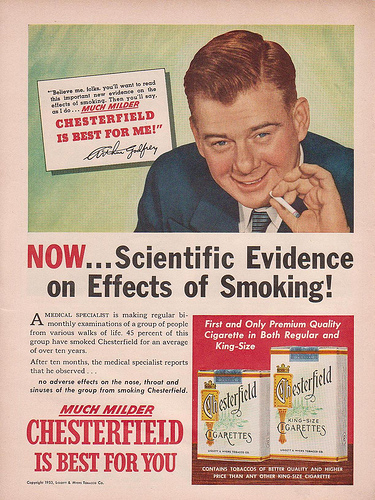
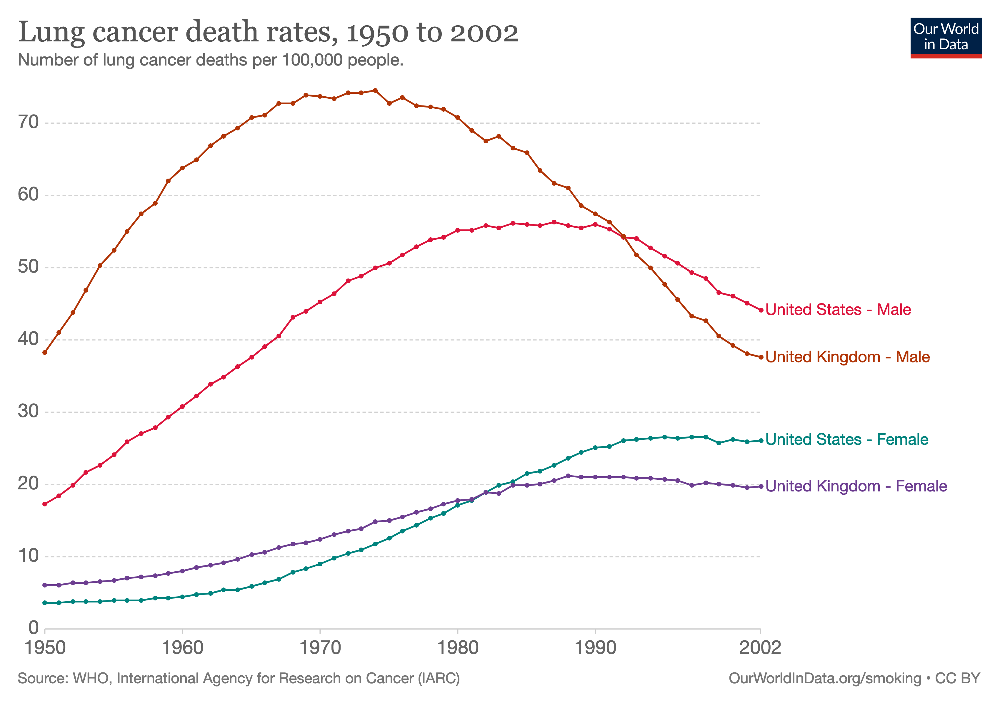

class: inverse

```{r setup, include=FALSE}
options(htmltools.dir.version = FALSE)
knitr::opts_chunk$set(fig.retina = 3, warning = FALSE, message = FALSE)
options(knitr.table.format = "html")
```

```{r xaringan-themer, include=FALSE, warning=FALSE}
library(xaringanthemer)
style_duo_accent(
  primary_color = "#2d708e",
  secondary_color = "#230433",
  link_color = "#55c667",
  text_bold_color = '#f68f46',
  title_slide_background_color = "#ffffff", #"#042333",
  title_slide_background_image = "../../../files/theme/LSE/LSEcrest_large.jpg",
#    "https://upload.wikimedia.org/wikipedia/commons/1/1a/Workhouse_Nantwich.jpg",
  title_slide_background_size = "cover",
  ) #or contain
```

```{r xaringanextra, include=FALSE, warning=FALSE}
library(xaringanExtra)
xaringanExtra::use_animate_all("slide_left")
xaringanExtra::use_tile_view()
xaringanExtra::use_panelset()
xaringanExtra::style_panelset_tabs(font_family = "inherit")
```

```{r tidyverse, include=FALSE, warning=FALSE}
library(tidyverse)
library(knitr)
theme_set(theme_minimal(base_size = 22))
set.seed(1)
```

<style type="text/css">
.remark-slide-content {
    font-size: 1.2rem;
    padding: 1em 4em 1em 4em;
}
</style>


### From the stars to "Poor Law Statistics"

- Almost a century after Gauss
- Scientists correlating/regressing anything
- Problem: what does it mean?

--

e.g. [Francis Galton](https://www.theguardian.com/education/2020/jun/19/ucl-renames-three-facilities-that-honoured-prominent-eugenicists) correlated numeric traits between generations of organisms...

But *why*? "Nature versus nurture" debate never ends?

--

e.g. [Udny Yule](https://en.wikipedia.org/wiki/Udny_Yule) and others correlated poverty ("pauperism") with welfare ("out-relief")...

But *why*? The "[welfare](http://economistjourney.blogspot.com/2014/08/the-crazy-dream-of-george-udny-yule-is.html) [trap](https://en.wikipedia.org/wiki/Welfare_trap)" debate never ends?

---
class: inverse

# Origin of multiple regression

.pull-left[
- Udny Yule (1871-1951)

- Studied this poverty question

- First paper using multiple regression in 1897

- Association between poverty and welfare while "controlling for" age
]
.pull-right[

]

---
class: inverse

## Yule, in 1897:

> Instead of speaking of "causal relation," ... we will use the terms "correlation," ...

- Variables, roughly:
  - $Y =$ prevalence of poverty
  - $X_1 =$ generosity of welfare policy
  - $X_2 =$ age
- Positive correlations:
  - $\text{cor}(Y, X_1) > 0$
  - $\text{cor}(X_2, X_1) > 0$

--

Do more people enter/stay in poverty if welfare is more generous?

Or is this association "due to" age?

---
class: inverse

## Yule, in 1897:

> The investigation of **causal relations** between economic phenomena presents many problems of peculiar difficulty, and offers many opportunities for fallacious conclusions.

--

> Since the statistician can seldom or never make experiments for himself, he has to accept the data of daily experience, and discuss as best he can the relations of a whole group of changes; he **cannot, like the physicist, narrow down the issue to the effect of one variation at a time. The problems of statistics are in this sense far more complex than the problems of physics**.


---

### Regression estimates when $p = 3$


---
class: inverse

### Progress(?) in regression

$p$ variables $\to$ $\binom{p}{2}$ "product sums" to compute by hand...

Yule:
> ... if we wished to discuss the causality [note: correlation?! -JL] of pauperism on the basis of as many as eight variables, the **work** involved would be something like twenty-eight times as much as that necessary for the example taken on pp. 824-831. The **labour** would, in fact, be almost impossible for a single individual.

- 1958: Ted Anderson *An Introduction to Multivariate Analysis*

- 1960's: **Electric** desktop calculators made it easier

- Present: linear algebra notation and computers (R, etc)

---

### Interpreting coefficients

People *want* these two things to be true:

1. $$\frac{\partial}{\partial x_j} \mathbb E[\mathbf y | \mathbf X] = \beta_j \approx \hat \beta_j$$

2. $\beta_j$ is a causal parameter, i.e. **intervening**  to increase $x_j$ by 1 unit would result in conditional average of $y$ changing by $\beta_j$ units

--

Both of these can be *importantly wrong*! Always remember:

- Think about *general* conditional expectation functions vs the **linear model assumption** (strength of ML!)
- Think about **relationships between predictors** (causal or associations)
- Consider **unobserved variables** not in the dataset


---

## Non-linear example

Suppose there is one predictor $x$, and a (global) non-linear model fits the CEF:

$$\mathbb E[\mathbf y |X = x] = \beta_0 + \beta_1 x + \beta_2 x^2$$

--

We don't know the $\beta$'s but we have some data, and we use multiple linear regression to fit the coefficients

```{r eval = FALSE}
x2 <- x^2
lm(y ~ x + x2)
```
--
But, there's a **problem**:

$$\frac{\partial}{\partial x} \mathbb E[\mathbf y | x] = \beta_1 + 2\beta_2 x \neq \beta_1 \approx \hat \beta_1$$
---

## What went wrong?

In this simple example we know the problem is that $x_2$ is actually a function of $x$. **Solution**: interpret $\frac{\partial}{\partial x}$ locally as a function of $x$, not as a global constant

--

Sometimes simplifying assumptions are **importantly wrong**, and we must reject simple interpretations

Machine learning provides tools for fitting more complex models, like non-linear models


---

## Interpreting causality

- In the real world when is it true that one predictor variable *does not depend* on any of the other ones?

- Or when is it true that there are no important **unobserved confounders**, variables that are related to both the predictor and the outcome?

--

Consider Yule's regression analysis of poverty

Other important but unobserved variables?

Reverse causation? Simultaneity (feedback loop)?


---
class: inverse, center, middle

## In the real world

### *ceteris* is never *paribus*

Fortunately, we will also study "causal inference" - a field with methods specialized for interpreting coefficients the way *people generally want to*

Remember Yule!

> *[We] cannot, like the physicist, narrow down the issue to the effect of **one variation at a time***

---

.pull-left[

]
.pull-right[


Hey kids... don't smoke
]


---
class: inverse


[R. A. Fisher](https://www.newstatesman.com/international/science-tech/2020/07/ra-fisher-and-science-hatred) on [smoking](https://www.york.ac.uk/depts/maths/histstat/smoking.htm) and lung cancer (in 1957)

> ... the B.B.C. gave me the opportunity of putting forward examples of the two classes of alternative theories which **any statistical association, observed without the predictions of a definite experiment**, allows--namely, (1) that the supposed effect **is really the cause**, or in this case that incipient cancer, or a pre-cancerous condition with chronic inflammation, is a factor in inducing the smoking of cigarettes, or (2) that cigarette smoking and lung cancer, though not mutually causative, are **both influenced by a common cause**, in this case the individual genotype ...

---

## Graphical notation for causality

```{r echo = FALSE, fig.height = 3.5, fig.align='center'}
library(ggdag)
DAGtoplot <- function(DAG) {
  DAG %>%
  tidy_dagitty() %>% 
  mutate(color = ifelse(name == "G", "gray", "black"),
         linetype = ifelse(name == "G", "dashed", "solid")) %>%
  ggplot(aes(x = x, y = y, xend = xend, yend = yend)) + 
    geom_dag_point(size = 18, aes(color = color), show.legend = FALSE) +
    geom_dag_text(size = 10) + 
    geom_dag_edges(aes(edge_linetype = linetype), edge_width = 1.5) +
  scale_color_grey() +
  theme_dag_blank()
}
dag('{
S [exposure,pos="0,0"]
C [outcome,pos="2,0"]
G [pos="1,.5"]
G -> S
G -> C
S -> C
}') %>% 
 DAGtoplot()
```

Variables: vertices (or nodes)

Relationships: directed edges (arrows) 

Shaded node / dashed edges: unobserved variable

---

Smoking causes cancer?

```{r echo = FALSE, fig.height = 2, fig.width = 5, fig.align='center'}
dag('{
S [exposure, pos="0,0"]
C [outcome, pos="1,0"]
S -> C
}') %>% 
  ggdag(node_size = 18, text_size = 10) + 
  theme_dag_blank()
```

Genotype is a common cause?

```{r echo = FALSE,  fig.height = 4, fig.align='center'}
dag('{
S [exposure,pos="0,0"]
C [outcome,pos="2,0"]
G [pos="1,.5"]
G -> S
G -> C
}') %>% DAGtoplot()
```


---
class: inverse, middle, center

## Fisher: correlation is not causation

He did not use graphical notation like this

But the graphs can be very useful

---

## Explaining an observed correlation

We find a statistically significant correlation between $X$ and $Y$

What does it mean?

1. False positive (spurious correlation)
2. $X$ causes $Y$
3. $Y$ causes $X$
4. Both have common cause $U$ [possibly unobserved]

--

Statistically indistinguishable cases (without "experimental" data)

--

Importantly different consequences!

---

## A simple mathematical model of causality

Think about **interventions** that change some target variable $T$

- Forget about the arrows pointing into $T$ (intervention makes them irrelevant)

--

- Change $T$, e.g. setting it to some arbitrary new value $T = t$

--

- This change propagates along directed paths out of $T$ to all descendant variables of $T$ in the graph, causing their values to change

--

All of these changes could be deterministic, but most likely in our usage they are probabilistic

---

.pull-left[
```{r echo = FALSE, fig.height = 2, fig.width = 5, fig.align='center'}
dag('{
X [exposure, pos="0,0"]
Y [outcome, pos="1,0"]
X -> Y
}') %>% 
  tidy_dagitty() %>% 
  ggplot(aes(x = x, y = y, xend = xend, yend = yend)) + 
    geom_dag_point(size = 18, show.legend = FALSE) +
    geom_dag_text(size = 10) + 
    geom_dag_edges(edge_width = 0) +
  scale_color_grey() +
  theme_dag_blank()
```

```{r echo = FALSE, fig.height = 2, fig.width = 5, fig.align='center'}
dag('{
X [exposure, pos="0,0"]
Y [outcome, pos="1,0"]
X -> Y
}') %>% 
  tidy_dagitty() %>% 
  ggplot(aes(x = x, y = y, xend = xend, yend = yend)) + 
    geom_dag_point(size = 18, show.legend = FALSE) +
    geom_dag_text(size = 10) + 
    geom_dag_edges(edge_width = 1.5) +
  scale_color_grey() +
  theme_dag_blank()
```


```{r echo = FALSE, fig.height = 2, fig.width = 5, fig.align='center'}
dag('{
X [exposure, pos="0,0"]
Y [outcome, pos="1,0"]
Y -> X
}') %>% 
  tidy_dagitty() %>% 
  ggplot(aes(x = x, y = y, xend = xend, yend = yend)) + 
    geom_dag_point(size = 18, show.legend = FALSE) +
    geom_dag_text(size = 10) + 
    geom_dag_edges(edge_width = 1.5) +
  scale_color_grey() +
  theme_dag_blank()
```
]
.pull-right[

**Exercise**: in each of these cases, if we intervene on $X$ which other variable(s) are changed as a result?


```{r echo = FALSE, fig.height = 4, fig.width = 5, fig.align='center'}
dag('{
X [exposure,pos="0,0"]
Y [outcome,pos="2,0"]
U [pos="1,.5"]
U -> X
U -> Y
}') %>% 
  tidy_dagitty() %>% 
  mutate(color = ifelse(name == "U", "gray", "black"),
         linetype = ifelse(name == "U", "dashed", "solid")) %>%
  ggplot(aes(x = x, y = y, xend = xend, yend = yend)) + 
    geom_dag_point(size = 18, aes(color = color), show.legend = FALSE) +
    geom_dag_text(size = 10) + 
    geom_dag_edges(aes(edge_linetype = linetype), edge_width = 1.5) +
  scale_color_grey() +
  theme_dag_blank()

```

]

---

### Computing counterfactuals

If we know/estimate *functions* represented by edges, we can simulate/compute the consequences of an intervention

$$x = \text{exogeneous}, \quad  m = f(x) + \varepsilon_m, \quad y = g(m) + \varepsilon_y$$

```{r echo = FALSE, fig.height = 3, fig.align = 'center'}
ggdag_mediation_triangle() +
  geom_dag_text(size = 10) + 
    geom_dag_edges(edge_width = 1.5) +
  scale_color_grey() +
  theme_dag_blank()
```


--

$$x \gets x',  \quad m \gets f(x') + \varepsilon_m, \quad y \gets g(f(x') + \varepsilon_m) + \varepsilon_y$$
---

### Causal inference: much more difficult

*Predictive* machine learning is about

$$
p_{Y|X}(y|x)
$$
and regression--conditional expectation, conditional quantile, etc. If we passively observe some value of $x$, what would we observe about $y$?

--

*Causal inference* is about (various notations)

$$
p(y|\text{do}[X=x]), \quad \text{i.e.} \quad p_{}(y| X \gets x)
$$
i.e. what happens to $Y$ when we actually **intervene** on $X$

If we actively change $x$, what would we observe about $y$?

---
class: inverse, center

### Experiments

Actually do interventions while collecting data

--

### Observational studies

Try to infer causal relationships without interventions, by using ~~dark arts~~ more/specialized assumptions/methods that require careful interpretation

--

Scientific progress: be wrong in more interesting/specific ways

---

### Potential outcomes: another causal framework

Relative strengths/weaknesses compared to DAGs

- Narrow focus: goal is to estimate one edge in a graph
- Difficult to express more complex relationships

--

### This is not a course on causal inference

Covering a few basics for interesting connections to ML!

#### So when is ML (and e.g. regression) useful for causal inference?

---

## Idea: adjusting for confounders

**Confounders**: other variables that obscure the (causal) relationship from $X$ to $Y$, e.g.

- $Y$: health outcome
- $X$: treatment dose
- $Z$: disease severity

--

Without considering $Z$, it might seem like larger doses of $X$ correlate with worse health outcomes

--

### Solution: add more variables to the model

Make model complex enough to capture important factors

Similarly, might need to model *non-linear causal relationships*

---

### Strategy: two staged regression

Two-stage least squares (2SLS)

Suppose we want to learn the causal relationship of $D$ on $Y$, but

$$
Y = D \theta + X \beta + \varepsilon_Y
$$

$$
D = X \alpha + \varepsilon_D
$$
In words: $X$ is confounding the relationship

--

- First stage: regress out $X$

- Second stage: using residuals from first stage,

$$\text{regress } Y - X \hat \beta \text{ on } D - X \hat \alpha$$ 

---
class: inverse, center, middle

# Powerful, intuitive idea

## Orthogonal projection

### We'll come back to this

(Think about fitting the relationships using ML instead of regression)

---

## Propensity

General theme: applying ML strengths to causality

Special case: if the "treatment" (causal) variable is categorical

Many causal methods for this case involve predicting the treatment itself

i.e. prediction with categorical outcome, **classification**

We'll also come back to this ([propensity methods](https://en.wikipedia.org/wiki/Propensity_score_matching)) after covering classification

--

#### Summary: a key ingredient in many causal inference methods involves classification, can leverage ML tools

---
class: inverse

## Guiding ideas / warnings

- More complex models (ML) do not guarantee better causal inference

Might even make things worse (just like with prediction)

--

- Models with better predictions may be worse for causal inference

Even if prediction accuracy is measured on test data!

--

- Inference = causal inference...?

Or, at least, causal interpretations can be special case of trade-off between prediction and inference/interpretation

---
class: inverse

# the end

Wisdom from one of the great early statistical explorers

[Udny Yule](https://mathshistory.st-andrews.ac.uk/Biographies/Yule/quotations/):

> Measurement does not necessarily mean progress. Failing the possibility of measuring that which you desire, the lust for measurement may, for example, merely result in your measuring something else - and perhaps forgetting the difference - or in your ignoring some things because they cannot be measured.

---
class: inverse, center, middle

# Causal inference

## An exciting interdisciplinary field

### Practically important, connections to ML

> "Data scientists have hitherto only predicted the world in various ways; the point is to change it" - Joshua Loftus

Mixtape... remix? `r emo::ji_completion("think")`