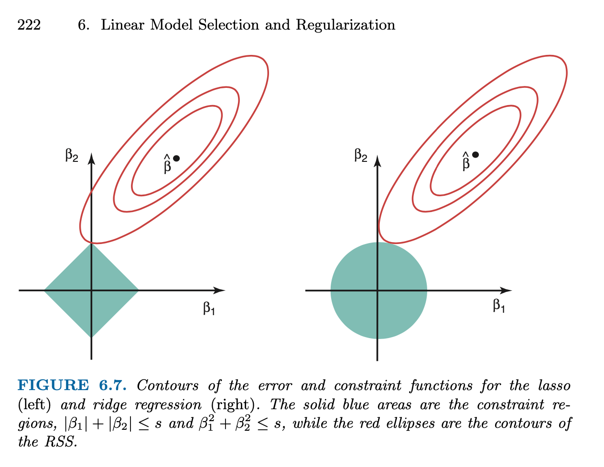
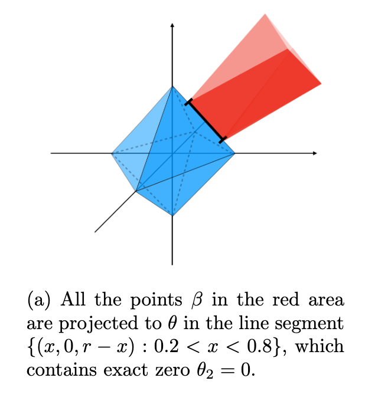

class: inverse

```{r setup, include=FALSE}
options(htmltools.dir.version = FALSE)
knitr::opts_chunk$set(fig.retina = 3, warning = FALSE, message = FALSE)
options(knitr.table.format = "html")
options(digits = 2)
options(scipen = 2)
```

```{r xaringan-themer, include=FALSE, warning=FALSE}
library(xaringanthemer)
style_duo_accent(
  primary_color = "#2d708e",
  secondary_color = "#230433",
  link_color = "#55c667",
  text_bold_color = '#f68f46',
#  title_slide_text_color = "#292929",
  title_slide_background_color = "#ffffff", #"#042333",
  title_slide_background_image = "../../../files/theme/LSE/hock_exterior.jpg",
#    "https://upload.wikimedia.org/wikipedia/commons/1/1a/Workhouse_Nantwich.jpg",
  title_slide_background_size = "cover",
  ) #or contain
```

```{r xaringanextra, include=FALSE, warning=FALSE}
library(xaringanExtra)
#xaringanExtra::use_animate_all("slide_left")
xaringanExtra::use_tile_view()
xaringanExtra::use_panelset()
xaringanExtra::style_panelset_tabs(font_family = "inherit")
```

```{r tidyverse, include=FALSE, warning=FALSE}
library(tidyverse)
library(knitr)
theme_set(theme_minimal(base_size = 22))
set.seed(1)
library(broom)
library(modelr)
```

<style type="text/css">
.remark-slide-content {
    font-size: 1.2rem;
    padding: 1em 4em 1em 4em;
}
</style>


# Lasso regression

#### Comparison to ridge regression

#### Sparse models are more interpretable

#### Optimality and degrees of freedom for lasso

## Inference

#### ML/optimization finds the "best" model

#### But is the best model actually good?


---
class: inverse, center, middle


# Interpretable

## high-dimensional regression

### with the lasso

---

### Lasso vs ridge

- Generate some fake data from a linear model

- Introduce lasso by comparison to ridge

```{r}
library(glmnet)
library(plotmo) # for plot_glmnet
n <- 100
p <- 20
X <- matrix(rnorm(n*p), nrow = n)
beta = sample(c(-1,0,0,0,1), p, replace = TRUE)
Y <- X %*% beta + rnorm(n)
lasso_fit <- glmnet(X, Y)
ridge_fit <- glmnet(X, Y, alpha = 0)
which(beta != 0)
```

Only `r sum(beta != 0)` of the `r p` variables have nonzero coefficients

---

### Lasso vs ridge: solution paths of $\hat \beta$

```{r echo = FALSE}
cv_lasso <- cv.glmnet(X, Y)
cv_ridge <- cv.glmnet(X, Y, alpha = 1)
```


.pull-left[
```{r}
plot_glmnet(ridge_fit,
  s = cv_ridge$lambda.1se)
```
]
.pull-right[
```{r}
plot_glmnet(lasso_fit,
  s = cv_lasso$lambda.1se)
```

]

---

### Lasso vs ridge: L1 vs L2 norm penalties

A simple `diff` to remember lasso/ridge is via the penalty/constraint (1-norm instead of 2-norm). Lasso is

$$\text{minimize } \frac{1}{2n}\| \mathbf y - \mathbf X \beta \|_2^2 \text{ s. t. } \| \beta \|_1 \leq t$$
where

$$\| \beta \|_1 = \sum_{j=1}^p |\beta_j|$$
Lagrangian form

$$\text{minimize } \frac{1}{2n} \| \mathbf y - \mathbf X \beta \|_2^2 + \lambda \| \beta \|_1$$

---

## Lasso vs ridge: sparsity of solutions

- For both ridge and lasso

- Choose $\lambda$ with cross-validation

- Fit model on full data at the chosen $\hat \lambda$

- Look at the estimate $\hat \beta$ values...

```{r execute = FALSE}
cv_lasso <- cv.glmnet(X, Y)
coef_lasso <- coef(lasso_fit, s = cv_lasso$lambda.1se)
cv_ridge <- cv.glmnet(X, Y, alpha = 1)
coef_ridge <- coef(ridge_fit, s = cv_ridge$lambda.1se)
```

Note: `lambda.1se` larger `lambda.min` $\to$ heavier penalty

---

## Lasso vs ridge: sparsity of solutions

```{r echo = FALSE}
low_dim <- data.frame(
  variable = 1:p,
  true_beta = beta,
  beta_hat_lasso = coef_lasso[-1],
  beta_hat_ridge = coef_ridge[-1]
) 
low_dim
```

---


```{r echo = FALSE, out.width="70%"}
ggplot(low_dim, aes(variable)) +
  ylab("beta") +
  geom_point(aes(y = true_beta)) +
  geom_point(aes(y = beta_hat_lasso),
             color = "red", pch = 1, size = 3) +
  geom_point(aes(y = beta_hat_ridge),
             color = "blue", pch = 3, size = 2)
```

True values are solid black dots, lasso estimates are hollow red circles, ridge estimates are blue crosses

---

### High dimensional example

```{r echo = FALSE}
set.seed(10)
n <- 100
p <- 200 # high-dimensional!
X <- matrix(rnorm(n*p), nrow = n)
beta = rnorm(p) * rbinom(p, 1, .1) * rpois(p, 1) 
Y <- X %*% beta + rnorm(n)
lasso_fit <- glmnet(X, Y)
ridge_fit <- glmnet(X, Y, alpha = 0)
```

```{r echo = FALSE}
cv_lasso <- cv.glmnet(X, Y)
coef_lasso <- coef(lasso_fit, s = cv_lasso$lambda.1se)
cv_ridge <- cv.glmnet(X, Y, alpha = 1)
coef_ridge <- coef(ridge_fit, s = cv_ridge$lambda.1se)
```

```{r echo = FALSE}
high_dim <- data.frame(
  variable = 1:p,
  true_beta = beta,
  beta_hat_lasso = coef_lasso[-1],
  beta_hat_ridge = coef_ridge[-1]
) 
#high_dim
```

```{r echo = FALSE, out.width="76%"}
ggplot(high_dim, aes(variable)) +
  ylab("beta") + xlab("") +
  geom_point(aes(y = true_beta)) +
  geom_point(aes(y = beta_hat_lasso),
             color = "red", pch = 1, size = 3) +
  geom_point(aes(y = beta_hat_ridge),
             color = "blue", pch = 3, size = 2) #+
  #coord_fixed(ratio=10)
```

---

```{r echo = FALSE, out.width="90%"}
high_dim %>% 
  filter(variable <= 100, variable >= 50) %>%
ggplot(aes(variable)) +
  ylab("beta") + xlab("") +
  geom_point(aes(y = true_beta)) +
  geom_point(aes(y = beta_hat_lasso),
             color = "red", pch = 1, size = 3) +
  geom_point(aes(y = beta_hat_ridge),
             color = "blue", pch = 3, size = 2) +
  ggtitle("Zoom in on variables 50 to 100") #+
  #coord_fixed(ratio=10)
```

---
class: inverse

# Lasso: cool or extremely cool?

- High-dimensional: $p > n$ means we can't fit OLS

But all is not lost! Penalized regression to the rescue

- True model is sparse

Only `r sum(beta != 0)` of `r p` variables have nonzero coefficients

- Ridge estimates are dense

All coefficients nonzero `r emo::ji("cold_sweat")`

- Lasso estimates are sparse

Nonzero estimates largely coincide with true model `r emo::ji("sunglasses")`

---

## Lessons about sparsity

### Solving otherwise impossible problems

*Curse of dimensionality* / NP-hard optimization (best subsets) / unidentifiable statistical estimation / overfitting vs generalization

Need special mathematical structure like sparsity to make things tractable

### Sparsity helps with interpretation

Easier to interpret `r sum(high_dim$beta_hat_lasso != 0)` nonzero coefficients than all `r p`

---

### Sparse models are more interpretable

Usual linear model interpretation of coefficients

If the conditional expectation function (CEF) is linear
$$f(\mathbb x) = \mathbb E[\mathbf Y | \mathbf X = \mathbf x] = \beta_0 + \sum_{j=1}^p \beta_j x_j$$

Then

$$\hat \beta_j \approx \frac{\partial}{\partial x_j} \mathbb E[\mathbf Y | \mathbf X = \mathbf x]$$
"Change in CEF *holding other variables constant*"

Small set of **other variables** $\to$ easy (human) understanding

---

### Why are lasso estimates sparse?

- **Lagrangian form**

$$\hat \beta_{\text{lasso}}(\lambda) = \arg\min_\beta \frac{1}{2n} \| \mathbf y - \mathbf X \beta \|_2^2 + \lambda \| \beta \|_1$$

- **Constrained form**
$$\hat \beta_{\text{lasso}}(t) = \arg\min_\beta \frac{1}{2n}\| \mathbf y - \mathbf X \beta \|_2^2 \text{ s. t. } \| \beta \|_1 \leq t$$


Level sets $\{ \beta : \| \mathbf y - \mathbf X \beta \|_2^2 = \text{const.} \}$ are **ellipsoids**

Level sets: $\{ \beta : \| \beta \|_1 = t \}$ are **diamond thingies**

(i.e. "cross polytope" or $L^1$ ball)

---

## KKT optimality conditions

Constrained optimization in multivariate calculus:

- Switch to lagrangian form
- Check stationary points (vanishing gradient)
- Check boundary/singularity points
- Verify feasibility (constraints satisfied)

(Exam note: problems may use multivariate calculus like this)

The [Karush-Kuhn-Tucker](https://en.wikipedia.org/wiki/Karush%E2%80%93Kuhn%E2%80%93Tucker_conditions) (KKT) conditions generalize these, useful for analysis of constrained optimization problems (i.e. almost all ML methods) -- more advanced, **not examinable**

Recall: optimizer occurs at point of intersection between level sets of constraints and level sets of objective

---

#### Why are lasso solutions sparse? ISLR Figure 6.7



---

## Why are lasso solutions sparse?

The $L^1$ ball in $\mathbb R^p$ $\{ x : \| x \|_1 = \text{const} \}$ contains

- $2p$ points that are 1-sparse $x_j = \pm 1$, $x_{-j} = 0$

- $\binom{p}{k} 2^k$ points $k$-sparse with elements $\pm k^{-1}$

- Higher dimensional edges/faces spanning (some) sets of these points, etc

- Each of these is sparse, i.e. many coordinates are 0

--

The ellipsoid $\| \mathbf y - \mathbf X \beta \|_2^2 = \text{const}$ *probably* intersects one of these *sharp parts of the diamond thingies*

Solution to optimization problem is an intersection point

---

## Why are lasso solutions sparse?

.pull-left[
At the point of intersection of the ellipse and the $L^1$ ball, the normal vector of the ellipse has to be in the *normal cone* of the $L^1$ ball (at the same point)

Another intuition: consider projecting to the nearest point on the surface of the $L^1$ ball (see figure)
]
.pull-right[

From Figure 1 in [Xu and Duan (2020)](https://arxiv.org/abs/2006.01340)
]

---

### Optimality: stationary points

- Of the **OLS** objective (uncorrelated residuals)

$$
\frac{1}{n} \mathbf X^T ( \mathbf X \hat \beta - \mathbf y) = 0
$$

- For **ridge** (larger $|\hat \beta_j|$ have larger resid. covariance)

$$
\frac{1}{n} \mathbf X^T ( \mathbf X \hat \beta - \mathbf y) = - 2\lambda \hat \beta
$$

- For **lasso** (resid. |covar| = $\lambda$ if $\hat \beta_j \neq 0$ and $\leq \lambda$ otherwise)

$$
\frac{1}{n} \mathbf X^T ( \mathbf X \hat \beta - \mathbf y) = - \lambda \text{ sign}(\hat \beta)
$$
*Lasso treats predictors more "democratically"*

---

## Optimism / generalization gap

**Recall**: for some $\text{df}(\hat f) > 0$ (depends on problem/fun. class)

$$\Delta = \mathbb E_{Y|\mathbf x_1, \ldots, \mathbf x_n}[R(\hat f) - \hat R(\hat f)] = \frac{2\sigma^2_\varepsilon}{n} \text{df}(\hat f) > 0$$

#### Fairly general case

For many ML tasks and fitting procedures

$$\text{df}(\hat f) = \frac{1}{\sigma^2_\varepsilon} \text{Tr}[ \text{Cov}(\hat f (\mathbf X), \mathbf y) ] = \frac{1}{\sigma^2_\varepsilon} \sum_{i=1}^n \text{Cov}(\hat f (\mathbf x_i), y_i)$$

---

### Degrees of freedom: classic regression case

If $\hat f$ is linear with deterministic set of $p$ predictors (or $p$ basis function transformations of original predictors) then

$$
\text{df}(\hat f) = p, \text{ so } \Delta = 2 \sigma^2_\varepsilon \frac{p}{n} 
$$

But if we do model/variable selection and use the data to choose $\hat p$ predictors then *usually*

$$
\text{df}(\hat f) > \hat p
$$
And the more optimization / larger search this involves, it becomes more likely that

$$
\text{df}(\hat f) \gg \hat p
$$

---

### Degrees of freedom: lasso case

The "0-norm" (not really a norm) counts sparsity

$$\| \beta \|_0 = \sum_{j=1}^p \mathbf 1_{\beta_j \neq 0} = | \{ j : \beta_j \neq 0 \} |$$
e.g. for OLS with deterministic choice of variables

$$\text{df}(\hat \beta_\text{OLS}) = \| \hat \beta_\text{OLS} \|_0$$

**Surprisingly**, under fairly weak conditions on $\mathbf X$ (columns in "general position"), for the lasso solution $\hat \beta(\lambda)$ 

$$\mathbb E[\| \hat \beta_\text{lasso}(\lambda) \|_0] = \text{df}(\hat \beta_\text{lasso}(\lambda))$$
**Solution sparsity is unbiased estimate of df** - like OLS case

---
class: inverse

# Choosing $\lambda$ for lasso

- Could use degrees of freedom combined with AIC, BIC, etc

- Most commonly people use **cross-validation**


### Important note
.pull-left[
 $\hat \beta_\text{lasso}(\lambda)$ at fixed $\lambda \quad \quad$ vs 
 ]
.pull-right[ 
$\hat \beta_\text{lasso}(\hat \lambda)$ at data-chosen $\hat \lambda$
]

Different in general!

e.g. Theoretical results about first may not apply to the second

---

## plot(cv.glmnet) and plot(glmnet)

.pull-left[
```{r}
cv_fit <- cv.glmnet(X, Y)
plot(cv_fit)
```
]
.pull-right[
```{r}
plot_glmnet(lasso_fit,
    s = cv_fit$lambda.1se)
```
]

---
class: inverse, middle, center

# Inference

## for high-dimensional regression

We have used regularization to avoid overfitting

But this results in bias, e.g. $\| \hat \beta \|$ smaller than true $\| \beta  \|$

Inference must correct for this somehow

---

## Approaches to inference

- Debiased inference
- Selective inference
- Post-selection inference
- Stability selection

`R` packages for some of these

Topic for future study? `r emo::ji("grin")`

---

## One example

```{r}
set.seed(1)
n <- 100; p <- 200
X <- matrix(rnorm(n*p), nrow = n)
beta = sample(c(-1, rep(0, 20), 1), p, replace = TRUE)
Y <- X %*% beta + rnorm(n)
```

```{r echo = FALSE}
Y <- rnorm(n)
lasso_fit <- glmnet(X, Y - mean(Y), intercept = FALSE)
cv_lasso <- cv.glmnet(X, Y - mean(Y), intercept = FALSE)
```

Cross-validation plot (next slide)

```{r}
beta_hat <- coef(lasso_fit, s = cv_lasso$lambda.min)[-1]
vars <- which(beta_hat != 0)
vars
```

**Idea**: since $\hat \beta$ is biased by penalization, how about refitting OLS (unpenalized) using only these variables?


---

```{r echo = FALSE}
plot_glmnet(lasso_fit,
    s = cv_lasso$lambda.min)
```


---

```{r}
summary(lm(Y ~ X[,vars]-1))
```

---

## Looks good, time to publish!

- Sparse, interpretable model
- Some significant predictors
- Decent $R^2$ value showing predictive accuracy

Pretty good... hey wait, what was this line in the code...

--

```{r eval = FALSE}
Y <- rnorm(n) #<<
lasso_fit <- glmnet(X, Y)
cv_lasso <- cv.glmnet(X, Y)
```

It was a trick `r emo::ji("smiling_face_with_horns")` `r emo::ji("see_no_evil")` model was *actually* fit on pure noise

Classic inference methods don't work for *selected* models `r emo::ji("scream")`

**Idea**: compute inferences (`summary`) on new validation data

---

### Lessons about high-dimensional regression

- Can fit to noise, even with cross-validation

- Theoretical results (advanced, not examinable)

Lasso "performs well" (prediction error, estimation error, sparse support recovery) under various sets of sufficient conditions, derived/proven using KKT conditions and probability bounds (see SLS Chapter 11)

Roughly:

- $\mathbf X$ has to be well-conditioned in some sense
- True $\beta$ has to be sparse enough
- Solution still generally includes some [false positives](https://projecteuclid.org/journals/annals-of-statistics/volume-45/issue-5/False-discoveries-occur-early-on-the-Lasso-path/10.1214/16-AOS1521.full)

---
class: inverse

#### Sparsity

Useful simplifying assumption, especially in higher dimensions 

#### Lasso

Penalized/regularized regression with the $L^1$ norm 

#### Interpretation

Sparse models are easier to interpret

#### Model selection bias

If we use the same data to (1) select a model and (2) compute tests / intervals / model diagnostics / etc, then those inferences will be biased (similar to overfitting)
