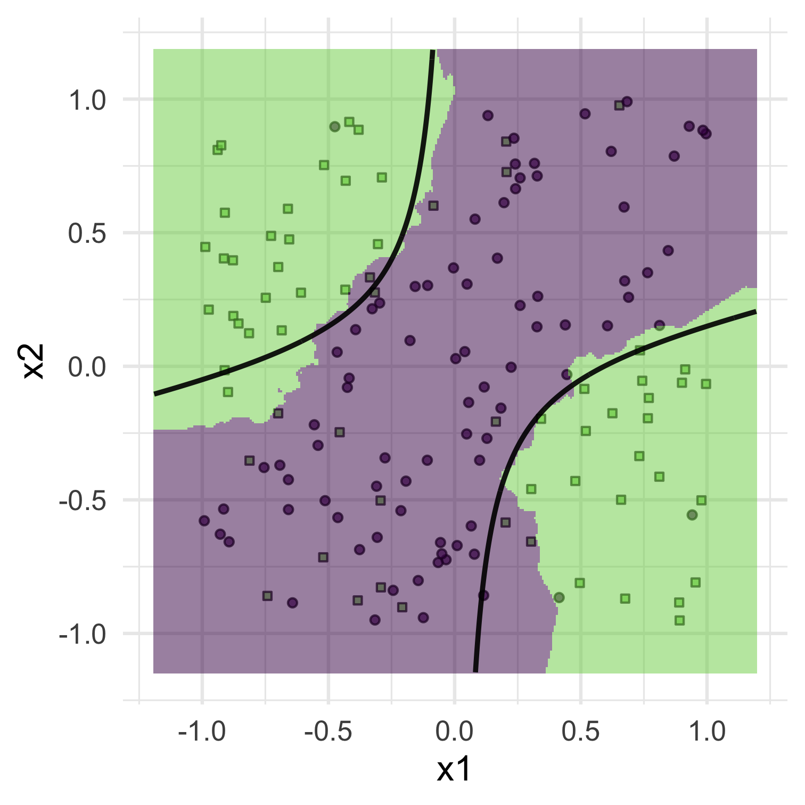
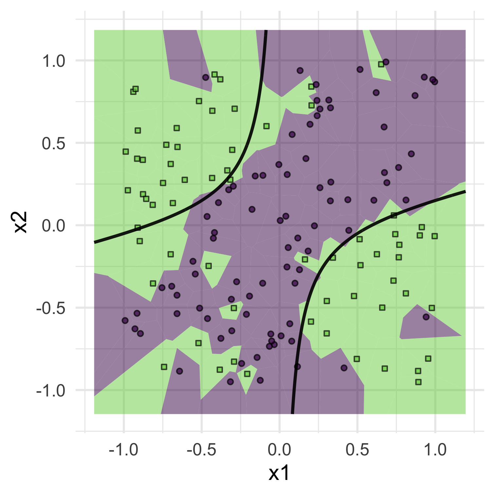

class: inverse

```{r setup, include=FALSE}
options(htmltools.dir.version = FALSE)
knitr::opts_chunk$set(fig.retina = 3, warning = FALSE, message = FALSE)
options(knitr.table.format = "html")
```

```{r xaringan-themer, include=FALSE, warning=FALSE}
library(xaringanthemer)
style_duo_accent(
  primary_color = "#2d708e",
  secondary_color = "#230433",
  link_color = "#55c667",
  text_bold_color = '#f68f46',
  title_slide_background_color = "#ffffff", #"#042333",
  title_slide_background_image = "../../../files/theme/LSE/aerial2.jpg",
#    "https://upload.wikimedia.org/wikipedia/commons/1/1a/Workhouse_Nantwich.jpg",
  title_slide_background_size = "cover",
  ) #or contain
```

```{r xaringanextra, include=FALSE, warning=FALSE}
library(xaringanExtra)
#xaringanExtra::use_animate_all("slide_left")
xaringanExtra::use_tile_view()
xaringanExtra::use_panelset()
xaringanExtra::style_panelset_tabs(font_family = "inherit")
```

```{r tidyverse, include=FALSE, warning=FALSE}
library(tidyverse)
library(knitr)
theme_set(theme_minimal(base_size = 22))
set.seed(1)
library(broom)
library(modelr)
library(ggvoronoi)
```

<style type="text/css">
.remark-slide-content {
    font-size: 1.2rem;
    padding: 1em 4em 1em 4em;
}
</style>

# Kernel methods

Distances in higher-dimensional/functional spaces

- Like a **smoother** version of nearest neighbors

- **Feature embedding**: fairly automatic way to embed predictors in higher-dimensional spaces

- Computational speed-ups in special cases allow high-dimensions and large datasets ("**kernel trick**")

- Close mathematical ties to **penalized optimization over function spaces**

---

### Preview: $k$-NN vs kSVM decision boundaries

.pull-left[

.center[
$k\text{-NN}$ with $k = 11$
]
]
.pull-right[
```{r echo = FALSE}
library(kernlab)
```


```{r svm-eg, echo = FALSE, fig.align='center'}
n <- 150
circle <- data.frame(
  x1 = 1 - 2*runif(n),
  x2 = 1 - 2*runif(n)
)
true_boundary_function <- function(x1, x2) {
  # experiment with changing this
  1 - x1/4 - x1^2 + 5*x1*x2 - .5
}
circle <- data.frame(
  x1 = 1 - 2*runif(n),
  x2 = 1 - 2*runif(n)
) %>% 
  mutate(
    separable = true_boundary_function(x1, x2) > 0,
    y = factor(rbinom(n, 1, 9/10 - 8*as.numeric(separable)/10 ))
  )
decision_surface <- 
  data_grid(circle,
          x1 = seq_range(x1, 300, expand = .2),
          x2 = seq_range(x2, 300, expand = .2)) %>%
  mutate(z = true_boundary_function(x1, x2))

x <- circle[, 1:2]
y <- circle$y
rbf_svm <- ksvm(y ~ x1 + x2, data = circle,
                kernel = rbfdot(sigma = 50))
rbf_fitted <- predict(rbf_svm,
                       newdata = decision_surface,
                       type = "decision")
poly_svm <- ksvm(y ~ x1 + x2, data = circle,
                 kernel = polydot(degree = 2))
poly_fitted <- predict(poly_svm,
                       newdata = decision_surface,
                       type = "decision")
```


```{r poly-svm-plot, echo = FALSE}
circle_plot <- ggplot(circle, aes(x1, x2)) +
  scale_shape_manual(values=c(21, 22)) + 
  scale_fill_viridis_c(direction = 1, end = .8) +
  geom_contour(
    data = decision_surface,
    aes(x1, x2, z=z),
    bins = 2,
    size = 1.5,
    color = "black",
    alpha = .9) + 
  geom_tile(
    data = decision_surface %>%
      mutate(.fitted = poly_fitted),
    aes(x1, x2, fill=(.fitted)),
    #bins = 2,
    #size = 1.5,
    #color = "black",
    show.legend = FALSE,
    alpha = .5) + 
  geom_contour(
    data = decision_surface %>%
      mutate(.fitted = poly_fitted),
    aes(x1, x2, z=.fitted),
    bins = 2,
    size = 1,
    color = "white",
    #linetype = "dotted",
    breaks = c(0),
    show.legend = FALSE,
    alpha = .9) +
  geom_point(aes(shape = y, fill = as.numeric(y)),
              color = "black", size = 2, stroke = 1,
              show.legend = FALSE, alpha =  .7) 

circle_plot
```
.center[SVM with poly. kernel]
]

---

### e.g. Polynomial embedding

Consider this polynomial transformation:

$$
h(x_1, x_2) = (x_1, x_2, x_1^2, x_2^2, x_1x_2)
$$
This function $f$ is **linear** in the higher-dimensional features


$$
f(\mathbf x) = \color{green}{\beta_0} + \color{green}{\beta_1} x_1 + \color{green}{\beta_2} x_2 + \color{purple}{\beta_3} x_1^2 + \color{purple}{\beta_4} x_2^2 + \color{purple}{\beta_5} x_1x_2
$$
$$
= \beta_0 + \beta^T h(\mathbf x)
$$

---

### Separating hyperplane

[Wikipedia](https://en.wikipedia.org/wiki/Kernel_method) example showing a non-linear decision boundary in 2-dimensions, and separation with a linear decision boundary (plane) in 3-dimensions after using polynomial embedding


---

### Feature (predictor) transformation

- First, embed predictors in a higher-dimensional space

$$
\mathbf x \mapsto h(\mathbf x)
$$

.center[*unsupervised step, without using the outcome*]

- Then solve supervised problem optimizing over higher dimensional space

--

- Make it **local**: when predicting at $\mathbf x_0$, weight each training point by some measure of similarity with $\mathbf x_0$, e.g.

$$
K(\mathbf x_0, \mathbf x_i) = \mathbf x_0^T \mathbf x_i
$$

**Euclidean inner product**: $\langle \mathbf x, \mathbf x' \rangle_2= \mathbf x^T \mathbf x' = \sum_{j=1}^p x_j x'_j$

*Kernels: one elegant mathematical framework for all this and more*

---

### Inner products (and Hilbert spaces)

For a real vector space $V$, an **inner product** is any function

$$
\langle \cdot, \cdot \rangle : V \times V \to \mathbb R
$$
which satisfies these conditions

1. Symmetry: $\langle \mathbf x, \mathbf x' \rangle = \langle \mathbf x', \mathbf x \rangle$
2. Linearity: $\langle \alpha_1 \mathbf x_1 + \alpha_2 \mathbf x_2, \mathbf x \rangle =  \alpha_1 \langle \mathbf x_1, \mathbf x \rangle + \alpha_2 \langle \mathbf x_2, \mathbf x \rangle$
3. Positive definiteness: $\langle \mathbf x, \mathbf x \rangle > 0$ for all $\mathbf x \neq 0$

*Abstraction of measuring signed angle and magnitude*

Non-examinable: a **Hilbert space** is an inner product space which is complete, i.e. limits of converging sequences are also in the space (like $\mathbb R$ instead of $\mathbb Q$). Many spaces of functions useful in ML are Hilbert spaces

---

### What is a "kernel"?

A symmetric, **positive definite** matrix $\mathbf A$ satisfies $\mathbf x^T \mathbf {Ax} > 0$ for all $\mathbf x \neq 0$. Any such matrix can be used to define an inner product

$$
\langle \mathbf x, \mathbf x' \rangle_{\mathbf A} := \mathbf x^T \mathbf {Ax}'
$$

--

Any inner product $\langle \cdot, \cdot \rangle_*$, combined with any set of basis vectors $\mathbf e_1, \mathbf e_2, \ldots$ (not necessarily orthogonal), can be used to create a positive definite matrix

$$\mathbf A_{ij} := \langle \mathbf e_i, \mathbf e_j \rangle_*$$


A **kernel function** is just a generalization of a positive definite matrix, i.e. also an inner product or similarity measure

---

## Examples (from ESL)

For any inner product $\langle \cdot, \cdot \rangle$

- $K(\mathbf x, \mathbf x') = \langle \mathbf x, \mathbf x' \rangle$ is a kernel, and so are

- $K(\mathbf x, \mathbf x') = (1 + \langle \mathbf x, \mathbf x' \rangle )^d$ - degree $d$ polynomial

- $K(\mathbf x, \mathbf x') = \exp(-\gamma \| \mathbf x - \mathbf x' \|^2)$ - radial basis, Gaussian

- $K(\mathbf x, \mathbf x') = \tanh(\kappa_1 \langle \mathbf x, \mathbf x' \rangle + \kappa_2)$ - neural network

Next slides: visualizations to help with understanding

---

### Kernel matrix on a 1d regular grid

```{r echo = FALSE}
X <- data_grid(circle,
          x1 = seq_range(x1, 25))
K <- kernelMatrix(rbfdot(sigma = 1), as.matrix(X))
P <- kernelMatrix(vanilladot(), as.matrix(X))

L <- nrow(X)^2
outdf <- data.frame(
  i=integer(L),
  j=integer(L),
  xi=double(L),
  xj=double(L),
  Kij=double(L),
  Pij=double(L))

count <- 1
for (i in 1:nrow(X)) {
  for (j in 1:nrow(X)) {
    outdf[count,] <- c(i,j,X[i,1],X[j,1],K[i,j],P[i,j])
    count <- count+1
  }
}

```

.pull-left[
```{r grid1d_rbf, echo = FALSE, fig.align='center'}
outdf %>% 
  ggplot(aes(xj, rev(xi))) +
  scale_fill_viridis_c(direction = 1, end = .8) +
  geom_tile(aes(fill = Kij), show.legend = T) +
  theme(strip.text = element_blank(),
        axis.text=element_blank(),
        axis.ticks=element_blank()) +
  xlab("x_j") + ylab("x_i") + labs(fill = "K(x_i,x_j)") +
  ggtitle("Radial kernel")
```
]
.pull-right[
```{r grid1d_poly, echo = FALSE, fig.align='center'}
outdf %>% 
  ggplot(aes(xj, rev(xi))) +
  scale_fill_viridis_c(direction = 1, end = .8) +
  geom_tile(aes(fill = Pij), show.legend = T)  +
  theme(axis.text=element_blank(),
        axis.ticks=element_blank()
        ) + ylab("x_i") + xlab("x_j") + labs(fill = "K(x_i,x_j)") +
  ggtitle("Polynomial kernel")
```
]

For $p = 1$, can plot similarity $K(x_{i1}, x_{j1})$ contours on 2d-plot with $x_{i1}$ on horizontal axis and $x_{j1}$ on vertical axis

---

### Kernels without a sorted $x$-axis

```{r grid1d_unsorted, echo = FALSE, fig.align='center'}
X <- data_grid(circle,
          x1 = seq_range(x1, 75)) %>%
  mutate(x1 = sample(x1))
K <- kernelMatrix(rbfdot(sigma = 10), as.matrix(X))
P <- kernelMatrix(polydot(degree = 2), as.matrix(X))

L <- nrow(X)^2
outdf <- data.frame(
  i=integer(L),
  j=integer(L),
  xi=double(L),
  xj=double(L),
  Kij=double(L),
  Pij=double(L))

count <- 1
for (i in 1:nrow(X)) {
  for (j in 1:nrow(X)) {
    outdf[count,] <- c(i,j,X[i,1],X[j,1],K[i,j],P[i,j])
    count <- count+1
  }
}
```


.pull-left[
```{r grid1d_rbf_ij, echo = FALSE, fig.align='center'}
outdf %>% 
  ggplot(aes(j, rev(i))) +
  scale_fill_viridis_c(direction = 1, end = .8) +
  geom_tile(aes(fill = Kij), show.legend = T) +
  theme(strip.text = element_blank(),
        axis.text=element_blank(),
        axis.ticks=element_blank()) +
  xlab("j") + ylab("i") + labs(fill = "K(x_i,x_j)") +
  ggtitle("Radial kernel")
```
]
.pull-right[
```{r grid1d_poly_ij, echo = FALSE, fig.align='center'}
outdf %>% 
  ggplot(aes(j, rev(i))) +
  scale_fill_viridis_c(direction = 1, end = .8) +
  geom_tile(aes(fill = Pij), show.legend = T)  +
  theme(axis.text=element_blank(),
        axis.ticks=element_blank()
        ) + ylab("i") + xlab("j") + labs(fill = "K(x_i,x_j)") +
  ggtitle("Polynomial kernel")
```
]


---

### Kernel matrix on a 2d regular grid

```{r echo = FALSE}
X <- data_grid(circle,
          x1 = seq_range(x1, 5),
          x2 = seq_range(x2, 5)) #%>% arrange(x2, x1)
K <- kernelMatrix(rbfdot(sigma = 1.5), as.matrix(X))

L <- nrow(X)^2
outdf <- data.frame(
  i=integer(L),
  j=integer(L),
  xi1=double(L),
  xi2=double(L),
  xj1=double(L),
  xj2=double(L),
  Kij=double(L))

count <- 1
for (i in 1:nrow(X)) {
  for (j in 1:nrow(X)) {
    outdf[count,] <- c(i,j,X[i,1],X[i,2],X[j,1],X[j,2],K[i,j])
    count <- count+1
  }
}

```

.pull-left[
```{r grid2d_facet, echo = FALSE, fig.align='center'}
outdf %>% 
  ggplot(aes(xj1, rev(xi1))) +
  scale_fill_viridis_c(direction = 1, end = .8) +
  geom_tile(aes(fill = Kij), show.legend = F) +
  facet_grid((vars(xj2)), (vars(xi2))) +
  theme(strip.text = element_blank(),
        axis.text=element_blank(),
        axis.ticks=element_blank()) +
  xlab("x_j1") + ylab("x_i1") +
  ggtitle("Facets: x_i2 vs x_j2")
```
]
.pull-right[
```{r grid2d_ij, echo = FALSE, fig.align='center'}
outdf %>% 
  ggplot(aes(j, rev(i))) +
  scale_fill_viridis_c(direction = 1, end = .8) +
  geom_tile(aes(fill = Kij), show.legend = F)  +
  theme(axis.text=element_blank(),
        axis.ticks=element_blank()
        ) + ylab("i") +
  ggtitle("Similarity: obs. i vs j")
```
]

Within each facet (block), predictor 2 is fixed and we vary predictor 1 across observations

---

### Kernel matrix on a regular 3d grid

```{r echo = FALSE}
X <- data_grid(circle,
          x1 = seq_range(x1, 5),
          x2 = seq_range(x2, 5),
          x3 = seq_range(x1, 5)) #%>% arrange(x2, x1)
K <- kernelMatrix(rbfdot(sigma = 1.5), as.matrix(X))

L <- nrow(X)^2
outdf <- data.frame(
  i=integer(L),
  j=integer(L),
  xi1=double(L),
  xi2=double(L),
  xi3=double(L),
  xj1=double(L),
  xj2=double(L),
  xj3=double(L),
  Kij=double(L))

count <- 1
for (i in 1:nrow(X)) {
  for (j in 1:nrow(X)) {
    outdf[count,] <- c(i,j,X[i,1],X[i,2],X[i,3],X[j,1],X[j,2],X[j,3],K[i,j])
    count <- count+1
  }
}

```

.pull-left[
```{r grid3d_facet, echo = FALSE, fig.align='center'}
outdf %>% 
  ggplot(aes(xj1, rev(xi1))) +
  scale_fill_viridis_c(direction = 1, end = .8) +
  geom_tile(aes(fill = Kij), show.legend = F) +
  facet_grid(vars(xi3), vars(rev(xi2)))  +
  theme(strip.text = element_blank(),
        axis.text=element_blank(),
        axis.ticks=element_blank()) +
  xlab("x_j1") + ylab("x_i1") +
  ggtitle("Facets: x_i2 vs x_i3")
```
]
.pull-right[
```{r grid3d_ij, echo = FALSE, fig.align='center'}
outdf %>% 
  ggplot(aes(j, rev(i))) +
  scale_fill_viridis_c(direction = 1, end = .8) +
  geom_tile(aes(fill = Kij), show.legend = F) +
  theme(axis.text=element_blank(),
        axis.ticks=element_blank()
        ) + ylab("i") +
  ggtitle("Similarity: obs. i vs j")
```
]

Within each facet, variables 2 and 3 are fixed for observation $i$, and we vary variable 1 across observations

---

### Kernel matrix on training data

```{r echo = FALSE}
X <- circle %>% 
  # mutate(
  #   bin1 = cut_interval(x1, 5),
  #   bin2 = cut_interval(x2, 5),
  # ) %>% 
  # group_by(bin1, bin2) %>%
  # summarize(
  #   x1 = median(x1),
  #   x2 = median(x2)) %>% 
  # ungroup() %>%
  select(x1, x2) #%>% arrange(x1, x2) #%>%  sample_frac(.8)
#K <- kernelMatrix(polydot(degree = 2), as.matrix(X))
K <- kernelMatrix(rbfdot(sigma = 1.5), as.matrix(X))

L <- nrow(X)^2
outdf <- data.frame(
  i=integer(L),
  j=integer(L),
  xi1=double(L),
  xi2=double(L),
  xj1=double(L),
  xj2=double(L),
  Kij=double(L))

count <- 1
for (j in 1:nrow(X)) {
  for (i in 1:nrow(X)) {
    outdf[count,] <- c(i,j,X[i,1],X[i,2],X[j,1],X[j,2],K[i,j])
    count <- count+1
  }
}

```


```{r train_ij, echo = FALSE, fig.align='center'}
outdf %>% 
  ggplot(aes(j, rev(i))) +
  scale_fill_viridis_c(direction = 1, end = .8) +
  geom_tile(aes(fill = Kij), show.legend = F) +
  theme(axis.text=element_blank(),
        axis.ticks=element_blank()
        ) + ylab("i") +
  ggtitle("Similarity: obs. i vs j")
```

---

### Kernel matrix on training data

```{r train_facet, echo = FALSE, fig.align='center'}
outdf %>% 
  mutate(xj2 = cut_number(xj2, 3), xi2 = cut_number(xi2, 4)) %>%
  ggplot(aes(xj1, rev(xi1))) +
  scale_fill_viridis_d(direction = 1, end = .8) +
  geom_contour_filled(aes(z = Kij), show.legend = F) +
  facet_grid(vars(xj2), vars(xi2))  +
  theme(strip.text = element_blank(),
        axis.text=element_blank(),
        axis.ticks=element_blank()) +
  xlab("x_j1") + ylab("x_i1") +
  ggtitle("Facets: x_i2 vs x_j2 (binned)")
```

---

### $k$-NN vs radial basis kernel

.pull-left[

.center[
$k\text{-NN}$ with $\text{small } k$
]
]
.pull-right[
```{r rbf-svm-plot, echo = FALSE}
circle_plot <- ggplot(circle, aes(x1, x2)) +
  scale_shape_manual(values=c(21, 22)) + 
  scale_fill_viridis_c(direction = 1, end = .8) +
  geom_contour(
    data = decision_surface,
    aes(x1, x2, z=z),
    bins = 2,
    size = 1.5,
    color = "black",
    alpha = .9) + 
  geom_tile(
    data = decision_surface %>%
      mutate(.fitted = rbf_fitted),
    aes(x1, x2, fill=(.fitted)),
    #bins = 2,
    #size = 1.5,
    #color = "black",
    show.legend = FALSE,
    alpha = .5) + 
  geom_contour(
    data = decision_surface %>%
      mutate(.fitted = rbf_fitted),
    aes(x1, x2, z=.fitted),
    bins = 2,
    size = 1,
    color = "white",
    #linetype = "dotted",
    breaks = c(0),
    show.legend = FALSE,
    alpha = .9) +
  geom_point(aes(shape = y, fill = as.numeric(y)),
              color = "black", size = 2, stroke = 1,
              show.legend = FALSE, alpha =  .7) 

circle_plot
```
.center[
kSVM-rbf with $\text{small } \gamma$
]
]

Mixture of Gaussian densities centered at each training point


---

### Kernels, inner products, norms, distances...

- Norm from any inner product $\langle \cdot, \cdot \rangle$

$$\| \mathbf x \| = \langle \mathbf x, \mathbf x \rangle ^{1/2}$$

- Inner products and norms [Polarization identity](https://en.wikipedia.org/wiki/Polarization_identity)

$$\langle \mathbf x, \mathbf x' \rangle = 
\frac{1}{4} \left( \| \mathbf x + \mathbf x' \| - \| \mathbf x - \mathbf x' \|  \right)$$

- Distance (metrics) and norms

$$d(\mathbf x, \mathbf x') = \| \mathbf x - \mathbf x' \|$$
- Kernel functions and inner products

$$K(\mathbf x, \mathbf x') = \langle \mathbf x, \mathbf x' \rangle$$

---

## Kernels and feature embeddings

**Exercise**: consider an original feature space $\mathbb R^p$ with $p = 2$, and the polynomial kernel $K$ with degree 2. For two points $\mathbf x_i, \mathbf x_j \in \mathbb R^p$, expand $K(\mathbf x_i, \mathbf x_j)$ and find an embedding function $h(\mathbf x)$ so that
$$K(\mathbf x_i, \mathbf x_j) = \langle h(\mathbf x_i), h(\mathbf x_j) \rangle$$
What dimension is $h(\mathbf x)$? Can you extend this to $p > 2$?

**Exercise**: [read](https://en.wikipedia.org/wiki/Radial_basis_function_kernel) about how the radial kernel can be represented as an inner product in an infinite dimensional space

---

### "Kernel trick"

Avoid computing $h(\mathbf x)$, which may be high (infinite) dimensional

e.g. For degree $d$ polynomial, dimension $p \mapsto \binom{p+d}{d}$, but

$$
\langle h(\mathbf x_i), h(\mathbf x_j) \rangle 
= K(\mathbf x_i, \mathbf x_j) = (1 + \mathbf x_i^T \mathbf x_j)^d
$$
.pull-left[
much higher dimensional inner product
]
.pull-right[
$p$-dimensional inner product followed by power of scalar
]

**Pros**: fast computation despite high-dimensional embedding

**Cons**: memory-based, like $k$-NN, "memorize the training data"

---

### Many ML methods can use kernels

- Kernel SVM is the most popular / commonly known, but...

Versions of all of these can be combined with feature map and kernel combinations

- Ridge/lasso regression
- Gaussian processes
- PCA/CCA
- Spectral clustering
- and more

e.g. lasso on kernel basis expansion (but no kernel trick)

$$\text{minimize } \frac{1}{2n} \| \mathbf y - h(\mathbf x)^T \beta \|_2^2 + \lambda \| \beta \|_1$$
---

### But some go with kernels more nicely

- Any method that can be computed using only pairwise inner products can also use the kernel trick. This includes all examples on previous slide except for lasso

- For any method where the kernel trick works, combine with ridge regularization and the kernel trick still works! 

- Kernel methods are generally "memory-based" like $k$-NN, but SVM can save memory by reducing to a few "support vectors." Instead of storing entire training data, may only need a fraction of it (usually those observations closer to the decision boundary in classification)

- Structured data: text, images, "convolutional kernels" -- inner product of *local averages within a moving window*

---

### Kernel trick: regression with ridge penalty

Let $\mathbf H = h(\mathbf X)$ be the embedded predictor matrix, potentially with $\text{dim}(\mathbf H) \gg \text{dim}(\mathbf X)$

Then, using our formula for the ridge solution, we get predictions this way:

$$
\mathbf H \hat \beta_\lambda = \mathbf{H}(\mathbf{H}^T\mathbf{H} + \lambda \mathbf I)^{-1}\mathbf{H}^T\mathbf y
$$
Using the [SVD](https://en.wikipedia.org/wiki/Singular_value_decomposition) matrix factorization (non-examinable), can rewrite this as

$$
\mathbf H \hat \beta_\lambda = (\mathbf{HH}^T + \lambda \mathbf I)^{-1}\mathbf{HH}^T\mathbf y
$$
Trick: the $ij$ entry of $\mathbf{HH}^T = \langle h(\mathbf x_i), h(\mathbf x_j) \rangle = K(\mathbf x_i, \mathbf x_j)$

---
class: inverse

## Summary so far

- Definitions: inner products, kernels, etc

- Ways to think about kernels

  - Generalization of positive definite matrix / inner product
  
  - Measure of non-normalized similarity, like **covariance**
  
  - (Non-examinable: actually any $K$ can be used as a covariance function defining a Gaussian process)

- Kernel methods

  - Smoothed/weighted versions of $n$-nearest neighbors
  
  - Trick: high-dim embedding, original dim. computation

---

### Non-examinable section on function spaces

Instead of minimizing squared error over the set of all linear predictor functions, why not optimize over other function spaces?

$$\hat f = \arg \min_\mathcal H \| \mathbf y - f(\mathbf x) \|_2^2$$
For some function space $\mathcal H$, e.g. continuous or differentiable

--

Many spaces we commonly use are Hilbert spaces, they have an inner product $\langle \cdot, \cdot \rangle_\mathcal{H}$ and a norm $\| \cdot \|_\mathcal{H}$ defined by that inner product. So we can also add the ridge-like penalty

$$\hat f = \arg \min_\mathcal H \| \mathbf y - f(\mathbf x) \|_2^2 + \lambda \| f \|^2_\mathcal{H}$$


---

### RKHS optimization

For many function spaces $\mathcal H$ (which are Hilbert spaces), the solution to the ridge penalized optimization

$$\text{minimize } \sum_{i=1}^n (y_i - f(\mathbf x_i))^2 + \lambda \| f \|^2_\mathcal{H}$$
*always has the form*(!)

$$
\hat f(\mathbf x) = \mathbf k(\mathbf x)^T (\mathbf K + \lambda n \mathbf I)^{-1} \mathbf y
$$
where $\mathbf k(\cdot)^T = [K(\mathbf x_1, \cdot ), \ldots, K(\mathbf x_n, \cdot)]$,

and $\mathbf K_{ij} = K(\mathbf x_i, \mathbf x_{j})$

---
class: inverse

## Why this is so sweet


Potentially infinite dimensional problem (Hilbert space optimization)? *Nope, at most* $n$, after all we are minimizing the *empirical* risk with only $n$ observations...


To predict at $\mathbf x$:

1. Transform input to vector $\mathbf k(\mathbf x)$ of **similarities** with training $\mathbf x_i$'s

2. Weighted sum of $\mathbf y_i$'s, weights $(\mathbf K + \lambda n \mathbf I)^{-1}$ based on similarities among training points


---

### Extremely cool theorems

This is a special case of **representer theorem** (Wahba, 1990)

$$
\hat f(\cdot) = \sum_{i=1}^n \hat a_i K(\cdot, \mathbf x_i)
$$

Hilbert space minimizers of empirical risk are just linear combinations of the kernel function evaluated at training points

**Theorem** (Moore–Aronszajn) [kernels `r emo::ji("handshake")` Hilbert spaces]

For any kernel $K$, there is a (unique) corresponding Hilbert space of functions $\mathcal H_K$ for which $K$ defines the inner product and norm $\| \mathbf x \|_K = \langle \mathbf x, \mathbf x \rangle_K^{1/2} = K(\mathbf x, \mathbf x)^{1/2}$

---

### Extremely optional reading

- [Linear duality](https://en.wikipedia.org/wiki/Dual_space)

- [Riesz representation theorem](https://en.wikipedia.org/wiki/Riesz_representation_theorem)

- [RKHSs](https://en.wikipedia.org/wiki/Reproducing_kernel_Hilbert_space)

- "[Kernel trick](https://en.wikipedia.org/wiki/Kernel_method)" 

- [Representer theorem](https://en.wikipedia.org/wiki/Representer_theorem)

(This is all very cool but remember it is also non-examinable)

---
class: center, middle

and now, back to our regularly examinable content

---
class: inverse

### Kernels

- Data: similarity between observations

- Geometric: signed angle and magnitude

- Linear algebra: symmetric positive definite <a href="https://en.wikipedia.org/wiki/James_Mercer_(mathematician)">function</a>

- Probabilistic: covariance

### Useful for

- Higher dimensional feature embedding

- Fast computation when combined with learning algorithms that only depend on inner products (and ridge penalties)

---
class: inverse

### Lasting impacts of kernels

- "Automatic" feature engineering

- Outside low-dimensional motivating examples, typically don't choose type of kernel very carefully

- Ultra-algorithmic supervised ML philosophy: focus on expanding **expressivity** of the function class, let efficient optimization algorithms do the work of "respecting the structure in the data"

- Influential idea $\to$ deep learning


