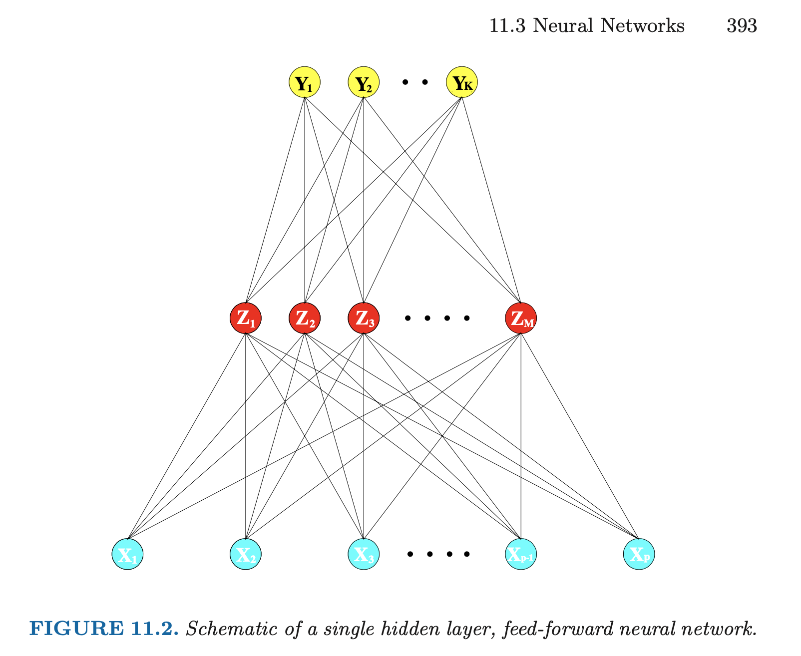
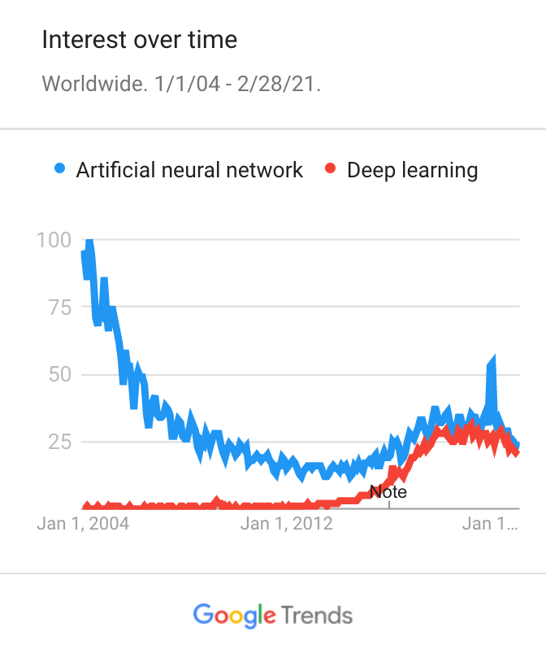
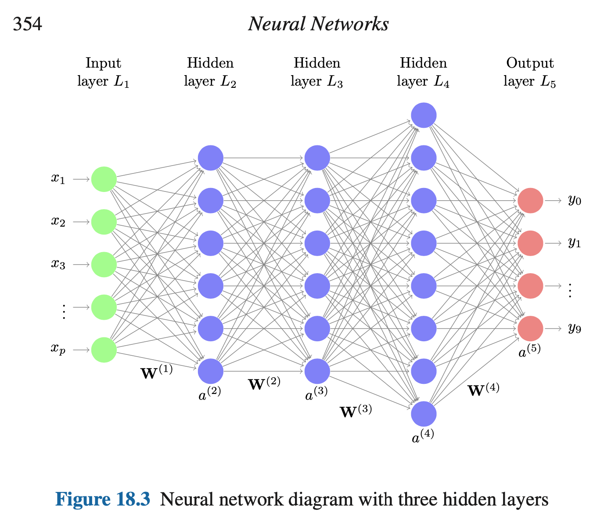
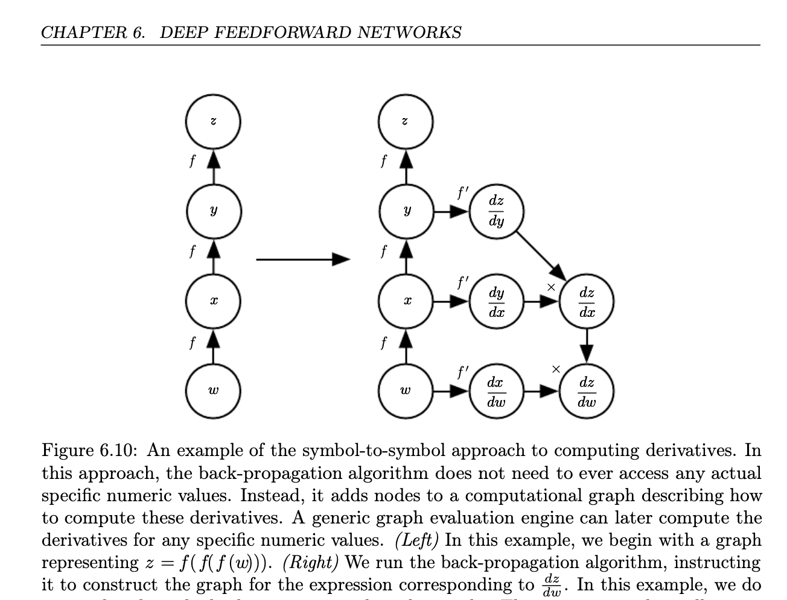
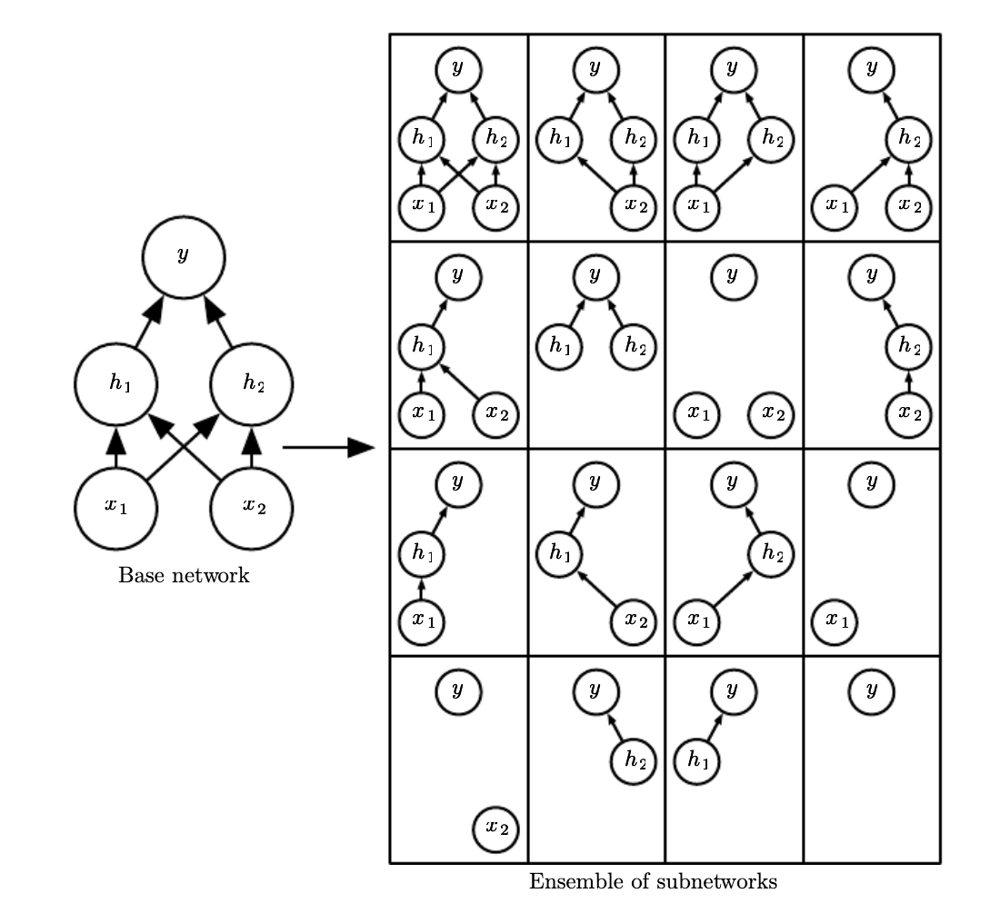
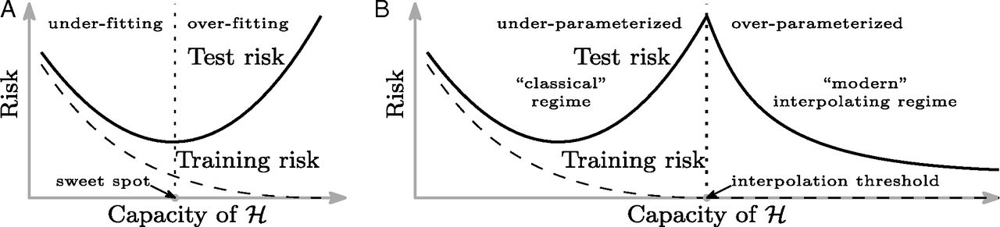
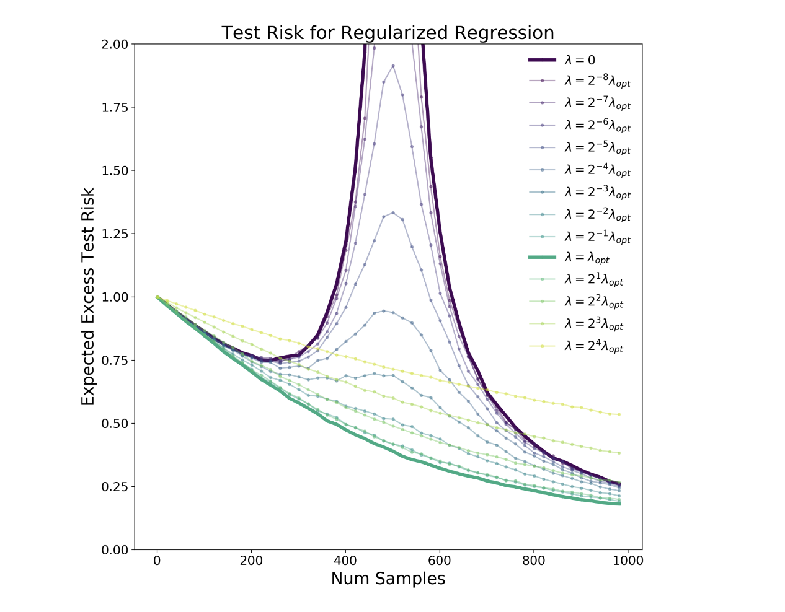
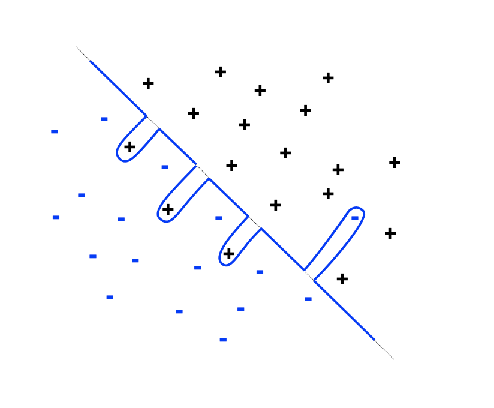

class: inverse

```{r setup, include=FALSE}
options(htmltools.dir.version = FALSE)
knitr::opts_chunk$set(fig.retina = 3, warning = FALSE, message = FALSE)
options(knitr.table.format = "html")
```

```{r xaringan-themer, include=FALSE, warning=FALSE}
library(xaringanthemer)
style_duo_accent(
  primary_color = "#2d708e",
  secondary_color = "#230433",
  link_color = "#55c667",
  text_bold_color = '#f68f46',
  title_slide_text_color = "#444444",
  title_slide_background_color = "#ffffff", #"#042333",
  title_slide_background_image = "../../../files/theme/LSE/library_atrium.jpg",
#    "https://upload.wikimedia.org/wikipedia/commons/1/1a/Workhouse_Nantwich.jpg",
  title_slide_background_size = "cover",
  ) #or contain
```

```{r xaringanextra, include=FALSE, warning=FALSE}
library(xaringanExtra)
#xaringanExtra::use_animate_all("slide_left")
xaringanExtra::use_tile_view()
xaringanExtra::use_panelset()
xaringanExtra::style_panelset_tabs(font_family = "inherit")
```

```{r tidyverse, include=FALSE, warning=FALSE}
library(tidyverse)
library(knitr)
theme_set(theme_minimal(base_size = 22))
set.seed(1)
library(broom)
library(modelr)
```

<style type="text/css">
.remark-slide-content {
    font-size: 1.2rem;
    padding: 1em 4em 1em 4em;
}
</style>


# Mathematical context

Non-linear function approximation

# Neural networks

Universal approximators / building blocks

# Deep learning

A revolution(?) in modeling, optimization, and data

---

### Function approximation of $\mathbb E[\mathbf y | \mathbf x]$

- Linear models

- Linear models with global transformations of predictors
  - $\mathbf x_j' = h_j(\mathbf X_j)$
  
- Additive non-linear models 
  - Kernel methods $\hat f(\mathbf x) = \mathbf k(\mathbf x)^T \mathbf y$
  - GAMs, similar to global with supervised learning of $\hat h_j$ 
  - Tree-based methods
  
--

- **Compositional non-linear models**

$$\hat f(\mathbf x) = \hat f_L \circ \cdots \circ \hat f_2 \circ \hat f_1(\mathbf x) = \hat f_L ( \cdots ( \hat f_2 (\hat f_1(\mathbf x)) \cdots )$$
---

## Example: you already know GLMs!

$$\mathbb E[\mathbf y | \mathbf x] = g^{-1}(\mathbf x^T \beta)$$


---

### Neural networks

Multilayer perceptron (MLP), feedforward network. ESL:

```{r, echo=FALSE, out.width="80%"}

```

---

### One "hidden layer" and other terminology

Inputs: $\mathbf X = [\mathbf X_1, \ldots, \mathbf X_p]^T$

"Hidden" layer: $\mathbf Z = \sigma(\beta^{(1)}_0 + \mathbf X \beta^{(1)}) = [\mathbf Z_1, \ldots, \mathbf Z_M]^T$

Outputs: $\mathbf Y = g(\beta^{(2)}_0 + \mathbf Z \beta^{(2)}) = [\mathbf Y_1, \dots, \mathbf Y_K]^T$

--

 
Units: (`keras` terminology) outputs of a given layer, e.g. $M$ (hidden units) for the input layer or $K$ (outputs/classes) for the hidden layer

Activation (non-linear) functions: $\sigma$ and $g$ in this example

Parameters: weights $\beta$ and biases $\beta_0$ (yes, really...) `r emo::ji("roll_eyes")` `r emo::ji("person_facepalming")`

Learning/optimization: fixed activations, fit parameters

---

[MNIST example](https://tensorflow.rstudio.com/tutorials/beginners/) with ESL 11.2 notation $p, M, K$

```{r echo = FALSE}
reticulate::use_python("~/.pyenv/versions/tf/bin/python")
```


```{r}
library(keras); p <- c(28, 28); M <- 128; K <- 10
model <- keras_model_sequential() %>%
  layer_flatten(input_shape = p) %>%
  layer_dense(units = K, activation = "relu") %>%
  layer_dense(10, activation = "softmax")
```


---

## History / connection to "neurons"

Early work ([1943](https://en.wikipedia.org/wiki/Walter_Pitts)) motivated by analogy to neurons, "activation" of a neuron cell's action potential which sends an electric signal to connected neurons

Equivalence between a mathematical model of brain activity and boolean logic

[Universal approximation](https://en.wikipedia.org/wiki/Universal_approximation_theorem) means this class of models can approximate any continuous function. First shown in 1989 for softmax activation, later extended to other activations

Useful analogy, can inspire research ideas (remember it's just an analogy, it doesn't mean actual brain biology works this way or that neural networks are like thinking brains...)

---

### Second wave of neural network research

.pull-left[

]
.pull-right[
Combination of algorithms, software, and **datasets** allow training much larger and more complex models

NNs with multiple hidden layers start beating SoTA on image classification tasks

Driven by empirical performance on prediction/classification, very little theory or interpretability
]

---

### Deep = multiple hidden layers (CASI 18.3)



---

### Benefits of deepness

[Some functions](https://arxiv.org/abs/1509.08101) require exponentially many parameters to represent with a 2-layer network, but grow polynomially if depth of network increases

[Expressivity](https://arxiv.org/abs/1606.05336) depends more strongly on depth, e.g.
[trajectory length](https://arxiv.org/abs/1611.08083) of a curve in input space grows exponentially in depth (Figure 1 from previous link). (Recall "real data" manifold idea)


---

### What's special about **deep** learning?

Faster optimizers and hardware, and larger datasets, also allow other methods to scale up number of parameters. So why did deep learning become SoTA?

Flexibility, expressivity, "[capacity](https://arxiv.org/abs/1901.00434)", *degrees of freedom is not just about counting parameters*

1. Smaller layers limit capacity (bottleneck effect)

2. But shallow networks may not learn structure

$\to$ Want more layers (2), but to avoid making them small (1) need enough data to estimate many more parameters

---

## Specialized modeling choices

For deep networks, choose number $L$ of (hidden) layers, and *for every layer*  choose

- Layer type (dense, [convolutional](https://towardsdatascience.com/a-comprehensive-introduction-to-different-types-of-convolutions-in-deep-learning-669281e58215), pooling, ...) (matrix/tensor multiplication with some kind of structure)
- Number/shape (e.g. vector/matrix/tensor) of outputs
- Activation function (ReLU, sigmoid, linear, tanh, ...)
- Regularizer (L1 or L2 norm penalties, dropout, ...)

--

Compare to e.g. regularized kernel regression: choose kernel, regularizer, bandwidth. Not that many choices.

**Network architecture** = combinatorial explosion of choices

*Modeling side of the DL revolution*

---

## Specialized optimization

After network architecture is fixed, how do we train the network / estimate the weights and biases?

To use gradient descent, need to compute gradient of 

$$
\sigma_L (\cdots \sigma_2(\beta^{(2)}_0 + \sigma_1(\beta^{(1)}_0 + \mathbf X \beta^{(1)}) \beta^{(2)}) \cdots )
$$
with respect to all the $\beta$'s

--

Chain rule, automatic differentiation, [efficient implementations](https://en.wikipedia.org/wiki/Backpropagation), handling [numerical issues](https://mlstory.org/deep.html#vanishing-gradients), etc

**Epoch**: one gradient descent pass over entire training data

*Algorithm and software side of the DL revolution*

---

### Optimization: backprop for efficient chain-rule



---

## Specialized regularization

.pull-left[
- **Dropout** is like bagging

- During training: randomly drop units, iteration of gradient descent uses subnetwork

- During testing: use full network

Averaging over many models represented by all possible subnetworks
]
.pull-right[



(Figure 7.6 from [DLbook](https://www.deeplearningbook.org/contents/regularization.html))
]


---

### Questions/practical lessons

Why does it "work" (beat SoTA)?

Short answer: a lot of resources (expertise, time, data, money) went into making it work! e.g. [MLstory](https://mlstory.org/optimization.html) **SGD Quick Start Guide**:

1. Pick as large a minibatch size as you can given your computer’s RAM.
2. Set your momentum parameter to either 0 or 0.9. Your call!
3. Find the largest constant stepsize such that SGD doesn’t diverge. This takes some trial and error, but you only need to be accurate to within a factor of 10 here.
4. Run SGD with this constant stepsize until the empirical risk plateaus.
5. Reduce the stepsize by a constant factor (say, 10)
6. Repeat steps 4 and 5 until you converge.


---

### Specialized (or same old?) statistical problems

Decisions about network architecture made by experimenting, checking error on test data, and trying again...

Recall Duda and Hart:

> A [...] problem arises *when a classifier undergoes a long series of refinements guided by the results of repeated testing on the same data*. This form of "**training on the testing data**" often escapes attention until new test samples are obtained.

Crisis: [adversarial](https://en.wikipedia.org/wiki/Adversarial_machine_learning) examples, robustness, [OOD](https://en.wikipedia.org/wiki/Multi-task_learning) [generalization](https://en.wikipedia.org/wiki/Transfer_learning)

Crisis: breakdown of the [Common Task Framework](https://arxiv.org/abs/2001.07648)? ([David Donoho](https://courses.csail.mit.edu/18.337/2015/docs/50YearsDataScience.pdf) attributes the success of machine learning to the CTF)

---

## Optimization issues: non-convexity

Almost all our understanding is based on *empirical results*

No mathematical guarantees about convergence

Plot graph of test error... has it converged yet?

(Dangerous/confusing territory- we'll come back to this)

(Time for break?)


---

### Does statistics apply to DL?

The bias-variance trade-off is one of the most important pillars of statistical wisdom

If we make a model too complex, it overfits to the training data... or does it?

Some people think that deep learning is an exception



Lots of citations/papers, a big mystery!... Or is it?

---

## Apply the logic carefully

Does zero training error *necessarily* mean the model is overfit?

--

**No**! Anna Karenina principle: 

> All truly optimal models are alike; each overfit model is overfit in its own way.

e.g. 1-dim interpolation of the same (training) points with curves of different smoothness

---

#### Why is "double descent" often observed in practice?

--

**Too many moving parts**! Choices in training. [Nakkiran et al](https://arxiv.org/abs/2003.01897): 



---

#### Why can training-interpolating models generalize?

**Simple plus spiky** decomposition. [Bartlett et al](https://arxiv.org/abs/2103.09177):




---

### Two point statistical summary of DL

- Overparametrization apparently has a lot of benefits, at the cost of interpretability

- But don't forget [researcher degrees of freedom](https://en.wikipedia.org/wiki/Researcher_degrees_of_freedom)

---

### Questions/mathematical lessons

Non-convex, but doesn't seem to suffer local minima problems

Overparametrized so global optimum is 0 training loss. Real question is why do these solutions generalize, aren't overfit?

- Low dimensional data manifold heuristic

- "Implicit regularization" - SGD converges to minimum norm solutions

- Remember, optimization and generalization are still not equivalent! No guarantee that minimum norm solution is a good one, but maybe if there's signal in the data [can always find a minimum norm solution to predict $y$ sampled independently from `rnorm(n)`]


---
class: inverse

# Where are we going?

Don't usually talk about this in our courses...

But [professional](https://rss.org.uk/RSS/media/News-and-publications/Publications/Reports%20and%20guides/A-Guide-for-Ethical-Data-Science-Final-Oct-2019.pdf) [ethics](https://www.amstat.org/ASA/Your-Career/Ethical-Guidelines-for-Statistical-Practice.aspx) are an *increasingly* important, central part of our discipline

- [This](https://www.theguardian.com/commentisfree/2020/dec/05/companies-are-now-writing-reports-tailored-for-ai-readers-and-it-should-worry-us) [tech](https://www.ft.com/content/bb03ba1c-add3-4440-9bf2-2a65566aef4a) [is](https://www.wired.com/story/google-microsoft-warn-ai-may-do-dumb-things/) [going](https://en.wikipedia.org/wiki/2020_UK_GCSE_and_A-Level_grading_controversy) to be [used](https://ghostwork.info/articles/) for everything

- It's "data hungry" -- implications for everyone/everything

- Large organizations, mostly unaccountable, are currently [designing](https://hdsr.mitpress.mit.edu/pub/wot7mkc1/release/9) a very different [future](https://phenomenalworld.org/analysis/data-as-property) 

- These already make up what we can think of as a distributed system [optimizing](https://en.wikipedia.org/wiki/Instrumental_convergence#Paperclip_maximizer) for [something](https://www.decisionproblem.com/paperclips/)...


---

## References

- ESL Chapter 11 (pre-deep, solid foundation)

- CASI Chapter 18

- [MLstory](https://mlstory.org/index.html) chapters on optimization, generalization, deep learning, and datasets

- [DLbook](https://www.deeplearningbook.org/), especially part II and chapters 6-9

- Jared Tanner's [course](https://courses.maths.ox.ac.uk/node/37111) on theories of DL

- [New paper](https://arxiv.org/abs/2102.11107) surveying applications to causality

- Beyond feedforward networks: architectures like RNN, GAN, LSTM, transformer (lecture 10)
