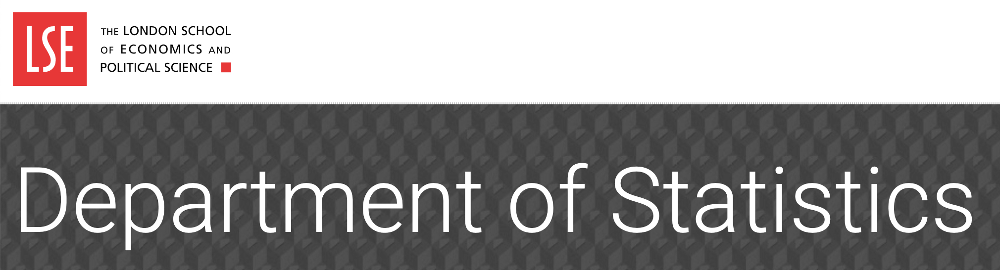

```{r setup, include=FALSE}
options(htmltools.dir.version = FALSE)
knitr::opts_chunk$set(fig.retina = 3, warning = FALSE, message = FALSE)
options(knitr.table.format = "html")
```

```{r xaringan-themer, include=FALSE, warning=FALSE}
library(xaringanthemer)
style_duo_accent(
  primary_color = "#2d708e",
  secondary_color = "#230433",
  link_color = "#55c667",
  title_slide_background_color = "#ffffff", #"#042333",
  title_slide_background_image = "../../../files/theme/LSE/aerial5.jpg",
  title_slide_background_size = "cover",
  ) #or contain
```

```{r xaringanextra, include=FALSE, warning=FALSE}
library(xaringanExtra)
xaringanExtra::use_animate_all("slide_left")
xaringanExtra::use_tile_view()
xaringanExtra::use_panelset()
xaringanExtra::style_panelset_tabs(font_family = "inherit")
```

```{r tidyverse, include=FALSE, warning=FALSE}
library(tidyverse)
library(knitr)
theme_set(theme_minimal(base_size = 22))
```

<style type="text/css">
.remark-slide-content {
    font-size: 1.2rem;
    padding: 1em 4em 1em 4em;
}
</style>



class: center, middle

# Welcome!

### ST 310 - Machine Learning

London School of Economics

Michaelmas term 2021

---

.pull-left[


]


.pull-right[

&nbsp;

&nbsp;

&nbsp;

What makes humans "special"?

- vs machines: We're alive

- vs other animals...?

  - Cumulative cultural evolution (our crowd-sourced software, not really our hardware)
]

---

# Social learning: imitation

> Monkey see, monkey do


Might apply to humans more than any other species

[Over-imitation](https://en.wikipedia.org/wiki/Imitation#Over-imitation) [[article](https://theconversation.com/being-copycats-might-be-key-to-being-human-121932)] [[video](https://www.youtube.com/watch?v=JwwclyVYTkk)]

