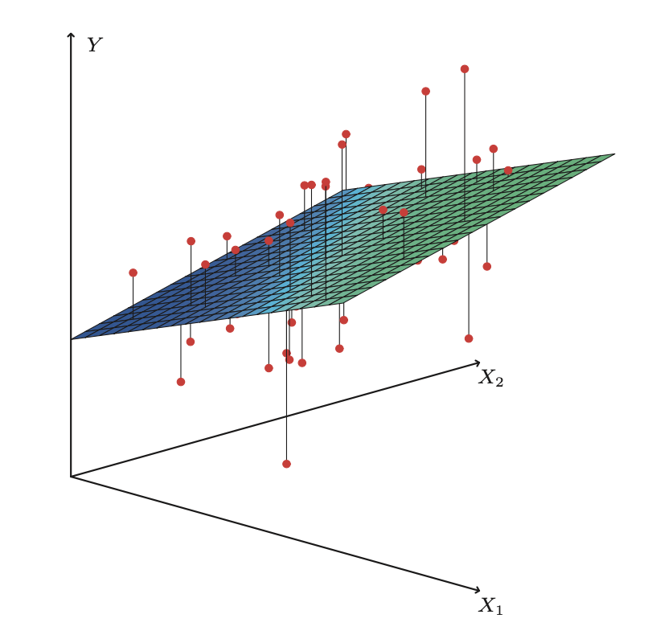
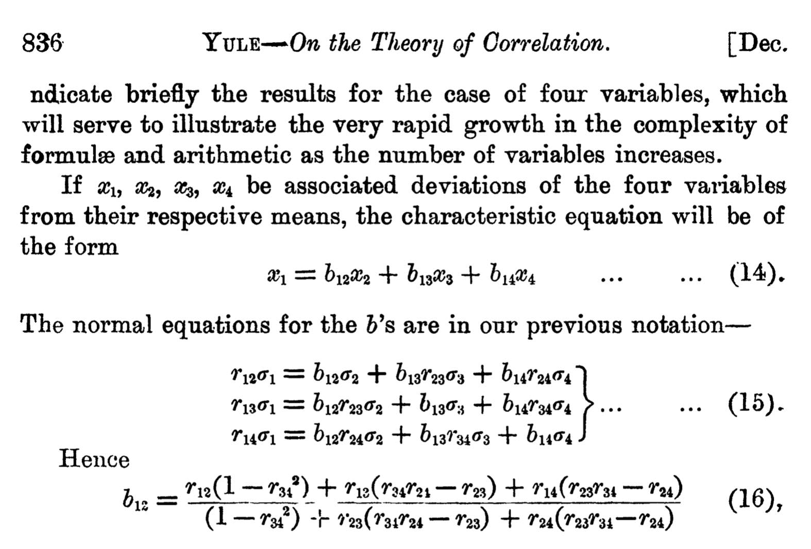

class: inverse

```{r setup, include=FALSE}
options(htmltools.dir.version = FALSE)
knitr::opts_chunk$set(fig.retina = 3, warning = FALSE, message = FALSE)
options(knitr.table.format = "html")
```

```{r xaringan-themer, include=FALSE, warning=FALSE}
library(xaringanthemer)
style_duo_accent(
  primary_color = "#2d708e",
  secondary_color = "#230433",
  link_color = "#55c667",
  text_bold_color = '#f68f46',
  title_slide_background_color = "#ffffff", #"#042333",
  title_slide_background_image = "../../../files/theme/LSE/library_night.jpg",
#    "https://upload.wikimedia.org/wikipedia/commons/1/1a/Workhouse_Nantwich.jpg",
  title_slide_background_size = "cover",
  ) #or contain
```

```{r xaringanextra, include=FALSE, warning=FALSE}
library(xaringanExtra)
xaringanExtra::use_animate_all("slide_left")
xaringanExtra::use_tile_view()
xaringanExtra::use_panelset()
xaringanExtra::style_panelset_tabs(font_family = "inherit")
```

```{r tidyverse, include=FALSE, warning=FALSE}
library(tidyverse)
library(knitr)
theme_set(theme_minimal(base_size = 22))
set.seed(1)
```

<style type="text/css">
.remark-slide-content {
    font-size: 1.2rem;
    padding: 1em 4em 1em 4em;
}
</style>

### From the stars to "Poor Law Statistics"

- Almost a century after Gauss
- Scientists correlating/regressing anything
- Problem: what does it mean?

--

e.g. [Francis Galton](https://www.theguardian.com/education/2020/jun/19/ucl-renames-three-facilities-that-honoured-prominent-eugenicists) correlated numeric traits between generations of organisms...

But *why*? "Nature versus nurture" debate never ends?

--

e.g. [Udny Yule](https://en.wikipedia.org/wiki/Udny_Yule) and others correlated poverty ("pauperism") with welfare ("out-relief")...

But *why*? The "[welfare](http://economistjourney.blogspot.com/2014/08/the-crazy-dream-of-george-udny-yule-is.html) [trap](https://en.wikipedia.org/wiki/Welfare_trap)" debate never ends?

---
class: inverse

# Origin of multiple regression

.pull-left[
- Udny Yule (1871-1951)

- Studied this poverty question

- First paper using multiple regression in 1897

- Association between poverty and welfare while "controlling for" age
]
.pull-right[

]

---
class: inverse

## Yule, in 1897:

> Instead of speaking of "causal relation," ... we will use the terms "correlation," ...

- Variables, roughly:
  - $Y =$ prevalence of poverty
  - $X_1 =$ generosity of welfare policy
  - $X_2 =$ age
- Positive correlations:
  - $\text{cor}(Y, X_1) > 0$
  - $\text{cor}(X_2, X_1) > 0$

--

Do more people enter/stay in poverty if welfare is more generous?

Or is this association "due to" age?

---
class: inverse

## Yule, in 1897:

> The investigation of **causal relations** between economic phenomena presents many problems of peculiar difficulty, and offers many opportunities for fallacious conclusions.

--

> Since the statistician can seldom or never make experiments for himself, he has to accept the data of daily experience, and discuss as best he can the relations of a whole group of changes; he **cannot, like the physicist, narrow down the issue to the effect of one variation at a time. The problems of statistics are in this sense far more complex than the problems of physics**.

---

### When $p > 1$

.pull-left[
- Instead of a regression line, we fit a regression (hyper)plane

- Among all possible such planes, find the one minimizing sum of squared errors (represented by vertical lines in ISLR Fig 3.4)

- How to find the coefficients? Calculus?
]
.pull-right[

]


---

### Regression estimates when $p = 3$



---
class: inverse

### Progress(?) in regression

$p$ variables $\to$ $\binom{p}{2}$ "product sums" to compute by hand...

Yule:
> ... if we wished to discuss the causality [note: correlation?! -JL] of pauperism on the basis of as many as eight variables, the **work** involved would be something like twenty-eight times as much as that necessary for the example taken on pp. 824-831. The **labour** would, in fact, be almost impossible for a single individual.

- 1958: Ted Anderson *An Introduction to Multivariate Analysis*

- 1960's: **Electric** desktop calculators made it easier

- Present: linear algebra notation and computers (R, etc)

---

# Notation

Writing the same thing in various ways

- For observation $i$:

$$y_i = \beta_0 + \beta_1 x_{i1} + \beta_2 x_{i2} + \cdots + \beta_p x_{ip} + \varepsilon_i$$

or using the [inner product](https://en.wikipedia.org/wiki/Dot_product) (of column vectors)

$$y_i = x_i^T \beta + \varepsilon_i$$
- Random variable version:

$$Y = X^T \beta + \varepsilon$$
---

# Notation, continued

- For all $n$ observations

$$
\begin{pmatrix}
y_1 \\
y_2 \\
\vdots \\
y_n
\end{pmatrix}
=
\begin{pmatrix}
1 & x_{11} & x_{12} & \cdots & x_{1p}\\
1 & x_{21} & x_{22} & \cdots & x_{2p}\\
\vdots & \vdots & \vdots & \ddots & \vdots \\
1 & x_{n1} & x_{n2} & \cdots & x_{np}\\
\end{pmatrix}
\begin{pmatrix}
\beta_0 \\
\beta_1 \\
\vdots \\
\beta_p
\end{pmatrix}
+
\begin{pmatrix}
\varepsilon_1 \\
\varepsilon_2 \\
\vdots \\
\varepsilon_n
\end{pmatrix}
$$

or

$$\mathbf{y} = \mathbf{X} \beta + \mathbf{\varepsilon}$$

Note: column of 1's for intercept term. Sometimes omitted by assuming $\mathbf y$ is already "centered"

---

## Notational conventions

We'll use common conventions in this course

- Bold for vectors, bold and upper case for matrices
- Otherwise upper case denotes random variable
- Error terms $\varepsilon = y - \mathbf x^T \beta$ never truly observed
- Residuals $r = y - \mathbf x^T \hat \beta$ used as a proxy for errors
- Greek letters like $\beta, \theta, \sigma, \Sigma$ usually *unknown parameters*
- Greek letters with hats like $\hat \beta$ are estimates computed from data
- Roman letters that usually denote functions with hats, like $\hat f$ are also estimates
- Other Roman letters with hats like $\hat y$ are predictions

---

# Matrices and vectors in `R`

```{r}
# byrow = FALSE default
x <- matrix(1:9, nrow = 3, ncol = 3)
x
```

```{r}
beta <- rep(1,3)
beta
```

---

### Multiplication: %*% (yes, really)

- Beware "Error: non-conformable arguments"
- Always remember to check dimensions
- If dimension of one object divides dimension of another, `R` may "conveniently" (unintuitively) repeat the smaller one

```{r}
dim(x)
```

```{r}
dim(beta) # frustrating
```

```{r}
x %*% beta
```

---

### Transpose and symmetry

Recall: even if a matrix $\mathbf A$ is not square, both $\mathbf A^T\mathbf A$ and $\mathbf A \mathbf A^T$ are square and symmetric (often one is invertible)

```{r}
A <- matrix(c(rep(1,4), 0,0), nrow = 3, byrow = FALSE)
A
```


```{r}
t(A) %*% A
```

Note: this matrix is even invertible! (But $\mathbf A \mathbf A^T$ is not)

---

# Pseudoinversion

```{r}
# ginv() function in MASS library
Ainv <- MASS::ginv(A)
Ainv
```


```{r}
Ainv %*% A
```

The $2 \times 2$ identity matrix

---

# Pseudoinversion

Why does this work?

Let $\mathbf A^\dagger = (\mathbf A^T\mathbf A)^{-1} \mathbf A^T$, then

$$
\mathbf A^\dagger \mathbf A = (\mathbf A^T\mathbf A)^{-1} \mathbf A^T \mathbf A = (\mathbf A^T\mathbf A)^{-1} (\mathbf A^T \mathbf A) = \mathbf I
$$

--

`ginv` in the library `MASS` apparently computes the left or right pseudoinverse, whichever one works

```{r}
A %*% Ainv # not a right inverse
```

---

### Least-squares solutions in matrix notation

Instead of those long expressions that Yule found were already very complicated with $p = 3$, we can always write very simply:

$$
\hat {\mathbf \beta} = (\mathbf X^T\mathbf X)^{-1}\mathbf X^T \mathbf y = \mathbf X^\dagger \mathbf y
$$

--

This assumes $\mathbf X^T\mathbf X$ to be invertible, i.e. the *columns* of $\mathbf X$ have full rank (columns = variables)

- That's often true if $n > p$, unless some problem like one variable is a copy of another

--

- Impossible if $p > n$. "High-dimensional" regression requires special methods, covered soon in this course!

---

### Linear algebra and geometric intuition

Predictions from the linear model:

$$\hat{\mathbf y} = \mathbf {X} \hat{\mathbf \beta} = \mathbf X (\mathbf X^T\mathbf X)^{-1}\mathbf X^T \mathbf y = \mathbf H y$$
if we define

$$\mathbf H = \mathbf X (\mathbf X^T\mathbf X)^{-1}\mathbf X^T$$

--

COOL FACTS about $\mathbf H$:

- $\mathbf H$ is a projection: $\mathbf H^2 = \mathbf H$
- For any $n$-vector $\mathbf v$, the $n$-vector $\mathbf {Hv}$ is the orthogonal projection of $\mathbf v$ onto the column space of $\mathbf X$
- Of all linear combinations of columns of $\mathbf X$, $\mathbf {Hv}$ is the one closest (in Euclidean distance) to $\mathbf v$. 

---

## Exercise: do the calculus

We have the loss function

$$L(\mathbf X, \mathbf y, \mathbf \beta) = (\mathbf y - \mathbf X \beta)^T(\mathbf y - \mathbf X \beta)$$

(just a different way of writing sum of squared errors)

- Consider each coordinate separately and take univariate partial derivatives
- Use vector calculus and compute the gradient
- (Or even use matrix calculus identities)

--

Reach the same conclusion: at a stationary point of $L$,

$$\mathbf X^T \mathbf X \hat \beta = \mathbf X^T \mathbf y$$

---

### Categorical predictors

This is an interesting/practically important special case


.pull-left[
```{r}
x <- as.factor(
  sample(c("A", "B", "C"),
         10,
         replace = TRUE))
x
```

Categorical predictor with 3 levels, what does the **design matrix** (common terminology in regression) $\mathbf X$ look like?
]
.pull-right[
```{r}
model.matrix(~x)
```

]

---

```{r}
X <- model.matrix(~x-1) # take out intercept
head(X)
round(head(X %*% MASS::ginv(X)), 3) # hat matrix
```
```{r}
which(x == "C") # predicting within-group averages!
```

---

## Differences from simple regression

- **Interpreting coefficients**: "*ceteris paribus*" -- all other things being equal

The status quo is *ridiculous*, but I must tell you... (I will also tell you about better ways)

--

- **Diagnostic plots**: can't see higher dimensional relationships

Plot residuals vs fitted values, and/or various pair plots

`GGally` package `r emo::ji("thumbsup")`

--

- **Inference**: testing multiple coefficients

See ISLR's discussion of $F$-tests, beginning of Section 3.2.2

---

### Interpreting coefficients

People *want* these two things to be true:

1. $$\frac{\partial}{\partial x_j} \mathbb E[\mathbf y | \mathbf X] = \beta_j \approx \hat \beta_j$$

2. $\beta_j$ is a causal parameter, i.e. **intervening**  to increase $x_j$ by 1 unit would result in conditional average of $y$ changing by $\beta_j$ units

--

Both of these can be *importantly wrong*! Always remember:

- Think about *general* conditional expectation functions vs the **linear model assumption** (strength of ML!)
- Think about **relationships between predictors** (causal or associations)
- Consider **unobserved variables** not in the dataset


---

## Non-linear example

Suppose there is one predictor $x$, and a (global) non-linear model fits the CEF:

$$\mathbb E[\mathbf y |X = x] = \beta_0 + \beta_1 x + \beta_2 x^2$$

--

We don't know the $\beta$'s but we have some data, and we use multiple linear regression to fit the coefficients

```{r eval = FALSE}
x2 <- x^2
lm(y ~ x + x2)
```
--
But, there's a **problem**:

$$\frac{\partial}{\partial x} \mathbb E[\mathbf y | x] = \beta_1 + 2\beta_2 x \neq \beta_1 \approx \hat \beta_1$$
---

## What went wrong?

In this simple example we know the problem is that $x_2$ is actually a function of $x$. **Solution**: interpret $\frac{\partial}{\partial x}$ locally as a function of $x$, not as a global constant

--

Sometimes simplifying assumptions are **importantly wrong**, and we must reject simple interpretations

Machine learning provides tools for fitting more complex models, like non-linear models


---

## Interpreting causality

- In the real world when is it true that one predictor variable *does not depend* on any of the other ones?

- Or when is it true that there are no important **unobserved confounders**, variables that are related to both the predictor and the outcome?

--

Consider Yule's regression analysis of poverty

Other important but unobserved variables?

Reverse causation? Simultaneity (feedback loop)?


---
class: inverse, center, middle

## In the real world

### *ceteris* is never *paribus*

Fortunately, we will also study "causal inference" - a field with methods specialized for interpreting coefficients the way *people generally want to*

Remember Yule!

> *[We] cannot, like the physicist, narrow down the issue to the effect of **one variation at a time***

---

### Collinearity between predictors

Another important difference from simple regression

Related to problems with interpreting coefficients

For a set of predictors, the more closely they are mutually linearly dependent the more difficult it is to estimate their separate coefficients

If the problem is bad enough, can result in numerical instability

--

#### Assessing if it's a problem

- For each predictor $x_j$, treat it as an outcome in a regression model using all the other predictors
- $R^2$ of this model: closer to 1, worse collinearity


---

# Concluding points

One of the most commonly used methods, even with more complex ML often compare to regression as a "baseline"

Perhaps the most complex method that is still considered relatively interpretable. But interpretation is actually trickier than most understand! *Ceteris paribus* and causality...

Always remember bias, even if sample is large our estimates could be far from truth

Could be estimating the wrong thing, using a model that's importantly wrong, asking the wrong question, analyzing/collecting the wrong data, including wrong predictors, etc

---
class: inverse

# the end

Wisdom from one of the great early statistical explorers

[Udny Yule](https://mathshistory.st-andrews.ac.uk/Biographies/Yule/quotations/):

> Measurement does not necessarily mean progress. Failing the possibility of measuring that which you desire, the lust for measurement may, for example, merely result in your measuring something else - and perhaps forgetting the difference - or in your ignoring some things because they cannot be measured.

