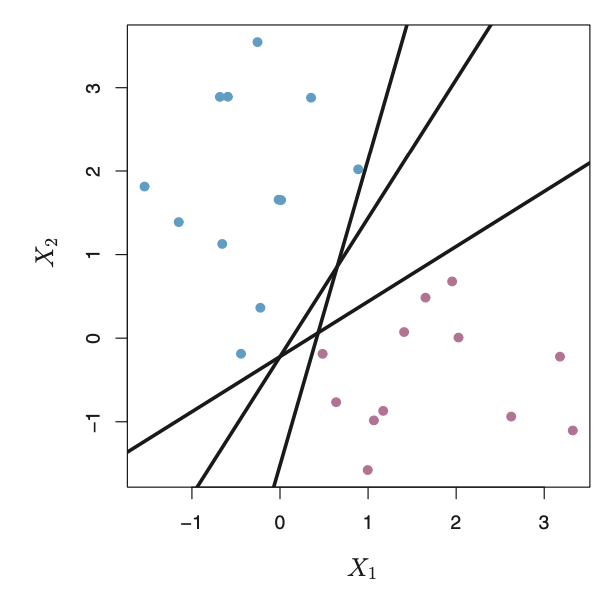
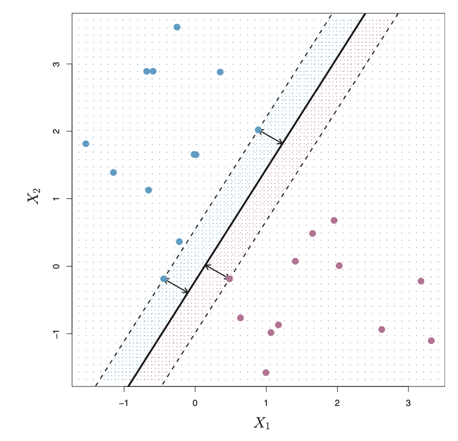
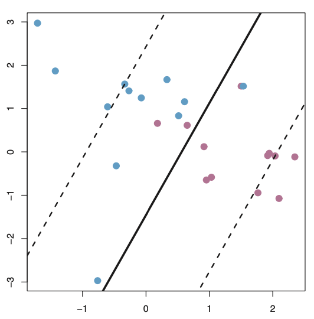
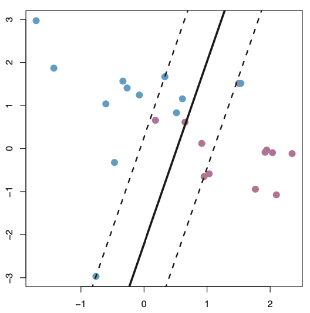

class: inverse

```{r setup, include=FALSE}
options(htmltools.dir.version = FALSE)
knitr::opts_chunk$set(fig.retina = 3, warning = FALSE, message = FALSE)
options(knitr.table.format = "html")
```

```{r xaringan-themer, include=FALSE, warning=FALSE}
library(xaringanthemer)
style_duo_accent(
  primary_color = "#2d708e",
  secondary_color = "#230433",
  link_color = "#55c667",
  text_bold_color = '#f68f46',
  title_slide_background_color = "#ffffff", #"#042333",
  title_slide_background_image = "../../../files/theme/LSE/centre_building_day.jpg",
#    "https://upload.wikimedia.org/wikipedia/commons/1/1a/Workhouse_Nantwich.jpg",
  title_slide_background_size = "cover",
  ) #or contain
```

```{r xaringanextra, include=FALSE, warning=FALSE}
library(xaringanExtra)
xaringanExtra::use_animate_all("slide_left")
xaringanExtra::use_tile_view()
xaringanExtra::use_panelset()
xaringanExtra::style_panelset_tabs(font_family = "inherit")
```

```{r tidyverse, include=FALSE, warning=FALSE}
library(tidyverse)
library(knitr)
theme_set(theme_minimal(base_size = 22))
set.seed(1)
library(broom)
library(modelr)
```

<style type="text/css">
.remark-slide-content {
    font-size: 1.2rem;
    padding: 1em 4em 1em 4em;
}
</style>

# Support Vector Machines

### Classification with linear decision boundaries

We already saw this with logistic regression

$$
\hat y = 1 \iff \hat p > g^{-1}(c) \iff \color{lightgreen}{ \mathbf x^T \beta > c}
$$

--

But we also know that logistic regression fails, for example, if the classes are perfectly separable (zero classification error)

What can we do in that case?

---

### Notation for linear classification

Define a **linear classifier** $f(\mathbf x)$ by

$$
f(\mathbf x) = \beta_0 + \mathbf x^T \beta
$$

with classification boundary $f(\mathbf x) = 0$, and decision rule

$$
G(\mathbf x) = \text{sign}[f(\mathbf x)]
$$

--

**Notation change**: It's convenient to assume $y \in \{ \pm  1 \}$ instead of 0-1

$$
\text{Misclassification } \leftrightarrow y \cdot G(\mathbf x) < 0
$$
---

## How to choose $\beta$?

We just want a linear classification boundary

Forget modeling the class probabilities

Consider the separable case... The classification task should be "easy" but we can't do it with logistic regression


---
class: inverse, middle, center

## First some geometric intuition

### for the separable case 

Then we'll figure out how to extend our new proposed solution to the non-separable case

---

### Geometric intuition: maximize distance

.pull-left[

Many linear classifiers with zero training error
]
.pull-right[

Unique classifier with largest distance
]


.footnote[Figures from Chapter 9 of [ISLR](https://statlearning.com/)]

---

### Maximizing the "margin" (separable case)

**Exercise**: Distance from $\mathbf x$ to the decision boundary $\{ \mathbf z : f(\mathbf z) = 0 \}$, defined as the minimum distance to any point on the boundary,

$$\min \| \mathbf x - \mathbf  z \| \text{ s.t. } f(\mathbf z) = 0$$

is given by (hint: orthogonal projection)

$$\frac{| f(\mathbf x) | }{ \| \beta \|}$$

--

and the smallest such distance in the training data is

$$\min_{1 \leq i \leq n} \frac{| f(\mathbf x_i) | }{ \| \beta \|}$$

---

### Constrained maximisation (separable case)

We could make the margin infinitely large by just sending the decision boundary $\to \infty$ away from all the data... `r emo::ji("zany_face")`

--

Recall that we want to choose *from among those linear classifiers that have **zero** classification errors*

--

Solve the *constrained* optimization problem

So there are infinitely many $\beta$ where on our training data

$$\text{maximize}\left[ \min_{1 \leq i \leq n} \frac{| f(\mathbf x_i) | }{ \| \beta \|} \right]$$
subject to (s.t.)
$$
y_i f(\mathbf x_i) > 0 \text{ for } 1 \leq i \leq n
$$
---
class: inverse

# Hey

## Think about this

$$\max_\beta \left[ \color{lightgreen}{ \min_{1 \leq i \leq n} \frac{| f(\mathbf x_i) | }{ \| \beta \|} } \right]$$
$$
\text{s.t.} \quad y_i f(\mathbf x_i) > 0 \text{ for } 1 \leq i \leq n
$$

### Notice something?...

--

**Recurring theme**: model/optimization/fit depends most strongly (or in this case *only*) on point(s) closest to the boundary

---

### Reformulating optimization (separable case)

**Exercise**: convince yourself this is equivalent to

$$\max_{M, \beta} M$$
$$\text{s.t. }  y_i f(\mathbf x_i) / \| \beta \| \geq M  \text{ for } 1 \leq i \leq n$$
(we have introduced a new variable, $M$, to optimize over)

--

Then, use re-scaling to show it's equivalent to

$$\text{minimize } \| \beta \|$$
$$\text{s.t. }  y_i (\beta_0 + \mathbf x_i^T \beta) \geq 1  \text{ for } 1 \leq i \leq n$$

--

Since $\text{minimize } \| \beta \| \leftrightarrow \text{minimize } \| \beta \|^2$ this is a quadratic program with linear inequality constraints

---
class: inverse

## ML = optimization

Can use standard **convex optimization** methods/software

This is nice because there's a [whole field](https://en.wikipedia.org/wiki/Convex_optimization) of mathematical research dedicated to problemsl like these

- Algorithms converging to *global* optimum

- Guaranteed convergence rates

To learn more check out LSE's MA333 which uses [this book](https://web.stanford.edu/~boyd/cvxbook/)

--

### Is this really necessary?

Community now focused on non-convex (deep learning) methods. "It just works (better)"

---

### Non-separable case

Idea: allow a "budget" for constraint violations

If observation $i$ is misclassified then let $\xi_i/\|\beta\|$ be its distance from the boundary. Solve

$$\text{minimize } \| \beta \|^2$$
$$\text{s.t. for } 1 \leq i \leq n,$$
$$y_i (\beta_0 + \mathbf x_i^T \beta) \geq 1 \color{skyblue}{- \xi_i}$$
$$\color{skyblue}{\xi_i \geq 0, \sum \xi_i \leq C}$$

**Complexity**: $C$ is a tuning parameter (more about this in slide after next one)

---

### "Support vectors"

(Warning: challenging, more advanced, not on the exam)

**Exercise**: use [careful calculus](https://en.wikipedia.org/wiki/Karush%E2%80%93Kuhn%E2%80%93Tucker_conditions) to show the optimal $\hat \beta$ can be written as a linear combination of the feature vectors $\mathbf x_i$.

**Exercise**: also show that $\hat \beta$ can be written as a *sparse* linear combination of $\mathbf x_i$ (with nonzero coefficients only for those observations on or violating the constraint)

(Hint: see ESL 12.2.1)

--

Exact mathematical statement related to our *recurring theme* -- solution depends only on a few observations

---

### Bias-variance trade off (ISLR 9.7)

.pull-left[

.center[
Budget $\uparrow$ \# support vectors $\uparrow$

Bias $\uparrow$  Variance $\downarrow$]
]
.pull-right[

.center[
Budget $\downarrow$ \# support vectors $\downarrow$

Bias $\downarrow$  Variance $\uparrow$]
]

---

### Non-linear classification boundaries

.pull-left[
```{r circle-eg, echo = FALSE, fig.align='center', out.width="500px"}
n <- 800
circle <- data.frame(
  x1 = 1 - 2*runif(n),
  x2 = 1 - 2*runif(n)
) %>% 
  mutate(
    y = factor(rbinom(n, 1, 9/10 - 8*as.numeric(sqrt(x1^2 + x2^2) > .7)/10 ))
  )
circle_plot <-
  ggplot(circle, aes(x1, x2)) +
  geom_point(aes(shape = y, fill = y),
             color = "black", size = 2, stroke = 1,
             show.legend = FALSE, alpha =  .4) +
  scale_shape_manual(values=c(21, 22)) + 
  scale_fill_viridis_d(direction = 1, end = .8)
circle_plot
```
]
.pull-right[
```{r poly-eg, echo = FALSE, fig.align='center', out.width="500px"}
n <- 1600
circle <- data.frame(
  x1 = 1 - 2*runif(n),
  x2 = 1 - 2*runif(n)
) %>% 
  mutate(
    y = factor(rbinom(n, 1, 9/10 - 8*as.numeric(1 - x1/4 - x1^2 + 5*x1*x2 > .5)/10 ))
  )
circle_plot <-
  ggplot(circle, aes(x1, x2)) +
  geom_point(aes(shape = y, fill = y),
             color = "black", size = 2, stroke = 1,
             show.legend = FALSE, alpha =  .4) +
  scale_shape_manual(values=c(21, 22)) + 
  scale_fill_viridis_d(direction = 1, end = .8)
circle_plot
```
]


What if the data looks like this? Game over `r emo::ji("scream")` for linear classifiers? (Piece of cake after we learn about **kernel methods**)

---
class: inverse

### "Generative" supervised learning

Some binary thinking...

- **Science vs humanities**. C. P. Snow, *The Two Cultures and the Scientific Revolution* (1959)

- **Intuition vs logic** or **fast vs slow** (Kahneman, 2011), **fox vs hedgehog** (Berlin, 1953 or Gould, 2003)

- **Algorithm vs inference**, *Statistical Modeling: The Two Cultures* (Breiman, 2001) or *Computer Age Statistical Inference* (Efron and Hastie, 2016)

- **Probabilistic** (generative, random, stochastic) vs **physical** (geometric, deterministic)

(Of course, none of these binaries are "real")

---
class: inverse

### Comparison

Probability axioms = **constraints**

#### Without probability

- Prediction accuracy
- Algorithm efficiency 

--

#### With probability

- Inference: prediction/confidence intervals, hypothesis tests
- Interpretation: coefficients might be meaningful
- Model diagnostics

History according to Efron and Hastie: algorithm first (possibly unconstrained), then inference gradually catches up

---
class: inverse

### Coming soon: **non-linearity**

## Summary of recent development

#### Concretely

- More details on logistic regression
- Support Vector Machines

--

#### Abstractly

- Optimization algorithms / fitting procedures depending more strongly on observations that are more difficult to classify
- Same optimization problem can be written many different ways, can be more or less amenable to theory/algorithms


