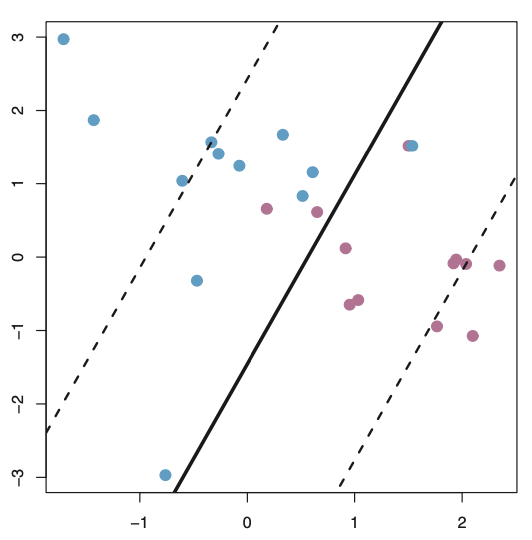
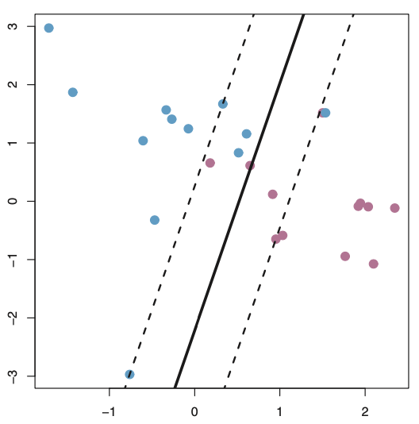

class: inverse

```{r setup, include=FALSE}
options(htmltools.dir.version = FALSE)
knitr::opts_chunk$set(fig.retina = 3, warning = FALSE, message = FALSE)
options(knitr.table.format = "html")
```

```{r xaringan-themer, include=FALSE, warning=FALSE}
library(xaringanthemer)
style_duo_accent(
  primary_color = "#2d708e",
  secondary_color = "#230433",
  link_color = "#55c667",
  text_bold_color = '#f68f46',
  title_slide_background_color = "#ffffff", #"#042333",
  title_slide_background_image = "../../../files/theme/LSE/centre_building_day.jpg",
#    "https://upload.wikimedia.org/wikipedia/commons/1/1a/Workhouse_Nantwich.jpg",
  title_slide_background_size = "cover",
  ) #or contain
```

```{r xaringanextra, include=FALSE, warning=FALSE}
library(xaringanExtra)
xaringanExtra::use_animate_all("slide_left")
xaringanExtra::use_tile_view()
xaringanExtra::use_panelset()
xaringanExtra::style_panelset_tabs(font_family = "inherit")
```

```{r tidyverse, include=FALSE, warning=FALSE}
library(tidyverse)
library(knitr)
theme_set(theme_minimal(base_size = 22))
set.seed(1)
library(broom)
library(modelr)
```

<style type="text/css">
.remark-slide-content {
    font-size: 1.2rem;
    padding: 1em 4em 1em 4em;
}
</style>


This lecture is about

# Linearity

in

## supervised machine learning

and especially

### Support Vector Machines

along with other context


---
class: inverse

### Classification

Supervised learning with categorical/qualitative outcomes

"Labels"

Binary thinking might be easier $\rightarrow$ bin / discretise numeric outcomes and do classification instead of regression (warning: information loss)

---

### Mental warm-up: logistic regression 

$$\mathbb E(Y| \mathbf X = \mathbf x) =  g^{-1}(\mathbf x^T \beta)$$
for
$$g(p) = \log{\left(\frac{p}{1-p}\right)}$$

- Other GLMs have different "link" functions $g$
- (Linear regression is a special case with $g = \text{id}$)
- Multi-class / multinomial / "softmax" regression
- Estimation/optimization: maximum-likelihood via Newton-Raphson / IRLS

---

```{r logit-data, echo = FALSE}
set.seed(42)
n <- 50
Y <- rbinom(n, 1, .5)
train <- data.frame(
  y = factor(Y),
  x1 = rnorm(n) + 1.5*Y,
  x2 = rnorm(n) + 1.2*Y
)
```

### One predictor, binary outcome

```{r logit-1dm, echo = FALSE, fig.align='center', out.width="540px"}
eg1 <- ggplot(train, aes(x1, y)) +
  geom_point(aes(color = y), show.legend = FALSE, alpha = .4) +
  geom_line(
    data = augment(
      glm(y ~ x1, family = "binomial", data  = train),
      type.predict = "response"
    ),
    aes(x1, .fitted + 1),
    size = 1
  ) + scale_color_viridis_d(option = "D", end = .8) +
  annotate("text", x = 0.2, y = 1.5, label = "g^{-1}", size = 6, parse = TRUE) 
eg1
```

---

### Classifications/decisions: threshold probability

```{r logit-1d-class, echo = FALSE, fig.align='center', out.width="540px"}
eg1 +
  annotate("segment", x = .9, xend = .9, y = .8, yend  = 2.2, linetype = "dashed", size = 1, color = "blue") +
  geom_point(data =  train,
             aes(color =  y), alpha =  .4,
             show.legend = FALSE) +
  annotate("text", x = -.25, y = 2.2, color = "red",
           label = "false negatives", size = 6) +
  annotate("text", x = 2, y = 2.2,
           label = "true positives", size = 6) +
  annotate("text", x = -.25, y = .8,
           label = "true negatives", size = 6) +
  annotate("text", x = 2, y = .8, color = "red",
           label = "false positives", size = 6) 
```

---

### Without giving $y$ a spatial dimension

```{r logit-0d-class, echo = FALSE, fig.align='center', out.width="540px"}
ggplot(train, aes(x1, y = 0)) +
  geom_point(aes(color = y), show.legend = FALSE, alpha =  .4) +
  scale_color_viridis_d(option = "D", end = .8) +
  ylim(c(-.2,.2)) +
  annotate("segment", x = .9, xend = .9, y = -.1, yend  = .1, linetype = "dashed", size = 1, color = "blue")
```


---

### Two predictors, binary outcome

```{r logit-data-plot, echo = FALSE, fig.align='center', out.width="540px"}
train_plot <-
  ggplot(train, aes(x1, x2)) +
  geom_point(aes(shape = y, fill = y),
             color = "black", size = 2, stroke = 1,
             show.legend = FALSE, alpha =  .4) +
  scale_shape_manual(values=c(21, 22)) + 
  scale_fill_viridis_d(direction = -1, end = .8)
train_plot
```


---

### Contours of GLM-predicted class probabilities

```{r logit-contour, echo = FALSE, fig.align='center', out.width="540px"}
logit_model <-  glm(y ~ x1 + x2, family = "binomial", data = train)
logit_surface <- logit_model %>%
   augment(type.predict = "response",
              newdata = data_grid(data = train,
                                  x1 = seq_range(x1, 100, expand = .1),
                                  x2 = seq_range(x2, 100, expand = .1)))
ggplot(
  data = logit_surface,
  aes(x1,x2)) +
  geom_contour_filled(
    aes(z = .fitted),
    show.legend = FALSE,
    alpha = .3,
    ) +
  geom_abline(slope = -coef(logit_model)[2]/coef(logit_model)[3],
              intercept = 3.05, linetype = "dashed", size = 1, color = "blue") +
  geom_point(
    data = train,
             aes(shape = y, color = y),
             size = 2, stroke = 1, alpha = .9,
             show.legend = FALSE) +
  scale_shape_manual(values=c(21, 22)) + 
  scale_color_viridis_d(option = "viridis", direction = -1, end = .8) + 
  scale_fill_viridis_d(option = "viridis", end = .8) +
  geom_point(
    data = augment(logit_model,
                   type.predict = "response") %>%
      mutate(yhat = as.numeric(.fitted > .56),
             class = as.numeric(y)-1 == yhat) %>%
      filter(class == FALSE),
    aes(shape = y, color = y),
             stroke = 1.5, alpha = .9,
             show.legend = FALSE,
    fill = "red", size = 3)
```

---
class: middle, center

**Classification boundaries** with

## $p = 3$ predictors

### Boundary = plane

## $p > 3$ predictors

### Boundary = hyperplane

(In practice, "high-dimensional" = can't easily plot it)

---

### Logistic regression fitting

Newton-IRLS (equivalent) steps:

$$
\begin{eqnarray}
\hat{\mathbf p}_t & = & g^{-1}(\mathbf X \hat \beta_t)
& \ \text{ update probs.} \\
\mathbf W_t & = & \text{diag}[\hat{\mathbf p}_t (1 - \hat{\mathbf p}_t)]  
& \ \text{ update weights} \\
\hat{\mathbf{y}}_t & = & g(\hat{\mathbf p}_t) + \mathbf W_t^{-1}(\mathbf y - \hat{\mathbf p}_t)
& \ \text{ update response}
\end{eqnarray}
$$

and then update parameter estimate:

$$\hat{\beta}_{t+1} = \arg \min_{\beta} (\hat{\mathbf{y}}_t - \mathbf X \beta)^T \mathbf W_t (\hat{\mathbf{y}}_t - \mathbf X \beta)$$ 

**Note**: larger weights on observations with $\hat p$ closer to 1/2, i.e. the most difficult to classify (*look for variations of this theme*)

.footnote[See Section 4.4.1 of [ESL](https://web.stanford.edu/~hastie/ElemStatLearn/)]

---

###  Challenges

#### Separable case (guaranteed if $p > n$)

If classes can be perfectly separated, the MLE is undefined, fitting algorithm diverges as $\hat \beta$ coordinates $\to \pm \infty$

Awkwardly, classification is *too easy*(!?) for this probabilistic approach

--

#### Curse of dimensionality

Biased MLE and wrong variance/asymp. dist. if $n/p \to \text{const}$, even if $> 1$

.footnote[See [Sur and Candès, (2019)](https://www.pnas.org/content/116/29/14516)]

---
class: inverse

### "Generative" supervised learning

Some binary thinking...

- **Science vs humanities**. C. P. Snow, *The Two Cultures and the Scientific Revolution* (1959)

- **Intuition vs logic** or **fast vs slow** (Kahneman, 2011), **fox vs hedgehog** (Berlin, 1953 or Gould, 2003)

- **Algorithm vs inference**, *Statistical Modeling: The Two Cultures* (Breiman, 2001) or *Computer Age Statistical Inference* (Efron and Hastie, 2016)

- **Probabilistic** (generative, random, stochastic) vs physical (geometric, deterministic)

(Of course, none of these binaries are "real")

---
class: inverse

### Comparison

Probability axioms = **constraints**

#### Without probability

- Prediction accuracy
- Algorithm efficiency 

--

#### With probability

- Inference: prediction/confidence intervals, hypothesis tests
- Interpretation: coefficients might be meaningful
- Model diagnostics

History according to Efron and Hastie: algorithm first (possibly unconstrained), then inference gradually catches up

---

### Support Vector Machines

What if we just want a linear classification boundary?

Forget modeling the class probabilities (maybe inference can catch up later)

Consider the separable case... Classification should be easy!

---

### Support Vector Machines

Define a **linear classifier** $f(\mathbf x)$ by

$$
f(\mathbf x) = \beta_0 + \mathbf x^T \beta
$$

with classification boundary $f(\mathbf x) = 0$, and decision rule

$$
G(\mathbf x) = \text{sign}[f(\mathbf x)]
$$

**Notation change**: It's convenient to assume $y \in \{ \pm  1 \}$ instead of 0-1

$$
\text{Misclassification } \leftrightarrow y \cdot G(\mathbf x) < 0
$$

--

#### How to choose $\beta$?

---
class: inverse, middle

## First some geometric intuition

### Then an interesting tour of generally useful optimization ideas

After SVMs we'll connect these ideas to other methods like ridge regression and lasso (i.e. $\ell^1$-penalized regression)

---

### Geometric intuition: maximize distance

.pull-left[

Many linear classifiers with zero training error
]
.pull-right[

Unique classifier with largest distance
]


.footnote[Figures from Chapter 9 of [ISLR](https://statlearning.com/)]

---

### Maximizing the "margin" (separable case)

Distance from $\mathbf x$ to the decision boundary $\{ \mathbf z : f(\mathbf z) = 0 \}$ 

$$\min \| \mathbf x - \mathbf  z \| \text{ s.t. } f(\mathbf z) = 0$$

is (by orthogonal projection)

$$\frac{| f(\mathbf x) | }{ \| \beta \|}$$
and the smallest such distance in the training data is

$$\min_{1 \leq i \leq n} \frac{| f(\mathbf x_i) | }{ \| \beta \|}$$

---

### SVM estimation/optimization (separable case)

So there are infinitely many $\beta$ where on our training data

$$
y_i f(\mathbf x_i) > 0 \text{ for } 1 \leq i \leq n
$$
and we want to find the unique one of these solving

$$\text{maximize}\left[ \min_{1 \leq i \leq n} \frac{| f(\mathbf x_i) | }{ \| \beta \|} \right]$$

(*Recurring theme*: optimization/fit depends (more strongly / only) on point(s) closest to the boundary)

---

### Reformulating optimization (separable case)

**Exercise**: convince yourself this is equivalent to

$$\text{maximize } M$$
$$\text{s.t. }  y_i f(\mathbf x_i) / \| \beta \| \geq M  \text{ for } 1 \leq i \leq n$$

--

Then, use re-scaling to show it's equivalent to

$$\text{minimize } \| \beta \|$$
$$\text{s.t. }  y_i (\beta_0 + \mathbf x_i^T \beta) \geq 1  \text{ for } 1 \leq i \leq n$$

--

Since $\text{minimize } \| \beta \| \leftrightarrow \text{minimize } \| \beta \|^2$ this is a quadratic program with linear inequality constraints, i.e. can use **convex optimization** methods

---

### Non-separable case

Idea: allow a "budget" for constraint violations

If observation $i$ is misclassified then let $\xi_i/\|\beta\|$ be its distance from the boundary. Solve ("soft" SVM in the UML book)

$$\text{minimize } \| \beta \|^2$$
$$\text{s.t. for } 1 \leq i \leq n,$$
$$y_i (\beta_0 + \mathbf x_i^T \beta) \geq 1 - \xi_i$$
$$\xi_i \geq 0, \sum \xi_i \leq C$$

**Complexity**: $C$ is a tuning parameter (more about this in a moment)

---

### "Support vectors"

**Exercise**: use any formulation of the SVM optimization problem and [careful calculus](https://en.wikipedia.org/wiki/Karush%E2%80%93Kuhn%E2%80%93Tucker_conditions) to show the optimal $\hat \beta$ can be written as a linear combination of the feature vectors $\mathbf x_i$.

**Exercise**: also show that $\hat \beta$ can be written as a *sparse* linear combination of $\mathbf x_i$ (with nonzero coefficients only for those observations on or violating the constraint)

(Hint: see ESL 12.2.1)

--

This formalizes part of the *recurring theme* -- solution depends only on a few observations, those closest to the boundary

#### Could provide significant dimension reduction!

---

### Bias-variance trade off (ISLR 9.7)

.pull-left[

.center[
Budget $\uparrow$ \# support vectors $\uparrow$

Bias $\uparrow$  Variance $\downarrow$]
]
.pull-right[

.center[
Budget $\downarrow$ \# support vectors $\downarrow$

Bias $\downarrow$  Variance $\uparrow$]
]

---

### Non-linear classification boundaries

.pull-left[
```{r circle-eg, echo = FALSE, fig.align='center', out.width="500px"}
n <- 800
circle <- data.frame(
  x1 = 1 - 2*runif(n),
  x2 = 1 - 2*runif(n)
) %>% 
  mutate(
    y = factor(rbinom(n, 1, 9/10 - 8*as.numeric(sqrt(x1^2 + x2^2) > .7)/10 ))
  )
circle_plot <-
  ggplot(circle, aes(x1, x2)) +
  geom_point(aes(shape = y, fill = y),
             color = "black", size = 2, stroke = 1,
             show.legend = FALSE, alpha =  .4) +
  scale_shape_manual(values=c(21, 22)) + 
  scale_fill_viridis_d(direction = 1, end = .8)
circle_plot
```
]
.pull-right[
```{r poly-eg, echo = FALSE, fig.align='center', out.width="500px"}
n <- 1600
circle <- data.frame(
  x1 = 1 - 2*runif(n),
  x2 = 1 - 2*runif(n)
) %>% 
  mutate(
    y = factor(rbinom(n, 1, 9/10 - 8*as.numeric(1 - x1/4 - x1^2 + 5*x1*x2 > .5)/10 ))
  )
circle_plot <-
  ggplot(circle, aes(x1, x2)) +
  geom_point(aes(shape = y, fill = y),
             color = "black", size = 2, stroke = 1,
             show.legend = FALSE, alpha =  .4) +
  scale_shape_manual(values=c(21, 22)) + 
  scale_fill_viridis_d(direction = 1, end = .8)
circle_plot
```
]


What if the data looks like this? Game over `r emo::ji("scream")` for linear classifiers?

---

### Feature transformation

- First, embed predictors in a higher-dimensional space

$$
\mathbf x \mapsto h(\mathbf x)
$$

.center[*unsupervised step, without using the outcome*]

--

- Then solve classification (or regression) problem optimizing over much larger(?) space of functions

e.g., this doubles the number of parameters

$$
(x_1, x_2) \mapsto (x_1, x_2, x_1^2, x_2^2, x_1x_2)
$$
$$
f(\mathbf x) = \beta_0 + \beta_1 x_1 + \beta_2 x_2 + \beta_3 x_1^2 + \beta_4 x_2^2 + \beta_5 x_1x_2
$$
is **linear** in the higher-dimensional features

---

### But... which transformations?

- If original feature space has $p > 3$ may not be able to "see" any obvious choices (like previous circle example)

--

- Some choices with nice mathematical and computational properties, and often good performance in practice: **kernels**

--

Background reading on related mathematical concepts/results: [Linear duality](https://en.wikipedia.org/wiki/Dual_space), [Riesz representation theorem](https://en.wikipedia.org/wiki/Riesz_representation_theorem), [RKHSs](https://en.wikipedia.org/wiki/Reproducing_kernel_Hilbert_space), "[Kernel trick](https://en.wikipedia.org/wiki/Kernel_method)", [Representer theorem](https://en.wikipedia.org/wiki/Representer_theorem)

Two key ingredients:

1. Algorithm/optimization depends on transformed features *only through inner products evaluated on training data*
2. Aforementioned inner products can be computed fast

---

### Kernel methods

I think of these as something like a "parametric version of nearest neighbors"

A **kernel function** is just a generalization of a positive definite matrix, i.e. also an inner product or similar measure

e.g. (in ESL), for any inner product $\langle \cdot, \cdot \rangle$

- $K(\mathbf x, \mathbf x') = \langle \mathbf x, \mathbf x' \rangle$ is a kernel, and so are

--

- $K(\mathbf x, \mathbf x') = (1 + \langle \mathbf x, \mathbf x' \rangle )^d$ - degree $d$ polynomial

- $K(\mathbf x, \mathbf x') = \exp(-\gamma \| \mathbf x - \mathbf x' \|^\alpha)$ - radial basis, $\alpha = 1$ or $2$

- $K(\mathbf x, \mathbf x') = \tanh(\kappa_1 \langle \mathbf x, \mathbf x' \rangle + \kappa_2)$ - neural network

---

### OK but what do these give us?

- Fairly automatic way to vastly expand feature space, possibly achieving perfect separation of classes in higher dimensions

e.g. For degree $d$ polynomial, dimension $p \mapsto \binom{p+d}{d}$

--

- Fast algorithms for trading off complexity

Vary cost parameter, tune with (cross)validation data

Computational complexity depends $n$ and not $p$, between $o(n^3)$ and $o(n^2)$ depending on problem specifics

--

- Theory of RKHSs 

Provide guarantees, write papers...

---

## Some cool theorems

**Theorem** (Moore–Aronszajn)

For any kernel $K$, there is a (unique) corresponding Hilbert space of functions [for which $K$ defines the inner product], and a natural norm $\| \mathbf x \| = \langle \mathbf x, \mathbf x \rangle^{1/2} = K(\mathbf x, \mathbf x)^{1/2}$

---

## Representer theorems

**Theorem** (Wahba, 1990)

For certain loss functions $V$, and any kernel $K$, the minimizer of

$$\sum_{i=1}^n V(y_i - f(\mathbf x_i)) + \lambda \| f \|$$
where $\| \cdot \|$ is the norm associated with $K$, has the form

$$
\hat f(\cdot) = \sum_{i=1}^n \hat a_i K(\cdot, \mathbf x_i)
$$

Potentially infinite dimensional problem? *Nope, at most* $n$

---

## Representer theorems

**Theorem** (Scholkopf, Herbrich, Smola, 2001)

Extended Wahba's result to more general loss functions and penalties of the form

$$
g(\| f \|)
$$
for any strictly increasing $g(\cdot)$

--

#### Intuition?

Penalized ERM over a function class that's infinite dimensional...

but we only have $n$ observations and it is the *empirical* risk over these $n$...

---

### Algorithms other than SVM?

Yes, a few...

- Smoothing splines
- Ridge/lasso regression
- Gaussian processes
- PCA/CCA
- Spectral clustering

Versions of all of these can be combined with feature map and kernel combinations that allow fast evaluation and optimization

---

### Recent kernel usefulness

*To understand deep learning we need to understand kernel learning.* (Belkin, Ma, and Mandal, [ICML 2018](https://arxiv.org/abs/1802.01396))

> ... Certain key phenomena of deep learning are manifested similarly in kernel methods in the modern "overfitted" regime. ...

e.g. Zero training error but not overfit... not surprising!

---

### What about logistic regression?


---

### SVM vs logistic regression


- SVM preferable if classes separated

- KLR comparable to kernel SVM

- Support vector property: SVM robust to outliers

- It is, apparently, somewhat of a *historical accident* `r emo::ji("roll_eyes")` that the kernel method became associated with SVMs

---
class: inverse

### Winner's curse?

Algorithm $\to$ inference, history rhyming

1. New algorithm drops, impressive results
2. Grandiose claims about algorithm's novelty and "secret sauce"
3. People start realizing what isn't new, and that the secret sauce [can be used](https://xkcd.com/1838/) as an ingredient in other algorithms 

ESL:

> *In the early literature on support vectors, there were claims that the kernel property of the support vector machine is unique to it and allows one to finesse the curse of dimensionality. Neither of these claims is true...*


---


Why am I telling you this?

---


### Some things are (relatively) timeless...

# Mathematical foundations!

Linear algebra and functional analysis: linearity, orthogonality, additivity, basis expansions, duality, etc

Optimization: regularization, equivalent/similar problems, sparsity (primal/dual or observations/parameters), etc


(*Maybe you'll see this history rhyming again when we talk about neural networks, or for some not-yet invented new thing...*)

---

### Lasting impacts of SVM/kernels

- Support Vectors

Solution typically depends on only a fraction of training data

Sparsity in observations, robustness

--

- "Automatic" feature engineering

Outside low-dimensional motivating examples, typically don't choose type of kernel very carefully

Ultra-algorithmic supervised ML philosophy: focus on expanding **expressivity** of the function class, let efficient optimization algorithms do the work of "respecting the structure in the data"

Influential idea $\to$ deep learning


---
class: inverse

## End of SVM part

### Time for break

Then: a kernel bridge to high-dimensional regression

and sparsity in features, rather than training examples

---

### General kernel usefulness

Consider e.g. kernel ridge regression

$$\text{minimize } \sum_{i=1}^n (y_i - f(\mathbf x_i))^2 + \lambda \| f \|^2$$
minimizing over an RKHS with norm $\| \cdot \|$. Then, good things happen, e.g.

$$
\hat f(\mathbf x) = \mathbf k(\mathbf x)^T (\mathbf K + \lambda n \mathbf I)^{-1} \mathbf y
$$
where $\mathbf k(\cdot)^T = [K(\mathbf x_1, \cdot ), \ldots, K(\mathbf x_n, \cdot)]$ and $\mathbf K_{ij} = K(\mathbf x_i, \mathbf x_j)$

--

**Bayesian interpretation**: MAP estimator for a *Gaussian Process prior on function space* with GP covariance $K$

.footnote[Adapted from [these](https://en.wikipedia.org/wiki/Bayesian_interpretation_of_kernel_regularization) [notes](https://arxiv.org/abs/1106.6251)]


---

### Ridge regression

Also called [Tikhonov regularization](https://en.wikipedia.org/wiki/Tikhonov_regularization) or $L^2$-penalized regression

#### Problem: 

Design matrix $\mathbf X$ is ill-conditioned or rank deficient, OLS estimator 

$$
\hat \beta = 
(\mathbf X^T \mathbf X)^{-1} \mathbf X^T  \mathbf y
$$
may be highly variable or undefined because $\mathbf X^T \mathbf X$ is (close to being) uninvertible

--

Guaranteed to happen in **high-dimensional regression** where number of predictors $p > n$, the sample size

---

### High-dimensional regression

#### Problem:

With $p > n$, there are generally infinitely many $\beta$ satisfying

$$
y = \mathbf X \beta
$$
Least squares has no unique solution

--

#### Ridge solution

Solve a different, penalized optimization problem

$$\text{minimize} \| y - \mathbf X \beta \|^2 + \lambda \| \beta \|^2$$
for some $\lambda > 0$.

---

### Ridge solution

It's basically calculus to show this has solution

$$
\hat \beta = (\mathbf X^T \mathbf X + \lambda \mathbf I)^{-1} \mathbf X^T \mathbf y
$$
where $\mathbf I$ is the $n \times n$ identity matrix.

--

**Linearity**: similarly to OLS, the solution is linear in $\mathbf y$.

**Bayesian interpretation**: MAP estimate for a prior $\beta \sim N(0, \tau^2 \mathbf I)$ with likelihood $\mathbf y | \mathbf X, \beta \sim N(\mathbf X \beta, \sigma^2 \mathbf I)$

---

### Lasso solution

Notationally similar, just replace the 2-norm penalty with a 1-norm

$$\| \beta \|_1 = \sum_{j=1}^p |\beta_j|$$
and solve

$$\text{minimize} \| y - \beta_0 - \mathbf X \beta \|^2 + \lambda \| \beta \|_1$$

--

**No closed-form**: optimization requires iterative algorithms

**Sparsity**: solutions $\hat \beta$ usually have few nonzero entries

Sparse linear models may be considered simpler and more interpretable


---

### Lasso regularization solution path


---

### Optimization 

Like SVMs, $\exists$ different formulations. *Re-parametrizations*

#### Constrained form (entire solution path)

$$\text{minimize} \| y - \beta_0 - \mathbf X \beta \|^2$$
$$\text{s.t. } \| \beta \|_1 \leq t$$
--

Solve this for some $t$ $\leftrightarrow$ solve the **Lagrangian form** for some $\lambda$

#### Square-root lasso (alternative to cross-validation)

$$\text{minimize} \| y - \beta_0 - \mathbf X \beta \| + \lambda \| \beta \|_1$$

Solve this for deterministic $\lambda$ $\leftrightarrow$ solve lasso at *random* $\hat \lambda$

---

### Sparsity in feature space

Constrained form + this famous picture (ESL 3.1, lasso vs ridge)


---
class: inverse

## The end, for now

In the next part, lecture 6 of the term

- First we'll resume studying the lasso and high-dimensional inference

- Then we'll turn to neural networks

---

### References

- [ESL](https://web.stanford.edu/~hastie/ElemStatLearn/) Chapter 12 for SVMs, 3.4 for ridge and lasso. Supplementary: 5.8 for RKHS in the splines context, and 6 on kernel regression

- [SLS](https://web.stanford.edu/~hastie/StatLearnSparsity/) Chapter 2 on the lasso

#### Other kernel method readings

- [AoS paper](https://projecteuclid.org/euclid.aos/1211819561) with solid definition-theorem presentation for statisticians ([arxiv version](https://arxiv.org/abs/math/0701907))

- R package vignettes for [`kernlab`](https://cran.r-project.org/web/packages/kernlab/vignettes/kernlab.pdf) and/or [`e1071`](https://cran.r-project.org/web/packages/e1071/vignettes/svmdoc.pdf)

- Python scikit learn documentation for [kernel ridge](https://scikit-learn.org/stable/modules/kernel_ridge.html) and [svm](https://scikit-learn.org/stable/modules/svm.html)


