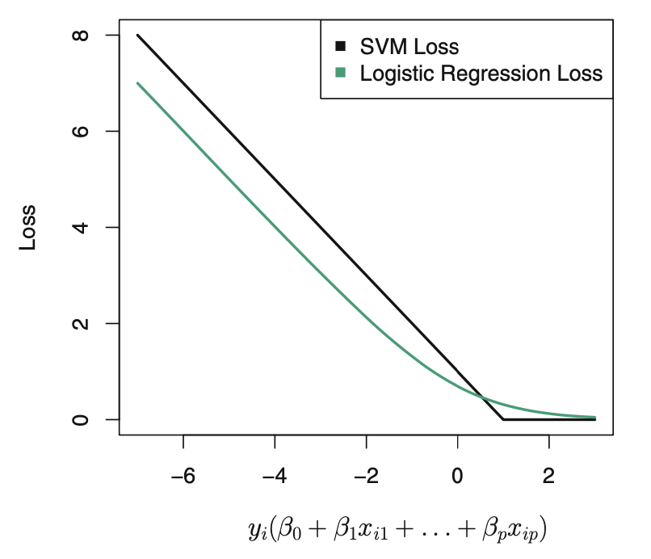

class: inverse

```{r setup, include=FALSE}
options(htmltools.dir.version = FALSE)
knitr::opts_chunk$set(fig.retina = 3, warning = FALSE, message = FALSE)
options(knitr.table.format = "html")
```

```{r xaringan-themer, include=FALSE, warning=FALSE}
library(xaringanthemer)
style_duo_accent(
  primary_color = "#2d708e",
  secondary_color = "#230433",
  link_color = "#55c667",
  text_bold_color = '#f68f46',
  title_slide_text_color = "#292929",
  title_slide_background_color = "#ffffff", #"#042333",
  title_slide_background_image = "../../../files/theme/LSE/spiral_stairs.jpg",
#    "https://upload.wikimedia.org/wikipedia/commons/1/1a/Workhouse_Nantwich.jpg",
  title_slide_background_size = "cover",
  ) #or contain
```

```{r xaringanextra, include=FALSE, warning=FALSE}
library(xaringanExtra)
xaringanExtra::use_animate_all("slide_left")
xaringanExtra::use_tile_view()
xaringanExtra::use_panelset()
xaringanExtra::style_panelset_tabs(font_family = "inherit")
```

```{r tidyverse, include=FALSE, warning=FALSE}
library(tidyverse)
library(knitr)
theme_set(theme_minimal(base_size = 22))
set.seed(1)
library(broom)
library(modelr)
```

<style type="text/css">
.remark-slide-content {
    font-size: 1.2rem;
    padding: 1em 4em 1em 4em;
}
</style>

## Recollections

Since the beginning of the term we've seen

- Fitting different kinds of models
  - Least squares (global/linear and local/flexible)
  - Newton-Raphson for logistic regression / GLM / MLE
  - Defining SVMs via optimization problems
  
--
  
- Making models more complex
  - Adding variables
  - More flexible functions
  
--

This lecture: **optimization** as a unifying framework for ML

---

## ML tasks as optimization problems

For a given **loss function** $L(x,y,g)$ and **probability model** $(X,Y) \sim P$, we want to minimize the **risk**

$$
\text{minimize } R(g) = \mathbb E_P[L(X,Y,g)]
$$
--

**Sampling assumption**: we have an i.i.d. sample from $P$

Then we focus on **empirical risk minimization** (ERM)

$$
\text{minimize } \frac{1}{n} \sum_{i=1}^n L(x_i, y_i, g)
$$

--

We also choose a **function class** (or parameter set), i.e. type of $g$, determining the domain of the optimization


---

### Example: GLMs

- Probability model: the family of the GLM (e.g. binomial)
- Empirical loss function: negative log-likelihood (MLE)
- Function class: set of (parametric) functions of the form

$$
f_\beta(\mathbf x) = g^{-1}(\mathbf x^T \beta)
$$
for some $(p+1)$-dimensional vector of parameters, fixed link function $g$

- Make it more complex:
  - Add more predictors (new ones, or non-linear transformations, interactions, etc)
  - Localize it: for some flexible, non-linear $h$ (e.g. `loess`) 
  
  $$
  f(\mathbf x) = g^{-1}(h(\mathbf x))
  $$

---

### Parametric vs "non"-parametric

For G**L**M, Newton-Raphson gives us $\hat \beta$, i.e. $\hat f$

For `loess`, we choose (or use the default) `span` and then do local logistic regression to get $\hat f$

(using a multi-dimensional analogue of `loess` if necessary)

--

In both cases, we have computed the empirical risk minimizer $\hat f$ over some function class

--

**Key optimization choice**: which function class?

- Multivariate linear case: which predictors to include?
- `loess` case: what `span` value?

---

### Example: SVM

- Probability model: ...
- Empirical loss function: **hinge** loss, $[\ ]_+$ means positive part

$$\frac{1}{n} \sum_{i=1}^n [1 - y_i(\mathbf x_i^T \beta - \beta_0)]_+$$

Next slide: ISLR Figure 9.2 plot of $L(y_i \hat y_i) = [1-y_i\hat y_i]_+$

- Function class: linear classifiers $f(\mathbf x) = \text{sign}(\mathbf x^T \beta + \beta_0)$

- Make it more complex

  - Add more predictors
  - Reduce constraint-violation budget (non-sep. case)
  - Make it flexibly non-linear (future lecture)

---

### Example: SVM

```{r, echo=FALSE, out.width="80%"}

```

---

### Comparison: logistic vs SVM

- Similar classification performance possible with both
  - Compare "apples to apples," e.g. both non-linear
- Logistic advantage: inference
- SVM advantage: computation

--

**Key optimization choice**: which function class?

- Multivariate linear case
  - Which predictors to include?
  - What constraint budget value?
- Non-linear case: choosing the analogue of the `span` value

---

### ML design choices

Pattern repeats as we introduce more ML methods (kernel methods, tree-based methods, neural networks, etc)

- Loss function (RSS, MLE, hinge, etc)

--

- Class of regression/classification functions (linear, parametric non-linear, some specific kind of non-parametric non-linear like `loess`, etc)

--

- Algorithm for fitting an optimal function *within* that class (choosing which predictors to include, estimating coefficients, choosing `span` or SVM constraint budget, etc)

--

**Statistics** ...often forgotten in ML! Key assumptions: **i.i.d.** data **sampled from desired probability distribution** (bias - "dataset/distribution shift")

---
class: inverse, center, middle


## Optimization strategies

### Choosing predictor variables

---

### Best subset selection


- Try all $2^p$ subsets of predictor variables

- Keep the best one (based on RSS or deviance or something)

--

- Problem: complexity exponential in $p$, over $10^9$ models if $p = 30$

---

### Forward stepwise/stagewise selection

"Greedy" approximation to best subset

1. Start with no predictors
2. At each step, find the one predictor (or a few, in stagewise) giving the best improvement (reduction in the loss function) over the current model
3. Add the best predictor(s) and iterate

--

- Greedy: not guaranteed to find the best model

- Computation: only $\binom{p}{2}$ models, e.g. 435 if $p = 30$

--

- **Problem**: when to stop adding more variables? After how many steps? (We'll come back to this)

---

### Modeling assumption: sparsity

We might be willing to assume that a "true" (good enough) model contains only a few predictors

--

We call this **sparsity**, and may even refer to the number of variables as "the sparsity" of the model, or look for "the best 5-sparse model"

[Motivation](https://en.wikipedia.org/wiki/Occam%27s_razor): Occam's razor / law of parsimony -- simpler models/theories are philosophically/scientifically preferable

--

#### Sparse best subsets

Now only $\sum_{k=1}^s \binom{p}{k}$ models to try, if sparsity assumed $\leq s$

e.g. about 174000 if $p = 30$ and $s = 5$

---

### Coming soon: lasso

Another method to choose predictor variables

Based on sparsity assumption

Can think of it as a *less greedy* version of forward stepwise

---
class: inverse, center, middle


## Optimization strategies

### Choosing tuning parameters


Degree of flexibility for non-linear methods, constraint budget for SVM, etc

---

## Discretize and fit sequentially

- Start with a grid of values for the tuning parameter
- Fit the model for each value in this grid
- Pick the best fit (visually, or based on loss function value, or...)

--

e.g. For the `span` or fraction $s$ in local regression, try $s \in \{ 0.1, 0.25, 0.5, 0.75, 0.9 \}$ and visualize the result

--

e.g. For the budget ("soft margin") $C$ in SVM, try $C \in \{ 2^{k} : k = -4, -2, 0, \ldots, 10 \}$ 

--

- **Problem**: When to stop increasing the complexity? (i.e. decreasing $s$ or $C$)


---

### Modeling assumption: smoothness

Version of simplicity/parsimony for flexible function classes

--

Linear functions are the smoothest

Smooth function classes: set of functions with some type of bound on second derivatives, for example

--

**Cool math fact**: can be related to sparsity by considering (rate of decay of) coefficients of function's Fourier transform (smoother functions have sparser representations when written in a basis of sine functions, for example)

---
class: inverse, center, middle

## Optimization strategies

### "Scaling up" to "big data"

---

### Calculus with the loss function, revisited

Downside of Newton-Raphson: requires second derivatives, including *inverting the $p \times p$ Hessian matrix* when optimizing over $p > 1$ parameters

If $p$ is large, **second-order** optimization methods like Newton's are very costly

--

First order methods only require computing the $p \times 1$ gradient vector

Recall that the gradient is a vector in the *direction of steepest increase* in the parameter space

---

### Gradient (steepest) descent

i.e. skiing as fast as possible. Notation, let

$$L(\beta) = L(\mathbf X, \mathbf y, g_\beta)$$

1. Start at an initial point $\beta^{(0)}$

2. For step $n = 1, \ldots$
  - Compute $\mathbf d_n = \nabla L(\beta^{(n-1)})$
  
  - Update $\beta^{(n)} = \beta^{(n-1)} - \gamma_n \mathbf d_n$
  
3. Until some convergence criteria is satisfied

--

Where the **step size** $\gamma_n$ is made small enough to not "overshoot" and increase the loss, i.e. the loss only decreases

---

### Coordinate descent

Update only one *coordinate* of $\beta$ in each step

Cycle through coordinates until some convergence criteria is satisfied

--

Can combine with any strategy for univariate optimization -- e.g. one-dimensional Newton's method -- treating other parameters as constants

---
class: inverse, center, middle

## Optimization strategies

### Scale up *more*! Bigger data! 


---

### Stochastic/random descent

- Instead of cycling through all coordinates in coordinate descent, just pick one randomly

- Instead of computing the gradient of the loss function on the entire dataset, compute it on a random sample

--

By identical distribution assumption, for any $i'$, by linearity `r emo::ji("shooting_star")` of $\nabla$ and $\mathbb E$ and $\sum$,

$$\mathbb E [ \nabla L(\mathbf x_{i'}, \mathbf y_{i'}, g_\beta) ] = \mathbb E \left[ \frac{1}{n} \sum_{i=1}^n \nabla L(\mathbf x_i, \mathbf y_i, g_\beta) \right]$$
--

Compute update using one randomly sampled observation

or a randomly sampled subset ("mini-batch SGD")

---
class: inverse, center, middle

## Optimization strategies

### A few special topics in conclusion

---

### Constrained optimization

Remember, some of our optimization problems have constraints on the parameters, e.g. SVM

**Problem**: What if the steps in these descent methods take us outside the parameter constraint region?

--

**Solution strategy**: Choose step sizes small enough to stay inside the constraint region

**Solution strategy**: *Project* from the updated point that is outside the constraint region to the *nearest* point inside the constraint region

---

### Non-smooth optimization

**Problem**: What if the loss function is not (everywhere) differentiable?

And suppose it is *still [convex](https://en.wikipedia.org/wiki/Convex_function)*, e.g. hinge loss, absolute value, etc

--

**Solution strategies**:  In this case there is not a well-defined gradient but there is still something called a *[subgradient](https://en.wikipedia.org/wiki/Subgradient_method)* which acts like a set of values that are all potential gradients--they all define tangent lines (surfaces) that *stay below the function*

Now if we're at a non-differentiable point we just need to compute any subgradient value and take a step in that direction

([Advanced topic](https://en.wikipedia.org/wiki/Proximal_gradient_method), this slide non-examinable)

---

### Early stopping

#### Optimization time = complexity

- For many optimization algorithms (including those on previous slides) the fitted model becomes more complex the longer the optimization algorithm runs

--

  - e.g. the more steps of (stochastic) gradient descent used in combination with a flexible function class
  
  - e.g. the more steps of forward stepwise (adding more predictor variables)

--
  
**Idea**: control model complexity by stopping the algorithm before convergence 

This is [early stopping](https://en.wikipedia.org/wiki/Early_stopping) -- we'll come back to it later

---
class: inverse

## Optimization theory

- If the loss function is convex many of these methods have *guaranteed convergence* to the *global minimizer*

--

- If the loss function is non-convex, we lose mathematical guarantees

  - Possible convergence to local minimizer
  
  - Local minimizers may be much worse than the best possible model...
  
  - Or they might not be!

--

Deep learning: to hell with convexity `r emo::ji("cowboy")` "it just works"

---
class: inverse, center, middle

### Conclusion: optimization in ML is a big topic

#### Strategies for specific problems

e.g. stepwise inclusion of variables, constraints, etc

#### Strategies for general loss/function classes

e.g. gradient methods, coordinate methods

#### Stopping at the right amount of complexity

*Maybe the most important part! Next lecture*