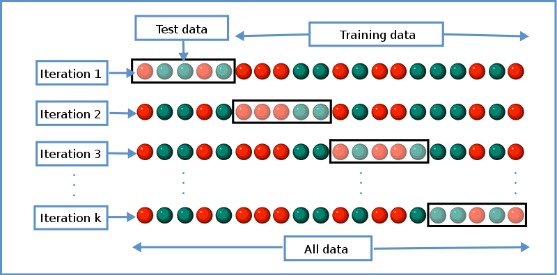

class: inverse

```{r setup, include=FALSE}
options(htmltools.dir.version = FALSE)
knitr::opts_chunk$set(fig.retina = 3, warning = FALSE, message = FALSE)
options(knitr.table.format = "html")
```

```{r xaringan-themer, include=FALSE, warning=FALSE}
library(xaringanthemer)
style_duo_accent(
  primary_color = "#2d708e",
  secondary_color = "#230433",
  link_color = "#55c667",
  text_bold_color = '#f68f46',
#  title_slide_text_color = "#292929",
  title_slide_background_color = "#ffffff", #"#042333",
  title_slide_background_image = "../../../files/theme/LSE/hock_exterior.jpg",
#    "https://upload.wikimedia.org/wikipedia/commons/1/1a/Workhouse_Nantwich.jpg",
  title_slide_background_size = "cover",
  ) #or contain
```

```{r xaringanextra, include=FALSE, warning=FALSE}
library(xaringanExtra)
#xaringanExtra::use_animate_all("slide_left")
xaringanExtra::use_tile_view()
xaringanExtra::use_panelset()
xaringanExtra::style_panelset_tabs(font_family = "inherit")
```

```{r tidyverse, include=FALSE, warning=FALSE}
library(tidyverse)
library(knitr)
theme_set(theme_minimal(base_size = 20))
set.seed(1)
library(broom)
library(modelr)
```

<style type="text/css">
.remark-slide-content {
    font-size: 1.2rem;
    padding: 1em 4em 1em 4em;
}
</style>

# Benefits of shrinkage/bias

### In "high-dimensions" (p > 2)

Shrinking estimates/models toward a pre-specified point

# (Adaptive) regularization

### Tuning $\lambda$ with cross-validation

Splitting data into training and testing subsets

---
class: inverse, center, middle

# Bias *can* be good, actually

### Especially in higher dimensions

---

### Stein "paradox" and bias

Estimating $\mu \in \mathbb R^p$ from an i.i.d. sample $\mathbf Y_1, \ldots, \mathbf Y_n \sim N(\mathbf{\mu}, \sigma^2 I)$
- The MLE is $\mathbf{\bar Y}$ (obvious and best, right?)

--

- [Charles Stein](https://news.stanford.edu/2016/12/01/charles-m-stein-extraordinary-statistician-anti-war-activist-dies-96/) discovered in the 1950's that the MLE is *[inadmissible](https://en.wikipedia.org/wiki/Admissible_decision_rule)* if $p > 2$ `r emo::ji("exploding_head")`

- The [James-Stein estimator](https://en.wikipedia.org/wiki/Stein%27s_example) **shrinks** $\mathbf{\bar Y}$ toward some other point, any other point, chosen *a priori*, e.g. 0

$$\text{MSE}(\mathbf{\hat \mu}_{\text{JS}}) < \text{MSE}(\mathbf{\bar Y}) \text{ for all } \mathbf \mu, \text{ if } p > 2$$
$$\mathbf{\hat \mu}_{\text{JS}} = \left(1 - \frac{(p-2)\sigma^2/n}{\|\mathbf{\bar Y}\|^2} \right) \mathbf{\bar Y}$$

---

### Shrinkage: less variance, more bias

.pull-left[
```{r echo = FALSE}
set.seed(42)
n <- 150
x0 <- 1.7
y0 <- 1.2
circ1 <- data.frame(
  x = rnorm(n) + x0,
  y = rnorm(n) + y0)
circ2 <- circ1 %>%
  mutate(dx = x - x0,
         dy = y - x0,
         d = x^2 + y^2,
         newx = max(1 - 2/d,0) * (x),
         newy = max(1 - 2/d,0) * (y),
         se = (x-x0)^2 + (y-y0)^2,
         newse = (newx-x0)^2 + (newy-y0)^2,
         worse  = newse > se
         )
ggplot(circ2, aes(x, y)) + 
#  ylim(c(-3,3)) + xlim(c(-3,3)) +
  geom_point(data = data.frame(x = 0, y = 0),
             size = 40, pch = 1) +
  geom_point(data = data.frame(x = x0, y = y0),
             size = 70, pch = 1) +
  geom_point(data = filter(circ2, !worse), alpha = .6) +
  geom_segment(aes(x = x, y =  y, xend = newx, yend = newy),
               alpha = .3) +
  geom_point(data = filter(circ2, worse), pch = 1, color = "red",  alpha =  .6) +
  xlab("") + ylab("") +
   theme(axis.title.x=element_blank(),
        axis.text.x=element_blank(),
        axis.ticks.x=element_blank(),
        axis.title.y=element_blank(),
        axis.text.y=element_blank(),
        axis.ticks.y=element_blank()) #+
  #geom_segment(data  = data.frame(x = 0, y = 0, xend = x0, yend = y0), aes(x=x, y=y, xend=xend, yend=yend))
# geom_point(data = circ2, aes(newx, newy), alpha = .5) +
  
```
Solid points are improved by shrinking, hollow red points do worse
]
.pull-right[
If $\bar Y$ is between $\mu$ and 0 then shrinking does worse

In higher dimensions, a greater portion of space is *not* between $\mu$ and 0

e.g. $2^p$ orthants in $p$-dimensional space, and only 1 contains $\mu - 0$

(*Not meant to be a [proof](https://statweb.stanford.edu/~candes/teaching/stats300c/Lectures/Lecture18.pdf)*)
]

---

## Historical significance

Statisticians (particularly frequentists) emphasized unbiasedness

But after Stein's example, we must admit bias is not always bad

Opens the doors to many interesting methods

Most (almost all?) ML methods use bias this way

(Even if some famous CS profs say otherwise on twitter `r emo::ji("face_with_raised_eyebrow")`)

---

### Regularized (i.e. penalized) regression

Motivation: If the JS estimator can do better than the MLE at estimating a sample mean, does a similar thing happen when estimating regression coefficients?

--

For some penalty function $\mathcal P_\lambda$, which depends on a tuning parameter $\lambda$, the estimator

$$\hat \beta_\lambda = \arg \min_\beta \| \mathbf y - \mathbf X \beta \|^2_2 + \mathcal P_\lambda(\beta)$$
is "regularized" or shrunk (shranken?) toward values that decrease the penalty. Often $\mathcal P_\lambda = \lambda \| \cdot \|$ for some norm

--

Many ML methods are optimizing "loss + penalty"

---

### Ridge (i.e. L2 penalized) regression

- Originally motivated by problems where $\mathbf X^T \mathbf X$ is uninvertible (or badly conditioned, i.e. almost uninvertible)

- If $p > n$ then this always happens

- Least squares estimator is undefined or numerically unstable

For some constant $\lambda > 0$,
$$\text{minimize } \| \mathbf y - \mathbf X \beta \|^2_2 + \lambda \| \beta \|^2$$
**Shrinks** coefficients $\hat \beta$ toward 0

Larger coefficients are penalized more (squared penalty)

---

### High-dimensional simulation

Parameters in covariate space (rather than outcome space)


1. Simulate a high-dimensional linear model
$$
\mathbf y = \mathbf X \beta + \varepsilon, \text{ for } \varepsilon \sim N(0, \sigma^2  I) 
$$
2. Fit **ridge regression** on a grid of $\lambda$ values
3. Iterate over multiple realizations of $\varepsilon$
4. Plot the MSE of estimated coefficients as a function of $\lambda$, with one line for each iterate

$$
\text{MSE}(\hat \beta_\text{ridge}(\lambda))
$$
Simulation is "cheating" -- can only compute MSE because we know true $\beta$


```{r echo = FALSE}
library(glmnet)
instance <- function(X, L, n, p, beta, mu) {
  # Add noise to signal
  Y <- mu + rnorm(n)
  y <- Y - mean(Y)
  # Fit model with glmnet
  ridge_fit <- glmnet(X, y, standardize = TRUE, intercept = FALSE, alpha = 0, lambda = L)
  # Extract estimate coefficients
  beta_mat <- coef(ridge_fit)[-1, ]
  # Compute MSE using true beta
  MSEs <- apply(beta_mat, 2, function(beta_hat) mean((beta_hat - beta)^2))
  out <- as.numeric(MSEs)
  names(out) <- L
  out
}

high_dim_MSE_MC <- function(n, p, instances = 10) {
  ## Generating signal
  # A random sparse coefficient vector
  beta <- rnorm(p) * rpois(p, 1) * rbinom(p, 1, .5)
  # Fixed design matrix and mean
  X <- matrix(rnorm(n*p), nrow = n)
  mu <- X %*% beta
  # Lambda grid
  L <- exp(seq(
    from = log(max(n, p, sum(beta^2))),
    to = log(1e-3), length.out = n))
  ## Generate many noise instances
  # tidyverse version of replicate()
  output <- tibble(inst = 1:instances) %>% 
    mutate(MSEs = map(inst, ~instance(X, L, n, p, beta, mu)))
  ## Transform output to long data.frame
  out_df <- output %>% 
    unnest_longer("MSEs") %>%
    mutate(MSEs_id = as.numeric(MSEs_id))
  names(out_df) <- c("instance", "MSE", "lambda")
  ## Plot results
  out_df %>%
  ggplot(aes(lambda, MSE)) +
    ggtitle(bquote(
      list(sparsity == .(sum(beta != 0)),
           abs(abs(beta))^2 == .(round(sum(beta^2), 2)))
    )) +
    geom_line(aes(group = factor(instance)),
            alpha = .2,
            show.legend = FALSE) + 
    scale_x_log10() 
}
```

---

#### MSE(ridge) lower-dimensional

```{r ridgen100p10, cache=T, out.width="66%"}
high_dim_MSE_MC(n = 100, p = 10, instances = 20)
```

---

#### MSE(ridge) higher-dimensional

```{r ridgen100p100_1, cache=T, out.width="66%"}
high_dim_MSE_MC(n = 100, p = 100, instances = 50)
```
---

#### MSE(ridge) higher-dimensional

```{r ridgen100p100_2, cache=T, out.width="66%"}
high_dim_MSE_MC(n = 100, p = 100, instances = 50)
```
---

#### MSE(ridge) higher-dimensional

```{r ridgen100p100_3, cache=T, out.width="66%"}
high_dim_MSE_MC(n = 100, p = 100, instances = 100)
```
---

#### MSE(ridge) higher-dimensional

```{r ridgen100p100_4, cache=T, out.width="66%"}
high_dim_MSE_MC(n = 100, p = 100, instances = 100)
```

---

#### MSE(ridge) higher-dimensional

```{r ridgen100p150, cache=T, out.width="66%"}
high_dim_MSE_MC(n = 100, p = 150, instances = 20)
```

---

#### MSE(ridge) much higher-dimensional

```{r ridgen100p200_1, cache=T, out.width="66%"}
high_dim_MSE_MC(n = 100, p = 200, instances = 20)
```
---

#### MSE(ridge) much higher-dimensional

```{r ridgen100p200_2, cache=T, out.width="66%"}
high_dim_MSE_MC(n = 100, p = 200, instances = 20)
```

---

### Lessons about bias

#### Bias can help

- Even in such a basic problem as **estimating the multivariate normal mean** (JS)
- More important in higher dimensions

--

#### But it depends! Task-specific

  - What's the scientific question?
  - Which estimator(s) are we evaluating?
  - How will the estimator / ML pipeline be used? For what?

e.g. If $\hat \sigma$ underestimates $\sigma$ it may have lower MSE, but do we care about estimating $\sigma$? Or do we care about C.I. coverage?

---
class: inverse, middle, center

# Regularization can help

# us to avoid overfitting

### But we have to choose the *amount* of regularization

e.g. norm-penalized regression, choose $\lambda$

Maybe use formula for $\text{df}(\hat \beta_\lambda)$

Is there another way? What if we don't have a formula?

---
class: inverse, center, middle

# Validation

## Estimate test error directly

### using "**validation data**" / "**test data**"

--

#### i.e. a new set of data, "unseen" by $\hat f$

Indep. samples $D = \{  (\mathbf x_i, y_i) \}_{i=1}^n$ and $D' = \{ (\mathbf x_i', y_i') \}_{i=1}^{n'}$

Estimate $\hat f$ on $D$, evaluate $\hat f$ on $D'$

---

## Motives

- Debiasing risk estimate. Since $\hat f$ does not depend on $D'$, it is not **overfit to the variability** in $D'$

- If $\hat f$ is overfit to $D$ then its test error on $D'$ will be large (complexity too high, variability too high)

--

- Actual practice: analogous to "deploying an ML model in production"

- Philosophy of science: use novelty, actual prediction (not accommodation)

- Tukey: [Exploratory Data Analysis](https://en.wikipedia.org/wiki/Exploratory_data_analysis) vs Confirmatory

- Use test error to choose **model complexity** / **amount of regularization**

---

# Choosing model complexity

## Using test/validation data

Indep. samples $D = \{  (\mathbf x_i, y_i) \}_{i=1}^n$ and $D' = \{ (\mathbf x_i', y_i') \}_{i=1}^{n'}$

- Estimate $\hat f_\lambda$ on $D$ for a "path" or grid of $\lambda$ values

- Evaluate $\hat f_\lambda$ on $D'$ and choose $\hat \lambda$ accordingly (e.g. with minimum loss)

- Refit $\hat f_{\hat \lambda}$ on full data $D \cup D'$, this is our final model

*Common when computational cost of fitting one model is high*

---

## Cross-validation

*When computational cost of fitting one model is not too high*

**Idea**: swap $D$ and $D'$ in previous process and get two estimates, $\hat R(\hat f_\lambda)$ and $\hat R(\hat f_\lambda')$

Average these and choose $\hat \lambda$ using the average (e.g. minimizer)

--

**Idea**: apply the same process with multiple independent "folds" of data

#### $K$-fold cross-validation

Each subset used once as test set, and $K-1$ times for training

Minimize $\hat R_{K\text{-cv}}(\lambda) = \frac{1}{K} \sum_{k=1}^K \hat R_k(\hat f^{(k)}_\lambda)$

---

## Cross-validation cartoon



Gives $K$ estimates of test error (risk) at each $\lambda$

Credit: [Wikipedia](https://en.wikipedia.org/wiki/Cross-validation)

---

## $K$-fold cross-validation

Each subset used once as test set, and $K-1$ times for training

Choose $\hat \lambda$ to minimize

$$\hat R_{K\text{-cv}}(\lambda) = \frac{1}{K} \sum_{k=1}^K \hat R_k(\hat f^{(k)}_\lambda)$$
where $\hat f^{(k)}_\lambda$ is fit on the dataset that "holds out" the $k$th fold

Then refit model $\hat f_{\hat \lambda}$ at that value of $\hat \lambda$ on the entire dataset

---

## plot(cv.glmnet) and plot(glmnet)


```{r echo = FALSE}
library(glmnet)
library(plotmo)
n <- 100
p <- 20
X <- matrix(rnorm(n*p), nrow = n)
beta = sample(c(-1,0,0,0,1), p, replace = TRUE)
Y <- X %*% beta + rnorm(n)
```

.pull-left[
```{r}
cv_ridge <- 
 cv.glmnet(X, Y, alpha = 0)
plot(cv_ridge)
```
]
.pull-right[
```{r}
ridge_fit <- 
 glmnet(X, Y, alpha = 0)
plot_glmnet(ridge_fit,
 s = cv_ridge$lambda.1se)
```
]

---

### Lessons about cross-validation

- Think of it as a way to **choose model complexity**

- **Beware** common cross-validation errors! From Duda and Hart quoted in [MLstory](https://mlstory.org/data.html)

> ... the same data were often used for designing and testing the classifier. This mistake is frequently referred to as "testing on the training data." A related but less obvious problem arises *when a classifier undergoes a long series of refinements guided by the results of repeated testing on the same data. This form of "**training on the testing data**" often escapes attention until new test samples are obtained*.

---

### Lessons about cross-validation

- **Beware** common cross-validation errors! From ESL:

> Ideally, the test set should be kept in a "vault," and be brought out only at the end of the data analysis. *Suppose instead that we use the test-set repeatedly, choosing the model with smallest test-set error. Then the test set error of the final chosen model will underestimate the true test error*, sometimes substantially.

- Cross-validate entire model building pipeline (not just one step), and only do it once -- or at *least* not many times

- Choosing $K$: larger $\to$ $\hat R_{K\text{-cv}}$ has lower bias, more variance. Often use $K = 5$ or $10$

---
class: inverse

### Bias can be good or bad

- Good for estimation in high-dimension (lower MSE)
- Bad for inference (intervals/hypothesis tests)
- Uncertainty principle: better estimate *or* better inference

### Regularization

- Fancy sounding word for "simplification," simpler models
- Increases bias to reduce variance

### Cross-validation

- Fit and evaluate models on different subsets of data
- Choose amount of regularization/complexity
- Re-using data *more than once* $\to$ overfitting again

