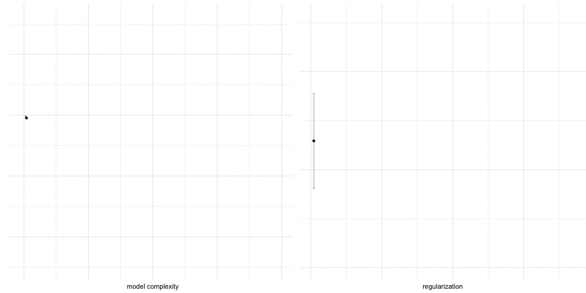

```{r}
#| label: setup
#| include: false
library(tidyverse)
library(gapminder)
library(knitr)
theme_set(theme_minimal(base_size = 18))
options(knitr.table.format = "html")
set.seed(42)
# Palette: viridis for the primary scale, magma for the second one.
v_dark <- "#440154"; v_blue <- "#31688e"; v_teal <- "#21918c"; v_green <- "#5ec962"
m_pink <- "#b73779"; m_purple <- "#8c2981"; m_orange <- "#fc8961"
gm <- gapminder |>
  filter(year == 2007) |>
  mutate(lgdp = log10(gdpPercap))
# One random split of countries: the held-out set the competitors never see.
n <- nrow(gm)
test_id <- sample(n, 42)
train <- gm[-test_id, ]
test  <- gm[test_id, ]
knn_predict <- function(x0, x, y, k) {
  d <- abs(x - x0)
  mean(y[order(d)[1:k]])
}
kernel_predict <- function(x0, x, y, h) {
  w <- exp(-0.5 * ((x - x0) / h)^2)
  sum(w * y) / sum(w)
}
grid <- tibble(lgdp = seq(min(gm$lgdp), max(gm$lgdp), length.out = 300))
```

## {.inverse}

### ST310: Machine Learning (for Data Science)

Lecturer: [Joshua Loftus](https://joshualoftus.com/)

Website: Moodle, and [ml4ds.com](https://ml4ds.com)

Seminars start this week. Bring a laptop with R and RStudio (see [about](https://ml4ds.com/about.html)).

**A request.** As a courtesy to me, please don't use "AI" tools in your communications with me or the teaching staff. This also applies to all aspects of this course. We are here to train our own minds, not to replace them. I'll say more about why during the term.

::: {.notes}
Timing, total 85 (the room is booked for 90; the rest is for questions). Course info 5 (format, how the course works, this week's plan); preview 3 (the gapminder tabs, not walked line by line; xkcd); themes and self-intro 3; what is ML 11 (applications 2, ML proper 2, the field 2, notation 2, tasks 2, regression 1); how to predict, probability, the assumptions 6; the competition and its history 8 (four parts 3, Netflix 5); prediction, loss, held-out set and the rule 5; where would you look and Fix–Hodges 3; nearest neighbors 3, which k 2, the score for every k 3, the leaderboard 3, the smooth cousin 1; the bias--variance decomposition at the board 15; where the bias comes from 2; the curse 5; distances concentrate 2; the request (on the title slide) 2; two things to think about 2; until the seminar 2. Reading is not spoken.

Cut order if short: (1) the self-intro to one line; (2) Fix and Hodges to one sentence; (3) the smooth cousin to its question alone ("what is a local average trying to land on?", which week 2 retrieves); (4) the preview tabs to the plot alone; (5) distances concentrate narrated from the figure. Does not move: the bias--variance decomposition and its backups; the score for every k; the leaderboard and its bars; the rule; the cube table; the two closing questions.

Pace: 0:20 what-is-ML done, notation on the board. 0:45 the leaderboard shown, the smooth-cousin question asked, the board starts. 1:00 noise + bias² + variance boxed and labeled. 1:20 the closing questions.

Board script: instructor project, week 1, board_theorem_A (25 September version).
:::

## About the course

Course info, teaching philosophy, ML overview

{height="400"}

::: {.notes}
Animation shows lasso, a method we'll learn about later.
:::

## Format

::: {.columns}
::: {.column width="48%"}
- *Mostly* self-contained -- ask if you need help!
- Weekly readings, lectures, seminars
- Seminars: problems on paper first, then computing. Bring a laptop
- [ml4ds.com](https://ml4ds.com): links, slides, notebooks
:::
::: {.column width="52%"}
Reading

- **ISLR** [Introduction to Statistical Learning](https://statlearning.com/)
- **CausalML** [Applied Causal Inference Powered by ML and AI](https://causalml-book.org/)
- **PPA** [Patterns, Predictions, and Actions](https://mlstory.org/)

Supplemental

- **R4DS** [R for Data Science](https://r4ds.hadley.nz/)
- **ESL** [Elements of Statistical Learning](https://hastie.su.domains/ElemStatLearn/)
- **CASI** [Computer Age Statistical Inference](https://hastie.su.domains/CASI/)
:::
:::

## Quick preview {.inverse .center}

Don't worry about following all the details now

We'll introduce R coding gradually

## The gapminder data

::: {.panel-tabset}

### Data

```{r}
#| echo: false
gapminder |> head() |> kable()
```

### Code

```{r}
#| label: plot-example
#| echo: true
#| eval: false
gdp_data <- gapminder |>
  filter(year == max(year))

life_exp_plot <-
  ggplot(gdp_data, aes(x = gdpPercap, y = lifeExp)) +
  geom_point(aes(color = continent,
                 shape = continent,
                 size = pop))

life_exp_plot +
  stat_smooth(formula = y ~ x, method = "loess", span = 1)
```

### Plot

```{r}
#| fig-width: 9
#| fig-height: 4.5
gdp_data <- gapminder |>
  filter(year == max(year))
life_exp_plot <-
  ggplot(gdp_data, aes(x = gdpPercap, y = lifeExp)) +
  geom_point(aes(color = continent, shape = continent, size = pop)) +
  scale_colour_viridis_d(end = 0.9)
life_exp_plot +
  stat_smooth(formula = y ~ x, method = "loess", span = 1, colour = m_pink)
```

### Modify

```{r}
#| label: plot-example2
#| echo: true
#| eval: false
life_exp_plot +
  scale_x_log10() +
  stat_smooth(formula = y ~ x, method = "lm") +
  xlab("GDP per capita") +
  ylab("Life expectancy")
```

### Plot again

```{r}
#| fig-width: 9
#| fig-height: 4.5
life_exp_plot +
  scale_x_log10() +
  stat_smooth(formula = y ~ x, method = "lm", colour = m_pink) +
  xlab("GDP per capita") +
  ylab("Life expectancy")
```

:::

::: {.notes}
Preview of some R. Model complexity: nonlinear vs relatively simple (linear) model. Linear model may not fit the data as well; but interpretable, one slope to summarize the relationship; but reliable/stable. Machine learning allows us to find models with just the right amount of complexity. Do not walk the code; that is the seminar's job.
:::

## Machine learning in one picture

::: {.columns}
::: {.column width="55%"}
{height="560"}
:::
::: {.column width="45%"}
[Source: [xkcd 2048](https://xkcd.com/2048/), CC BY-NC 2.5]{.credit}
:::
:::

## Teaching/course philosophy {.inverse .center}

::: {.notes}
Not just math, also my opinions. Textbooks are excellent, read them! But: value added by lectures.
:::

## Recurring themes

Concepts that keep coming back

- Held-out evaluation: a model is judged on data it never saw
- Bias--variance: flexible models need data near the point
- Prediction $\neq$ explanation $\neq$ intervention
- Fitting to residuals: one operation in regression, additive models, boosting, causal ML
- Distribution shift: test data look like training data by construction; the world need not

. . .

How the course runs

- Learning takes work: productive struggle, two words, both necessary
- Knowing a method includes knowing what it does not establish

::: {.notes}
Examples with ethical aspects; explicit consideration of ethics and professional responsibilities of data scientists. Future lectures include a dose of philosophy, vaccinating against mindless application of tools. Don't be a zombie data scientist. Learn from each other.
:::

## Please allow me to introduce myself {.inverse}

::: {.columns}
::: {.column width="60%"}
I'm Joshua Loftus

- From the US; used to teach at NYU
- Cambridge postdoc; Stats PhD from Stanford
- Reproducibility, fairness, interpretability, causality
- First-gen at university
- Travel, reading, audiobooks, lifting and, NEW: parenting
:::
::: {.column width="40%"}
{height="520"}
:::
:::

::: {.notes}
I am a person in the world, not just on lecture slides. For seminars, help from the very capable teaching staff. Am I trustworthy? Why should you listen to me? You decide!
:::

## What is "Machine Learning"? {.inverse .center}

### And why is it that?

## Machine learning applications {.inverse}

Can you think of an example? (Write it down)

. . .

- Electronic health records to predict which patients will require more care

. . .

- Genome sequence data for tissue samples to detect different kinds of cancer

. . .

- Text scraped from social media to predict events of social unrest, or track spread of misinformation

. . .

- Tech platform user data to target relevant content, or detect policy/regulation violations

. . .

- Learning adaptive control of robot prosthesis

etc...

## Machine learning, proper {.inverse}

These *application* examples help motivate the value of ML

(Actually, much of the value comes from work specific to the application, like the creation/gathering/processing of the data, and the real world *actions* taken based on the output of ML)

. . .

We'll use "ML" to refer to the *theory and general methods*

(Skills like gathering and cleaning data are very useful--and we'll practice them a little--but they're not the main focus of this course)

## Machine learning, the field

::: {.columns}
::: {.column width="50%"}
**Two lineages**

- Statistics: least squares (Gauss, Legendre, c. 1805), regression, likelihood. *Models of how data arise*
- Computer science: the perceptron (1958), learning theory (Valiant 1984). *Algorithms that improve with data*

Breiman (2001) called them the two cultures
:::
::: {.column width="50%"}
**Where the field meets**

- ICML, first held 1980
- NeurIPS (as NIPS), 1987
- COLT, 1988
- *Machine Learning* journal, 1986; JMLR, 2001

Conference papers, not journal articles, are the main currency (unusual among sciences)
:::
:::

::: {.notes}
Two minutes. The point is orientation: when a student reads "NeurIPS 2024" they should know what kind of venue that is, and that reviewed conference papers carry the field. Breiman's "Statistical Modeling: The Two Cultures" (Statistical Science, 2001) is the essay to name; it argues for the algorithmic culture and its discussants argue back. Dates: ICML began as a workshop at Carnegie Mellon in 1980; NIPS was first held in Denver in 1987 and renamed NeurIPS in 2018; COLT at MIT in 1988; the journal Machine Learning in 1986; JMLR in 2001 after the editorial board of Machine Learning resigned over open access.
:::

## What is "artificial intelligence"? {.inverse}

(Don't tell anyone I said this, but) It's a collection of computational tools that people use to create mathematically structured data out of non-mathematically structured data

e.g. a (possibly randomized) function from $\{ \text{some image file type} \} \to \mathbb R^d$ for some $d$.

::: {.columns}
::: {.column width="50%"}
e.g. [word embedding](https://en.wikipedia.org/wiki/Word_embedding) for text data: each word becomes a vector

*We'll usually assume our data is already mathematically structured*
:::
::: {.column width="50%"}
```{r}
#| fig-width: 5
#| fig-height: 3.4
words <- tibble(
  word = c("prediction", "model", "data", "error", "bias", "variance", "noise"),
  x = c(2.6, 2.2, 1.6, -1.8, -2.4, -1.4, -0.6),
  y = c(1.4, 2.4, 2.9, 2.0, 0.6, -1.2, -2.6)
)
ggplot(words) +
  geom_segment(aes(x = 0, y = 0, xend = x, yend = y), colour = v_blue,
               arrow = arrow(length = unit(0.25, "cm")), linewidth = 0.8) +
  geom_label(aes(x, y, label = word), colour = v_dark, size = 5,
             label.size = 0, fill = "white", alpha = 0.85) +
  coord_equal(xlim = c(-3.2, 3.4), ylim = c(-3.2, 3.5)) +
  labs(x = "dimension 1", y = "dimension 2") +
  theme_minimal(base_size = 14) +
  theme(panel.grid.minor = element_blank())
```
:::
:::

## Abstraction and notation

Along came some data which someone formats as a collection of $p$ distinct variables

$$
X = (X_1, X_2, \ldots, X_p) \in \mathbb R^p
$$

We assume **each observation is a point in a vector space** (which we also implicitly assumed is finite-dimensional, and that's OK by any practical standard)

. . .

### Question: is there a $Y$ variable?

Think about your application example (the one you wrote down)

## Categories of ML tasks

**Supervised learning** (this whole course)

Often we focus on one variable, name it $Y$, and give it the special status of being an "outcome"/"response"

**Not this course:** unsupervised learning (clustering, dimension reduction), ranking, anomaly detection, network data, embeddings, recommender systems, bandits, etc.

::: {.notes}
Say why: depth over coverage. Unsupervised methods are in ISLR chapter 12 for anyone who wants them; they are not assessed.
:::

## Supervised ML sub-categories

If $Y$ is numeric: **regression**

- Concentration levels of a protein (disease status/severity)
- Selling price of a house

If $Y$ is categorical: **classification**

- Should this item be flagged for (human) review? yes/no
- Identify type of cancer: lymphoma, sarcoma, neuroblastoma, etc

Special cases: $Y$ binary with rare cases (anomaly detection); $Y$ a time to event (survival analysis); multi-class, hierarchical classes, etc.

## Focus on regression

::: {.columns}
::: {.column width="55%"}
- Simpler math (orthogonal projection, Euclidean geometry)
- Intuition pump for other cases
- Often underlies other cases
:::
::: {.column width="45%"}
{height="330"}
:::
:::

- e.g. binary classification by thresholding a numeric **score**, or ranking (ordinal outcome) / set selection (select items with $\text{top-}k$ scores)

## How to predict $Y$ from $X$?

- Would be sweet if $\exists f$ such that the graph of the function $y = f(x)$ fit the data perfectly

- **Problem**: what if $(x_1, y_1) = (1, 0)$ and $(x_2, y_2) = (1, 1)$?

- **Problem**: even our most tested and verified physical laws won't fit data *[perfectly](https://en.wikipedia.org/wiki/Measurement_uncertainty)*

. . .

#### Solution: applied mathematics

For any function $f$ we can always write $\varepsilon \equiv y - f(x)$. Look for an $f$ which makes these "errors" "small" for the observed data

## Uncertainty opens the door for probability

- Assume a probability distribution (adequately) models the data/errors

Define a good function as one that minimizes

$$
\mathbb E[\varepsilon^2] = \mathbb E\{[Y - f(X)]^2\}
$$

. . .

- Assume the data/error is sampled independently

Motivates the **plug-in principle**: compute an estimate $\hat f$ of the good function $f$ by solving the corresponding problem on the dataset, i.e.

$$
\text{minimize} \sum_{i=1}^n \left[y_i - \hat f(x_i)\right]^2
$$

## Very useful assumptions! {.inverse}

### The *why* of machine learning: "it works"

- Squared error $\rightarrow$ simpler math

(we'll come back to this and consider other loss functions)

- i.i.d. sampling $\rightarrow$ simpler estimation, justifies generalization

(we'll come back to this too)

## Machine learning as competition

A **prediction competition**:

1. curated data, the same for every competitor
2. a task: submit a model that predicts $y$ from $x$ for units nobody has seen
3. an agreed score
4. an evaluation dataset the competitors cannot see

Winning model chosen by best score

::: {.notes}
The name in the literature is the "common task framework"; say it once, then call it the competition. Everything distinctive later in the course is a specific way this clean picture breaks. Each time we will ask: what did winning establish?
:::

## History: common task framework

::: {style="font-size: 1.25em"}
| | |
|---|---|
| **1986** | DARPA funds speech recognition on the condition that every group is scored on the same held-out data by an outside referee (NIST). Progress, measured, for the first time |
| **2006** | Netflix offers $1,000,000 for a 10% improvement on its own recommender |
| **2010** | Kaggle opens; ImageNet's first yearly challenge (ILSVRC) |

: {tbl-colwidths="[12,88]"}
:::

Donoho (2017) called the recipe the *common task framework* and credited it with most of what "machine learning" has achieved since

::: {.notes}
Three minutes, on the history budget: this buys the name. Mark Liberman traced the origin to the DARPA speech programme of the mid-1980s; the referee was the National Institute of Standards and Technology, and the point was that groups had been reporting results on their own data with no way to compare. Donoho, "50 years of data science" (JCGS 2017), section on the CTF: "the secret sauce". Kaggle was founded in April 2010; ILSVRC ran 2010–2017.
:::

## Netflix challenge

::: {.columns}
::: {.column width="50%"}
[$1,000,000]{.big}

for the first team to beat Netflix's own recommender by 10%

100 million ratings; score on 3 million held back
:::
::: {.column width="50%"}
[3 years]{.big}

[5,000 teams submitted]{.big}
:::
:::

::: {.notes}
Netflix Prize. RMSE on held-out ratings; Cinematch scored 0.9514, the target was 0.8563. Progress prizes in 2007 and 2008. Tens of thousands of teams registered; about 5,100 submitted at least one entry. In 2009 two teams crossed 10%: BellKor's Pragmatic Chaos and The Ensemble. On the public leaderboard (the "quiz" subset) The Ensemble was ahead, 0.8553 to 0.8554; the prize was decided on a separate, unrevealed "test" subset, where the two tied to four decimals (0.8567), and it went to the team that had submitted twenty minutes earlier. Ask the room: what does twenty minutes of difference tell you about the two methods? (Nothing.) That is the first appearance of a theme: the leaderboard number has noise in it. The validation week comes back to the two-subset structure.

Figures: the Netflix Prize final leaderboard (September 2009) and the grand-prize reports.
:::

## And then

The winning blend of hundreds of models was never put into production

Netflix said the gain wasn't worth the engineering, and the business had moved to streaming

The sequel was cancelled: researchers had re-identified "anonymous" users from their ratings

::: {.leave}
Winning a competition is not always useful. This course will help you understand why
:::

::: {.notes}
Netflix's engineering blog (2012) said the final solution was not implemented; two of the 2007 progress-prize algorithms were. Netflix Prize 2 was announced in 2009 and cancelled in 2010 after a privacy lawsuit and FTC attention, following Narayanan and Shmatikov's re-identification paper (2008), which linked the "anonymised" ratings to public IMDb reviews. Three lessons in one story: the score is noisy, the winner need not be deployable, and the data are people.
:::

## Prediction, loss, held-out set

**Training data**: $n$ units $(x_i, y_i)$, $i = 1, \ldots, n$, inputs $x_i$ and outcomes $y_i$, both known

**Test data** (held out): $m$ more units $(x_j^{\text{test}}, y_j^{\text{test}})$, $j = 1, \ldots, m$; competitors see only the $x_j^{\text{test}}$

A **predictor** $\hat f$ is built from the training data alone

A **loss** scores one prediction: today, $\ell(y, \hat y) = (y - \hat y)^2$

The **test error** is the average loss over the test data:
$$
\widehat{\text{Err}} = \frac{1}{m} \sum_{j=1}^{m} \ell\big(y_j^{\text{test}}, \hat f(x_j^{\text{test}})\big)
$$

That number is the leaderboard.

## One rule before we start

An input is fair game only if you would have it **at the moment you need the prediction**

Predict 2007 life expectancy from GDP: fine

Predict a patient's readmission from the discharge letter written *after* readmission: not fine

Predict a house's sale price from its list price: fine. From the price it eventually sold for: that's the answer, not an input

::: {.notes}
This is the first item on the checklist students will apply to their own project. It comes back in the validation week as leakage.
:::

## Your first task

::: {.columns}
::: {.column width="52%"}
You are given GDP per capita for all 142 countries

and life expectancy for 100 of them

**Predict life expectancy for the other 42**

Someone else has the answers and will score you
:::
::: {.column width="48%"}
```{r}
#| fig-height: 4
#| fig-width: 5.5
ggplot(train, aes(lgdp, lifeExp)) +
  geom_point(colour = v_blue, size = 2.2) +
  geom_point(data = test, aes(lgdp, y = 38), shape = 4, colour = m_pink, size = 2.5) +
  labs(x = "log10 GDP per capita", y = "life expectancy") +
  ylim(38, 85)
```
[crosses: the 42 countries you must predict]{.small}
:::
:::

::: {.ask}
Write down, in one line, how you would do it.
:::

::: {.notes}
Collect three or four answers. Somebody will say "draw a line", somebody "look at similar countries", somebody "average". All three are this week or next. Keep the answers on the board; we come back to them at the leaderboard.
:::

## Where would you look? {.inverse}

You know nothing about a country except its GDP.

Where would you look for its life expectancy?

Remember that you have life expectancy data about some other countries...

## History: k-nearest neighbors

::: {.columns}
::: {.column width="55%"}
Evelyn Fix and Joseph Hodges, Berkeley

A report for the US Air Force School of Aviation Medicine, Texas

The idea: to classify a new case, look at the cases nearest to it

Unpublished until 1989. By then it had a name and was everywhere
:::
::: {.column width="45%"}
Cover and Hart, 1967: with enough data, one nearest neighbor gets within a factor of two of the best possible error (for classification, as $n \to \infty$)
:::
:::

::: {.notes}
Fix and Hodges, "Discriminatory analysis: nonparametric discrimination, consistency properties", Randolph Field, 1951; reprinted in the International Statistical Review in 1989. Cover and Hart's bound is asymptotic and for classification. The bias--variance decomposition, at the board in fifteen minutes, is a different kind of result: an exact finite-sample decomposition of the regression error, not a limit.

Say: the method is so simple it did not need a paper. That is a warning as much as a compliment. Second on the cut order.
:::

## $k$ nearest neighbors

For a new input $x_0$: find the $k$ training inputs closest to it, $(x_{(1)}, y_{(1)}), \ldots, (x_{(k)}, y_{(k)})$, and average their outcomes
$$
\hat f_k(x_0) = \frac{1}{k} \sum_{l=1}^{k} y_{(l)}
$$

```{r}
#| fig-height: 3.6
#| fig-width: 10
fits <- bind_rows(lapply(c(1, 5, 20), function(kk) {
  grid |> mutate(fit = sapply(lgdp, knn_predict, x = train$lgdp, y = train$lifeExp, k = kk),
                 k = factor(paste0("k = ", kk), levels = paste0("k = ", c(1, 5, 20))))
}))
ggplot(train, aes(lgdp, lifeExp)) +
  geom_point(colour = "grey55", size = 1.6) +
  geom_line(data = fits, aes(y = fit), colour = v_dark, linewidth = 1) +
  facet_wrap(~ k) +
  labs(x = "log10 GDP per capita", y = "life expectancy")
```

No formula, no parameters. One choice: $k$.

## CTF competition: which $k$ would you submit?

::: {.ask}
Look at the three panels again. Write down the $k$ you would enter in the competition, and one reason.
:::

```{r}
#| fig-height: 3.6
#| fig-width: 10
ggplot(train, aes(lgdp, lifeExp)) +
  geom_point(colour = "grey55", size = 1.6) +
  geom_line(data = fits, aes(y = fit), colour = v_dark, linewidth = 1) +
  facet_wrap(~ k) +
  labs(x = NULL, y = NULL)
```

::: {.notes}
Take a show of hands for 1, 5, 20. Most rooms split between 5 and 20; a few brave people take 1 because "it fits the data perfectly". Keep those people in mind for the next slide.
:::

## The score, for every $k$

```{r}
#| fig-height: 4.2
#| fig-width: 9
ks <- c(1:10, 15, 20, 30, 50)
mse_k <- function(kk, newdata) {
  pred <- sapply(newdata$lgdp, knn_predict, x = train$lgdp, y = train$lifeExp, k = kk)
  mean((newdata$lifeExp - pred)^2)
}
err <- bind_rows(
  tibble(k = ks, set = "training countries", MSE = sapply(ks, mse_k, newdata = train)),
  tibble(k = ks, set = "held-out countries",  MSE = sapply(ks, mse_k, newdata = test))
)
ggplot(err, aes(k, MSE, colour = set)) +
  geom_line(linewidth = 1) + geom_point(size = 2.5) +
  scale_x_log10() +
  scale_colour_manual(values = c("held-out countries" = m_pink, "training countries" = v_blue)) +
  labs(x = "k (log scale)", y = "mean squared error", colour = NULL) +
  theme(legend.position = "top")
```

At $k = 1$ the training error is **exactly zero**. Is that good news?

::: {.notes}
Let them say why it is zero: each training point is its own nearest neighbor. Then leave "so what does that number tell you?" hanging. The full answer is the validation week. Do not give it.
:::

## The leaderboard

```{r}
#| fig-height: 4
#| fig-width: 9
mse_se <- function(pred, y) {
  l <- (y - pred)^2
  c(mean(l), sd(l) / sqrt(length(l)))
}
preds <- list(
  "baseline: one number for everyone" = rep(mean(train$lifeExp), nrow(test)),
  "1 nearest neighbor" = sapply(test$lgdp, knn_predict, x = train$lgdp, y = train$lifeExp, k = 1),
  "5 nearest neighbors" = sapply(test$lgdp, knn_predict, x = train$lgdp, y = train$lifeExp, k = 5),
  "10 nearest neighbors" = sapply(test$lgdp, knn_predict, x = train$lgdp, y = train$lifeExp, k = 10)
)
lb <- map_dfr(names(preds), function(nm) {
  r <- mse_se(preds[[nm]], test$lifeExp)
  tibble(entrant = nm, mse = r[1], se = r[2])
}) |> mutate(entrant = fct_reorder(entrant, -mse))
ggplot(lb, aes(mse, entrant)) +
  geom_errorbar(aes(xmin = mse - se, xmax = mse + se), width = 0.25, colour = "grey60", orientation = "y") +
  geom_point(size = 4, colour = v_dark) +
  labs(x = "test MSE on the 42 held-out countries", y = NULL, caption = "bars: one standard error")
```

Which model wins? What about those error bars?...

::: {.notes}
Each bar is one competitor's own standard error: the standard error of a mean of 42 squared errors, computed as if the 42 losses were independent draws, which is an assumption about the countries rather than a fact about them. Whether the gap between two competitors scored on the same 42 countries is real is a different question, about the difference of their losses on the same units; it is left open this week. The seminar computes the bars. Do not do the seminar's work here; just point at the bars and say "Netflix".
:::

## The smooth cousin

Instead of "the $k$ nearest, equally", weight *every* training point by how close it is:
$$
\hat f_h(x_0) = \frac{\sum_i K\!\left(\frac{x_i - x_0}{h}\right) y_i}{\sum_i K\!\left(\frac{x_i - x_0}{h}\right)},
\qquad K(u) = e^{-u^2/2}
$$

```{r}
#| fig-height: 3.2
#| fig-width: 10
kf <- bind_rows(lapply(c(0.05, 0.15, 0.4), function(hh) {
  grid |> mutate(fit = sapply(lgdp, kernel_predict, x = train$lgdp, y = train$lifeExp, h = hh),
                 h = factor(paste0("h = ", hh), levels = paste0("h = ", c(0.05, 0.15, 0.4))))
}))
ggplot(train, aes(lgdp, lifeExp)) +
  geom_point(colour = "grey55", size = 1.6) +
  geom_line(data = kf, aes(y = fit), colour = m_purple, linewidth = 1) +
  facet_wrap(~ h) +
  labs(x = "log10 GDP per capita", y = "life expectancy")
```

Both are local averages. What number is a local average *trying to land on*?

::: {.notes}
One minute: state it, ask the question, leave it open. The answer (the conditional expectation) is next week's theorem. If cut, ask the question from the nearest-neighbors slide instead; week 2 retrieves it.
:::

## What makes a nearest-neighbor prediction wrong? [board]{.board}

$y_i = f(x_i) + \varepsilon_i$, inputs fixed, noise independent, mean $0$, variance $\sigma^2$; new $Y_0 = f(x_0) + \varepsilon_0$.

We want $\mathbb E\big[(Y_0 - \hat f_k(x_0))^2\big]$, the expected squared error of the $k$-nearest-neighbor prediction at $x_0$.

::: {.ask}
Two facts from ST102 do all the work at the board. Which two? Write them down before we start.
:::

::: {.notes}
Board script: instructor project, week 1, board_theorem_A. Why anyone cared: we just watched k trade one thing for another on the error curve; the decomposition names the two things. Collect the two answers, then go to the board; the next slide is what stays on the screen while you write.
:::

## Bias--variance decomposition [board]{.board}

$y_i = f(x_i) + \varepsilon_i$, inputs fixed, noise independent, mean $0$, variance $\sigma^2$; new $Y_0 = f(x_0) + \varepsilon_0$.

**Bias--variance decomposition.**
$$
\mathbb E\big[(Y_0 - \hat f_k(x_0))^2\big]
= \underbrace{\sigma^2}_{\text{noise}}
+ \underbrace{\Big[f(x_0) - \tfrac{1}{k}\textstyle\sum_{l=1}^k f(x_{(l)})\Big]^2}_{\text{bias}^2}
+ \underbrace{\frac{\sigma^2}{k}}_{\text{variance}}
$$

::: {.leave}
noise + bias² + variance. Variance falls in $k$, always. Bias typically grows too, but it need not be monotonic (a constant $f$ keeps it at zero for every $k$).
:::

::: {.notes}
Backups follow, uncounted. This is the bias–variance trade-off, one of the most powerful ideas in statistics; it comes back in three more forms this term. Are the errors systematic (bias) or not (variance)?
:::

## Bias--variance decomposition, line 1 {.backup visibility="uncounted"}

$$
Y_0 - \hat f_k(x_0) = \varepsilon_0 + \big[f(x_0) - \hat f_k(x_0)\big]
$$

Square, take expectations:
$$
\mathbb E\big[(Y_0 - \hat f_k(x_0))^2\big] = \mathbb E[\varepsilon_0^2] + 2\,\mathbb E\big[\varepsilon_0 \,(f(x_0) - \hat f_k(x_0))\big] + \mathbb E\big[(f(x_0) - \hat f_k(x_0))^2\big]
$$

## Bias--variance decomposition, line 2 {.backup visibility="uncounted"}

$\varepsilon_0$ is independent of everything in $\hat f_k(x_0)$ and has mean $0$:
$$
\mathbb E\big[\varepsilon_0 \,(f(x_0) - \hat f_k(x_0))\big] = \mathbb E[\varepsilon_0]\; \mathbb E\big[f(x_0) - \hat f_k(x_0)\big] = 0
$$

Left with
$$
\sigma^2 + \mathbb E\big[(f(x_0) - \hat f_k(x_0))^2\big]
$$

## Bias--variance decomposition, line 3 {.backup visibility="uncounted"}

Add and subtract $\mathbb E \hat f_k(x_0)$ inside the square:
$$
\mathbb E\big[(f(x_0) - \hat f_k(x_0))^2\big] = \big[f(x_0) - \mathbb E\hat f_k(x_0)\big]^2 + \mathrm{Var}\big(\hat f_k(x_0)\big)
$$

(The cross term is $2[f(x_0) - \mathbb E\hat f_k(x_0)]\,\mathbb E[\mathbb E\hat f_k(x_0) - \hat f_k(x_0)] = 0$.)

## Bias--variance decomposition, lines 4 and 5 {.backup visibility="uncounted"}

The neighborhood is fixed, so
$$
\mathbb E\hat f_k(x_0) = \frac{1}{k}\sum_{l=1}^k f(x_{(l)}),
\qquad
\mathrm{Var}\big(\hat f_k(x_0)\big) = \frac{1}{k^2}\sum_{l=1}^k \sigma^2 = \frac{\sigma^2}{k}
$$

Substitute:
$$
\mathbb E\big[(Y_0 - \hat f_k(x_0))^2\big] = \sigma^2 + \Big[f(x_0) - \tfrac{1}{k}\textstyle\sum_{l=1}^k f(x_{(l)})\Big]^2 + \frac{\sigma^2}{k} \qquad \blacksquare
$$

(ESL §7.3, equation 7.10. cc's Theorem A.)

## Where the bias comes from

```{r}
#| fig-height: 4.2
#| fig-width: 10
x0 <- 3.2
f_hat <- loess(lifeExp ~ lgdp, data = gm, span = 0.75)
nb <- function(k) {
  d <- abs(train$lgdp - x0)
  train[order(d)[1:k], ] |> mutate(k = paste0("k = ", k))
}
nbs <- bind_rows(nb(3), nb(30)) |> mutate(k = factor(k, levels = c("k = 3", "k = 30")))
curve <- grid |> mutate(f = predict(f_hat, newdata = grid))
ggplot(train, aes(lgdp, lifeExp)) +
  geom_point(colour = "grey75", size = 1.6) +
  geom_line(data = curve, aes(y = f), colour = v_dark, linewidth = 1) +
  geom_point(data = nbs, colour = m_pink, size = 2.4) +
  geom_vline(xintercept = x0, linetype = "dashed", colour = v_blue) +
  facet_wrap(~ k) +
  labs(x = "log10 GDP per capita", y = "life expectancy")
```

Pink: the neighbors used at the dashed line. Dark curve: a stand-in for $f$. With 30 neighbors the average of $f$ over the pink points is not $f$ at the line.

::: {.notes}
Noise: nobody beats it on average. Variance: averaging helps, always. Bias: how far f drifts across the neighborhood, which is set by how smooth f is and by how far the neighbors are; for this smooth f it grows with k, though the takeaway box says why it need not in general. The dark curve is a loess smooth drawn from all 142 countries as a stand-in for f; it is never scored, so nothing leaks, and it is not a competitor. In one dimension the neighbors are close. What about ten?
:::

## The curse of dimensionality

Inputs uniform on $[0,1]^d$. Take an axis-aligned cube of edge length $e$ that sits inside the unit cube.

::: {.ask}
What fraction of the population lies inside it? So how long must the edge be to hold a fraction $r$? Write the formula, then evaluate it for $d = 10$ and $r = 0.01$.
:::

## The curse of dimensionality: edge length

How long must the edge be, to hold a fraction $r$ of the population, in $d$ dimensions?

```{r}
#| fig-height: 4
#| fig-width: 7
cd <- expand_grid(d = c(1, 2, 3, 10, 50, 100), r = seq(0.001, 0.5, length.out = 200)) |>
  mutate(edge = r^(1/d), d = factor(d))
ggplot(cd, aes(r, edge, colour = d)) + geom_line(linewidth = 1) +
  scale_colour_viridis_d(end = 0.9) +
  labs(x = "fraction of the population held, r", y = "edge length needed", colour = "d") +
  theme(legend.position = "right")
```

::: {.notes}
The phrase "curse of dimensionality" is Bellman's (1957), from dynamic programming: a grid over a state space with d coordinates has an exponential number of cells. Ours is that a neighborhood in d dimensions is not small. One sentence of history, no more.
:::

## Far away, in many directions

| $d$ | edge to hold 1% | to hold 10% |
|---|---|---|
| 1 | 0.01 | 0.10 |
| 2 | 0.10 | 0.32 |
| 10 | **0.63** | 0.79 |
| 100 | 0.95 | 0.98 |

In ten dimensions, a cube holding 1% of the population spans 63% of each axis. That is not local.

A nearest-neighbor set is a ball around the query, not a cube, and near the boundary the calculation changes, but the lesson carries: the nearest 1% of the data is far away. So the decomposition's bias term is where dimension bites: the neighbors are far away, and $f$ has room to drift.

::: {.notes}
ESL §2.5. Ask who got 0.63 before showing it. The number is an expected population fraction for an axis-aligned cube inside the support; a cube centered on a point near the boundary sticks out of the unit cube, and a k-NN neighborhood is an empirical ball, so do not present 0.63 as a property of the k nearest points. The seminar asks for the formula as a function of d.
:::

## Distances concentrate

```{r}
#| fig-height: 3.2
#| fig-width: 10
dists <- map_dfr(c(2, 10, 100, 1000), function(d) {
  X <- matrix(rnorm(500 * d), 500)
  q <- X[1, ]
  tibble(d = d, dist = sqrt(colSums((t(X[-1, ]) - q)^2)) / sqrt(2 * d))
}) |> mutate(d = factor(paste0("d = ", d), levels = paste0("d = ", c(2, 10, 100, 1000))))
ggplot(dists, aes(dist)) + geom_histogram(bins = 40, fill = v_blue) + facet_wrap(~ d, nrow = 1) +
  labs(x = "distance from one point to each of 499 others, divided by sqrt(2d)", y = NULL,
       title = "Simulated: 500 independent N(0, I) points in each dimension")
```

Why: $\|X - X'\|^2/2d$ is an average of $d$ independent coordinate terms, each with mean $1$, so its spread falls like $1/\sqrt d$: the same averaging that gave the bias--variance decomposition its variance term.

## Distance concentration

**Distance concentration (stated, not proved).** For $X, X'$ independent $N(0, I_d)$, $\|X - X'\|^2/2d$ has mean $1$ and variance $2/d$, so by Chebyshev
$$
\Pr\!\left( \Big| \tfrac{\|X - X'\|^2}{2d} - 1 \Big| > \varepsilon \right) \le \tfrac{2}{d\varepsilon^2},
$$
and by a union bound over the $n-1$ distances from a query point, every neighbor's squared distance lies within $2d(1 \pm \varepsilon)$ with probability at least $1 - 2(n-1)/(d\varepsilon^2)$. So for $n$ fixed as $d$ grows, the nearest neighbor is about as far as the farthest.

## Two things to think about

**1.** Your 1-NN submission had training error zero. What is that number measuring, and what would the competition have scored instead?

**2.** Suppose we fit a model to the 142 countries in 2002 and test it on the *same 142 countries in 1997*, and it does well. Has it predicted anything new?

::: {.notes}
Both answers are withheld: 1 is the validation week (training error is optimistic), 2 is the seminar's last question and next week's opener (test data look like training data by construction; the world need not).
:::

## Until the seminar

::: {.ask}
For the gapminder data, write down the four parts of the competition: the unit, the inputs and outcome, the score, and how the held-out set is chosen.

Then, for each input in the dataset: would you have it at the moment you need the prediction, for a country whose life expectancy you don't know?
:::

Bring it to the seminar.

## Reading

- ISLR ch. 1 (don't skip the section on notation and simple matrix algebra), and ch. 2 sections 2.1–2.2. Section 2.2.2 is the bias--variance decomposition in words. The lab in 2.3 if R is new to you.
- PPA ch. 1.

Deeper: ESL §2.5 (the curse) and §7.3 (the bias--variance decomposition).
