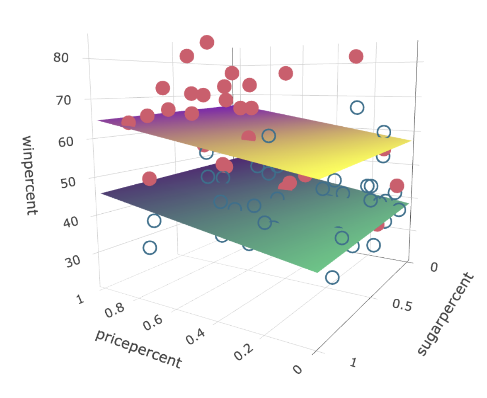
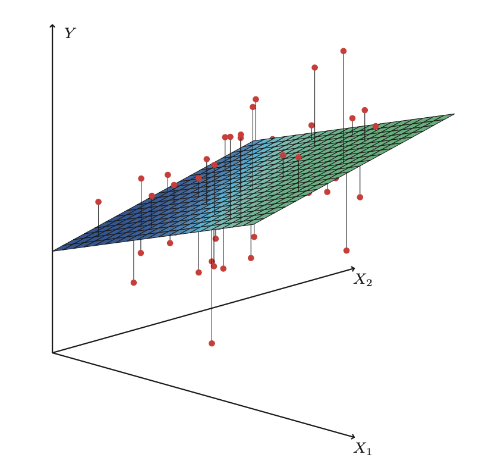

```{r}
#| label: setup
#| include: false
library(tidyverse)
library(gapminder)
library(knitr)
theme_set(theme_minimal(base_size = 18))
options(knitr.table.format = "html")
set.seed(42)
# Palette: viridis for the primary scale, magma for the second one.
v_dark <- "#440154"; v_blue <- "#31688e"; v_teal <- "#21918c"; v_green <- "#5ec962"
m_pink <- "#b73779"; m_purple <- "#8c2981"; m_orange <- "#fc8961"
gm <- gapminder |>
  filter(year == 2007) |>
  mutate(lgdp = log10(gdpPercap), lpop = log10(pop))
```

## {.inverse}

::: {.notes}
Plan 79 of 90 at factor 1.35 (a floor; 88 at 1.5). Dark = rush or skip; each dark slide's note says skip or gives the compressed phrase.

Cut order: (1) regression done badly + summary, (2) strengths, (3) probabilistic ML, (4) do the calculus; then Ceres to four slides (1801, Piazzi, contest, Gauss's answer).

Pace: 0:13 orthogonality, 0:31 three errors, 0:48 conventions, 0:55 hat matrix, 1:03 picture, 1:16 proof done.

In the notebook: OMT proof (ex. 1), OVB (ex. 2).
:::

### Week 2: linear regression

Part 1: least squares and optimal models

Part 2: multiple regression and orthogonality

## History: it's the year 1801 {.inverse}

::: {.notes}
Compress: astronomy was the GPS; a mature science.
:::

### There is no Google Maps

How do you travel? With the original GPS: **astronomy**

. . .

- Relatively mature science
- Millennia of observations and evolving theories
- About 2 centuries of observations *with telescopes*
- Similar time since Kepler's laws (elliptical orbit formulas)
- 20 years after discovery of Uranus
- But still, 45 years before discovery of Neptune

## History: discovering planets and things {.inverse .center background-image="img/ceres.jpg" background-size="cover" background-opacity="0.45" background-color="#440154"}

::: {.notes}
Piazzi: three weeks of observations, fell ill, then the sun.
:::

### Imagine being the first to observe a previously unknown celestial object in our solar system

. . .

...

::: {.fragment}
<h3>and then <a href="https://en.wikipedia.org/wiki/Ceres_%28dwarf_planet%29#Discovery">losing it</a></h3>
:::

## {.inverse}

::: {.notes}
Skip if behind.
:::

mfw

{height="520"}

## History: a (pre-machine learning?) prediction contest {.inverse}

::: {.notes}
Compress: 24 observations, a year's scramble, Gauss at 24.
:::

::: {.columns}
::: {.column width="40%"}
{height="380"}

[Yung Gauss](https://plus.maths.org/content/prime-number-lottery)
:::
::: {.column width="60%"}
- Piazzi published his $n = 24$ observations in February

- An international community of scientists and mathematicians scrambled to find Ceres

- Almost a year later, it was rediscovered using the predictions of (24 year old) C. F. Gauß
:::
:::

## History: Gauss became an instant celebrity {.inverse}

::: {.notes}
Compress: small, three degrees of arc, a year later.
:::

### Why was this impressive?

- Ceres is small (smaller than our moon)
- Observed path only ~3 degrees of motion across the sky
- Almost a year passed, so its position was far from the initial observations
- Searching for a small dim object in a sky full of brighter stars

How did Gauss do it? Kepler's laws determine an orbit uniquely from 3 points. What to do with 24?

## {.inverse}

::: {.notes}
Compress: minimize the errors; but why squared?
:::

[Gauss](https://www.maa.org/programs/maa-awards/writing-awards/the-discovery-of-ceres-how-gauss-became-famous):

> When the number of unknown quantities is equal to the number of the observed quantities depending on them, the former may be so determined as exactly to satisfy the latter. But when the number of the former is less than that of the latter, an absolutely exact agreement cannot be determined, in so far as the observations do not enjoy absolute accuracy. In this *case care must be taken to establish the best possible agreement, or to diminish as far as practicable the differences*.

### i.e. minimize errors

but why *squared* errors?

## Constraints {.inverse}

::: {.notes}
Compress: absolute, maximum, any even power.
:::

1. Errors sum to zero
2. Minimize something else, but what?

- Around the same time, R. J. Boscovich and P-S. Laplace minimized sum of absolute errors: $\text{minimize} \sum_i | r_i |$

- Laplace also suggested minimizing the maximum error: $\text{minimize} \max_i | r_i |$

- Gauss said we can use any even power, e.g. $\sum r_i^8$

## Gauss's answer {.inverse}

::: {.notes}
Compress: the simplest calculations. The better reason (loss chooses the target) in 15 min.
:::

> of all these principles ours [least squares] is the **most simple**; by the others we shall be led into the most complicated calculations

If *Gauss* didn't want to do those calculations, that's really saying something...

On the other hand, he said he used least squares *thousands* of times in his years of work (without electricity!)

For more about the origin of least squares see [this article](https://academic.oup.com/biomet/article/59/2/239/325474).

## Lessons for ML from the re-discovery of Ceres {.inverse}

::: {.notes}
Compress: severity, the right complexity, theory and observation.
:::

- **Severity (or novelty)**: lots of mathematicians used methods to fit the initial observations, what distinguished Gauss was predicting a *new* data point

. . .

- The *right amount* of **complexity**: some predictions assumed a circular orbit instead of elliptical, this simplified calculations but missed Ceres

. . .

- **Theory *and* observation**: without the heliocentric model of the solar system this search would have been a lost cause. That model itself evolved from previous iterations of theories and observations

## By contrast, regression done badly {.inverse}

::: {.notes}
Skip if behind. Else: Quetelet, Galton, the replication crisis.
:::

Convenience of calculation enables a lot of bad science

- A. Quetelet in 1835, "social physics," correlates basically any social data together, tries to predict "crime," poverty, alcohol consumption, etc

- F. Galton (1822-1911) founds the field of eugenics...

- Modern science: [replication](https://journals.sagepub.com/doi/10.1177/2515245917747646) [crisis](https://en.wikipedia.org/wiki/Replication_crisis)

Much of modern ML is similarly fitting curves to model relationships in any available data *because we can* -- not because there is any scientific or theoretical reason to do so

## {.inverse .center}

::: {.notes}
Skip if behind.
:::

### Regression began with an exemplary application, the re-discovery of Ceres

### Scientifically questionable applications have exploded since then

### Computers speed up the process, which perhaps decreases quality

### The era of "[surveillance capitalism](https://theconversation.com/the-price-of-connection-surveillance-capitalism-64124)" means scientifically (and ethically) questionable data is multiplying faster than ever

## Why squared errors? Another answer: nice geometry
At a minimum of

$$
\ell (\hat \alpha, \hat \beta) = \sum_i (y_i - \hat \alpha - \hat \beta x_i)^2
$$

we have $0 = \dfrac{\partial \ell}{\partial \alpha} = -2 \sum_i r_i$, i.e. the first constraint is satisfied,

and $0 = \dfrac{\partial \ell}{\partial \beta} = -2 \sum_i x_i r_i$, i.e. **orthogonality**.

## Orthogonality, uncorrelatedness, bias
- Since $\bar r = 0$ and $\sum x_i r_i = 0$, we also have

$$
\text{cor}(x, r) = 0
$$

- Correlation measures *linear dependence*

- If we minimized a different loss function and the resulting residuals were correlated with $x$, this would mean there is some remaining (linear) signal, in the squared-error sense

- A (linear) pattern in residuals, i.e. bias

## Randomness
- Minimizing squared error *on observed data*

$$
\text{minimize } \frac{1}{n} \sum_{i=1}^n (y_i - \alpha - \beta x_i)^2
$$

- Plug-in principle: assuming a probability model, i.e. some joint distribution $p_{X,Y}(x,y)$

$$
\text{minimize } \mathbb E[(Y - \alpha - \beta X)^2]
$$

## Probabilistic ML {.inverse}

::: {.notes}
Skip if behind. One line: we use probability models and say so.
:::

- Some machine learning methods do not explicitly use probability distributions
- Those that do use probability are sometimes (loosely) called "generative", because they
  1. Model the "data generation process" (DGP)
  2. Can be used to generate (synthetic) "data" (sampling with a random number generator)

This course is mainly focused on methods that do use probability, and we will always try to do so explicitly/transparently (not hiding our assumptions)

## Conditional distributions

Within probabilistic machine learning, supervised learning is broadly about modeling the *conditional distribution of the outcome given the features*

$$p_{Y|X}(y|x) =  p_{X,Y}(x,y) / p_{X}(x)$$

Some methods try to learn this entire distribution, others focus on some summary/functional, e.g.

::: {.columns}
::: {.column width="48%"}
::: {style="border: 2px solid #440154; border-radius: 10px; padding: 0.2em 0.8em 0.4em 0.8em;"}
conditional expectation

$$
\mathbb E_{Y|X}[Y|X]
$$
:::
:::
::: {.column width="4%"}
:::
::: {.column width="48%"}
::: {style="border: 2px solid #b73779; border-radius: 10px; padding: 0.2em 0.8em 0.4em 0.8em;"}
or conditional quantile

$$
Q_{Y|X}(\tau)
$$
(for the $\tau$th quantile)
:::
:::
:::

## Conditional distributions

::: {.notes}
Point at: the mean is a curve, not a line; the spread changes with x. Spread returns in the seminar's residual plots.
:::

```{r}
#| label: conditional-densities
#| fig-height: 4
#| fig-width: 10
# Simulated data: one input, outcome with a curved conditional mean and a
# conditional distribution that changes shape along x. The two curves are the
# densities p(y | x) at x = 1 and x = 3, drawn sideways.
n_sim <- 250
x_sim <- runif(n_sim, 0, 4)
mu <- function(x) 30 + 12 * x - 1.5 * x^2
sig <- function(x) 2 + 1.2 * x
y_sim <- mu(x_sim) + sig(x_sim) * rnorm(n_sim)
sim <- tibble(x = x_sim, y = y_sim)
curve_df <- tibble(x = seq(0, 4, length.out = 200), y = mu(x))
dens <- function(x0, scale = 0.9) {
  yy <- seq(mu(x0) - 3.5 * sig(x0), mu(x0) + 3.5 * sig(x0), length.out = 120)
  tibble(x0 = x0, y = yy, x = x0 + scale * dnorm(yy, mu(x0), sig(x0)) / dnorm(mu(x0), mu(x0), sig(x0)))
}
dd <- bind_rows(dens(1), dens(3))
ggplot(sim, aes(x, y)) +
  geom_point(colour = "grey60", size = 1.6) +
  geom_line(data = curve_df, colour = v_dark, linewidth = 1.1) +
  geom_path(data = dd, aes(group = x0), colour = m_pink, linewidth = 1.1) +
  geom_vline(xintercept = c(1, 3), linetype = "dashed", colour = m_pink) +
  annotate("text", x = 1.05, y = mu(1) + 3.2 * sig(1), label = "p(y | x = 1)", colour = m_pink, hjust = 0, size = 5.5) +
  annotate("text", x = 3.05, y = mu(3) + 3.2 * sig(3), label = "p(y | x = 3)", colour = m_pink, hjust = 0, size = 5.5) +
  annotate("text", x = 3.6, y = mu(3.6) - 2.5 * sig(3.6), label = "E[Y | X = x]", colour = v_dark, size = 5.5) +
  labs(x = "x", y = "y")
```

Curves: $p_{Y|X}(y|x)$ at two values of $x$. Dark curve: $\mathbb E[Y \mid X = x]$. Simulated data

## A variety of objectives

It can be shown (the theorem in a moment; the proof is yours, before the seminar) that

- The conditional expectation function (CEF)

$$f^\star(x) = \mathbb E_{Y|X}[Y|X = x]$$
minimizes the expected squared loss

$$f^\star = \arg \min_g \mathbb E_{X,Y} \{ [ Y - g(X) ]^2 \}$$

. . .

- Similarly, **quantile regression**: a conditional median $Q_{Y|X}(0.5)$ is a minimizer of $\mathbb E_{X,Y} [ |Y - g(X)| ]$ over $g$ (for other quantiles, "tilt" the absolute value loss function)

## Risk = expected loss

Other examples also fit into this broad framework

For a given **loss function** $\ell(y, \hat y)$ (last week: squared error), find the optimal "regression" function $f^\star$ that minimizes the **risk**, i.e.

$$
R(f) = \mathbb E_{X,Y}\big[\ell(Y, f(X))\big], \qquad f^\star = \arg \min_f R(f)
$$

. . .

*Statistical* machine learning:

::: {style="display: flex; align-items: center; justify-content: center; gap: 2.5em;"}
::: {}
$$
\mathbb E \longleftrightarrow \frac{1}{n} \sum
$$
:::
::: {style="border: 2px solid #440154; border-radius: 10px; padding: 0.3em 0.9em; font-size: 0.85em;"}
Empirical Risk Minimization (ERM)
:::
:::

Algorithms can leverage LLN, CLT, subsampling, etc...

## Three errors, three names

::: {.notes}
One minute: the three names. Plug-in = minimize R-hat. Optimism is week 5, not here.
:::

**Population risk** of a predictor $f$, an expectation over new data, the thing we want small:
$$R(f) = \mathbb E\,\ell(Y, f(X))$$

**Training error** (empirical risk), the same average over the data we fit on:
$$\hat R_n(f) = \tfrac{1}{n}\textstyle\sum_{i=1}^n \ell(y_i, f(x_i))$$

**Test error**, last week's leaderboard, over held-out data:
$$\widehat{\text{Err}} = \tfrac{1}{m}\textstyle\sum_{j=1}^m \ell(y_j^{\text{test}}, \hat f(x_j^{\text{test}}))$$

## Optimal model theorem

::: {.notes}
4 min. Statement, leave box, exercise. Do not give the method. Loss chooses the target: median for absolute loss (stated), 0-1 next week.
:::

Squared loss, any function of $X$ allowed, not only lines:

$\mathbb E Y^2 < \infty$ and $f^\star(x) = \mathbb E[Y \mid X = x]$. For every $f$ with $\mathbb E f(X)^2 < \infty$,
$$
R(f) = R(f^\star) + \mathbb E\big[(f^\star(X) - f(X))^2\big]
$$

::: {.leave}
Squared loss: the target is the conditional mean. Week 1's $f^\star$ is $\mathbb E[Y \mid X]$, and the excess risk of any $f$, any method, is one number.
:::

**Proof**: exercise 1 in the notebook, before the seminar. Corollaries: absolute loss, the conditional median (stated, not proved); zero--one loss, next week.

## Our focus

- For now, squared error. Other cases similar! (Bias-variance)
- Later: categorical outcome loss functions (classification)

### Additional modeling assumptions

Linear regression is based on an *assumption* that the conditional expectation function (CEF) is (*or can be adequately approximated as*) linear

$$
f^\star(x) := \mathbb E_{Y|X}(Y|X) = \beta_0 + \beta_1 X_1 + \cdots + \beta_p X_p
$$

(**Question**: why no $\varepsilon$ errors in this equation?)

## Statistical wisdom {.inverse}

::: {.notes}
Compress: Box, "importantly wrong".
:::

Sometimes this assumption works marvelously

Other times it breaks spectacularly

Often, it's somewhere in the gray area

. . .

### "All models are wrong, but some are useful"

Always, always, *always* remember [George Box](https://en.wikipedia.org/wiki/All_models_are_wrong):

> Since all models are wrong *the scientist must be alert to what is **importantly wrong***. It is inappropriate to be concerned about mice when there are tigers abroad.

## Strengths of machine learning {.inverse}

::: {.notes}
Skip if behind.
:::

- Relaxing the linearity assumption and using flexible, non-linear models

- Specialized methods for high-dimensional linear regression, where there are many predictor variables, possibly even $p > n$

- Beating other approaches at pure prediction accuracy, trading off simplicity/interpretability for better predictions

Recently, people have started caring more about interpretability again -- an emphasis in this course

## Multiple regression {.inverse}

#### This week

What is it? Simply a method for using more variables to predict the outcome?

Some math(s) notation

#### Next week

Interpreting the model and its coefficients

Association vs causality

## Multiple regression {.inverse}

{height="560"}

## When $p > 1$

::: {.columns}
::: {.column width="55%"}
- Instead of a regression line, we fit a regression (hyper)plane

- Among all possible such planes, find the one minimizing sum of squared errors (represented by vertical lines in ISLR Fig 3.4)

- How to find the coefficients? Calculus?
:::
::: {.column width="45%"}
{height="440"}
:::
:::

## Notation

Writing the same thing in various ways

- For observation $i$:

$$y_i = \beta_0 + \beta_1 x_{i1} + \beta_2 x_{i2} + \cdots + \beta_p x_{ip} + \varepsilon_i$$

or using the [inner product](https://en.wikipedia.org/wiki/Dot_product) (of column vectors)

$$y_i = x_i^\top \beta + \varepsilon_i$$

- Random variable version: $Y = X^\top \beta + \varepsilon$

## Notation, continued

- For all $n$ observations

$$
\begin{pmatrix}
y_1 \\
y_2 \\
\vdots \\
y_n
\end{pmatrix}
=
\begin{pmatrix}
1 & x_{11} & x_{12} & \cdots & x_{1p}\\
1 & x_{21} & x_{22} & \cdots & x_{2p}\\
\vdots & \vdots & \vdots & \ddots & \vdots \\
1 & x_{n1} & x_{n2} & \cdots & x_{np}\\
\end{pmatrix}
\begin{pmatrix}
\beta_0 \\
\beta_1 \\
\vdots \\
\beta_p
\end{pmatrix}
+
\begin{pmatrix}
\varepsilon_1 \\
\varepsilon_2 \\
\vdots \\
\varepsilon_n
\end{pmatrix}
$$

or $\mathbf{y} = \mathbf{X} \beta + \mathbf{\varepsilon}$. Note: column of 1's for intercept term. Sometimes omitted by assuming $\mathbf y$ and every column of $\mathbf X$ are already "centered"

## Notational conventions
We'll use common conventions in this course

- Bold for vectors, bold and upper case for matrices
- Otherwise upper case denotes random variable
- Error terms $\varepsilon = y - \mathbf x^\top \beta$ never truly observed
- Residuals $r = y - \mathbf x^\top \hat \beta$ used as a proxy for errors
- Greek letters like $\beta, \theta, \sigma, \Sigma$ usually *unknown parameters*
- Greek letters with hats like $\hat \beta$ are estimates computed from data
- Roman letters that usually denote functions with hats, like $\hat f$ are also estimates
- Other Roman letters with hats like $\hat y$ are predictions

## Least-squares solutions in matrix notation

With matrix-vector notation we can always write very simply:

$$
\hat {\mathbf \beta} = (\mathbf X^\top\mathbf X)^{-1}\mathbf X^\top \mathbf y = \mathbf X^\dagger \mathbf y
$$

**Remember this!** It encodes many important facts...

. . .

This assumes $\mathbf X^\top\mathbf X$ to be invertible, i.e. the *columns* of $\mathbf X$ have full rank (columns = variables)

- That's often true if $n > p$, unless some problem like one variable is a copy of another

. . .

- Impossible if $p \ge n$ (more columns than rows, the intercept counted). "High-dimensional" regression requires special methods, covered soon in this course!

## Linear algebra and geometric intuition

Predictions from the linear model:

$$\hat{\mathbf y} = \mathbf {X} \hat{\mathbf \beta} = \mathbf X (\mathbf X^\top\mathbf X)^{-1}\mathbf X^\top \mathbf y = \mathbf H \mathbf y$$
if we define

$$\mathbf H = \mathbf X (\mathbf X^\top\mathbf X)^{-1}\mathbf X^\top = \mathbf X \mathbf X^\dagger$$

(the pseudoinverse $\mathbf X^\dagger$ of the previous slide: $\hat{\mathbf y} = \mathbf X \hat{\boldsymbol\beta} = \mathbf X \mathbf X^\dagger \mathbf y$)

## Linear algebra and geometric intuition, continued

::: {.notes}
Two more facts for the proof: H symmetric; I minus H projects onto the complement, so r is orthogonal to every column. Proofs: optional problem 4.
:::

COOL FACTS about $\mathbf H$:

- $\mathbf H$ is a projection: $\mathbf H^2 = \mathbf H$
- For any $n$-vector $\mathbf v$, the $n$-vector $\mathbf {Hv}$ is the orthogonal projection of $\mathbf v$ onto the column space of $\mathbf X$
- Of all linear combinations of columns of $\mathbf X$, $\mathbf {Hv}$ is the one closest (in Euclidean distance) to $\mathbf v$.

## Exercise: do the calculus {.inverse}

::: {.notes}
Skip if behind: "the normal equations; read this at home".
:::

We have the loss function

$$L(\mathbf X, \mathbf y, \mathbf \beta) = (\mathbf y - \mathbf X \beta)^\top(\mathbf y - \mathbf X \beta)$$

(just a different way of writing sum of squared errors)

- Consider each coordinate separately and take univariate partial derivatives
- Use vector calculus and compute the gradient
- (Or even use matrix calculus identities)

. . .

Reach the same conclusion: at a stationary point of $L$,

$$\mathbf X^\top \mathbf X \hat \beta = \mathbf X^\top \mathbf y$$

## History: Frisch and Waugh, 1933 {.inverse}

::: {.notes}
1 min, or compress: detrending by hand equals adding time as a regressor. Not how lm computes (QR).
:::

Ragnar Frisch and Frederick Waugh, *Econometrica*, volume 1

Economists were "detrending" time series by hand before regressing one on another. Frisch and Waugh asked: is that the same as putting time in as a regressor?

Exactly the same, they proved. Lovell (1963) generalized it to any set of columns

::: {.leave}
Why care: it relates multiple regression coefficients to an intuitive univariate regression
:::

## Partialling-out theorem (Frisch--Waugh--Lovell)

::: {.notes}
Statement, picture, proof. Two facts do the work: normal equations (r orthogonal to columns); projection symmetric + idempotent. Full rank: denominator > 0, else NA. Gram-Schmidt column by column; backfitting, boosting, causal ML reuse it.
:::

$\mathbf X = [\mathbf X_1 \;\; \mathbf x_2]$, full column rank, the intercept column inside $\mathbf X_1$. $\mathbf M_1 = \mathbf I - \mathbf X_1(\mathbf X_1^\top\mathbf X_1)^{-1}\mathbf X_1^\top$ projects onto the orthogonal complement of $\mathrm{col}(\mathbf X_1)$, so $\tilde{\mathbf x}_2 = \mathbf M_1 \mathbf x_2$ is the residual of $\mathbf x_2$ after regressing it on $\mathbf X_1$. The coefficient on $\mathbf x_2$ in the regression of $\mathbf y$ on $\mathbf X$ is
$$
\hat\beta_2 = \frac{\tilde{\mathbf x}_2^\top \mathbf y}{\tilde{\mathbf x}_2^\top \tilde{\mathbf x}_2}
$$
(and the same number comes from regressing $\mathbf M_1 \mathbf y$ on $\tilde{\mathbf x}_2$: residual on residual).

::: {.leave}
The coefficient on $x_2$ is the slope of $y$ on *what is left of $x_2$ after $\mathbf X_1$ has explained what it can*. Fitting to residuals: additive models, boosting and causal ML share the mechanism, not a guarantee.
:::

## Visualizing orthogonal subspaces

::: {.notes}
2 min. col(X1) = one direction (intercept, n = 3); the plane = its complement. Project, then one univariate regression. Say "subspace", "projection". Intercept as X1: projection = centering.
:::

```{r}
#| label: fwl-picture
#| fig-width: 10
#| fig-height: 3.7
# R^3 drawn obliquely. col(X1) is a tilted direction n; its orthogonal complement is
# the plane spanned by e1, e2. Intrinsic coordinates (u, v, w) = u e1 + v e2 + w n.
nrm <- function(v) v / sqrt(sum(v^2))
n  <- nrm(c(-0.40, -0.50, 1))
e1 <- nrm(c(1, 0, 0) - sum(c(1, 0, 0) * n) * n)
e2 <- c(n[2]*e1[3] - n[3]*e1[2], n[3]*e1[1] - n[1]*e1[3], n[1]*e1[2] - n[2]*e1[1])
V  <- function(u, v, w) u * e1 + v * e2 + w * n
scr <- function(p) c(x = p[1] + 0.40 * p[2], y = p[3] + 0.21 * p[2])
seg <- function(a, b) { pa <- scr(a); pb <- scr(b); data.frame(x = pa[1], y = pa[2], xend = pb[1], yend = pb[2]) }
S <- function(a, b, ...) geom_segment(data = seg(a, b), aes(x, y, xend = xend, yend = yend), ...)
x2  <- V(3.2, -1.1, 2.0)
yv  <- V(2.3, 1.7, 2.9)
proj <- function(p) p - sum(p * n) * n
x2t <- proj(x2); yt <- proj(yv)
b2  <- sum(x2t * yt) / sum(x2t^2); fit <- b2 * x2t
o   <- c(0, 0, 0)
corners <- rbind(scr(V(-0.8, -2.0, 0)), scr(V(5.6, -2.0, 0)), scr(V(5.6, 3.6, 0)), scr(V(-0.8, 3.6, 0)))
floor <- data.frame(x = corners[,1], y = corners[,2])
edge <- scr(V(1, 0, 0)) - scr(V(0, 0, 0)); edge_deg <- atan2(edge[2], edge[1]) * 180 / pi
s <- 0.3
u <- nrm(x2t); w <- nrm(yt - fit)
ra  <- rbind(scr(fit - s*u), scr(fit - s*u + s*w), scr(fit + s*w)); ra  <- data.frame(x = ra[,1],  y = ra[,2])
ra2 <- rbind(scr(x2t + s*n), scr(x2t + s*n - s*u), scr(x2t - s*u));  ra2 <- data.frame(x = ra2[,1], y = ra2[,2])
arr <- arrow(length = unit(0.14, "inches"), type = "closed")
tri <- function(a, b) { m <- rbind(scr(o), scr(a), scr(b)); data.frame(x = m[,1], y = m[,2]) }
lab <- function(p, dx, dy, text, size, colour, hjust = 0, angle = 0) annotate("text", x = scr(p)[1] + dx, y = scr(p)[2] + dy, label = text, parse = TRUE, hjust = hjust, size = size, colour = colour, angle = angle)
axis_top <- V(0, 0, 3.9)
g <- ggplot() +
  geom_polygon(data = floor, aes(x, y), fill = "grey93", colour = "grey70") +
  geom_polygon(data = tri(x2, x2t), aes(x, y), fill = v_teal, alpha = 0.12) +
  geom_polygon(data = tri(yv, yt), aes(x, y), fill = m_pink, alpha = 0.12) +
  S(x2, x2t, linetype = "dashed", colour = "grey45") +
  S(yv, yt,  linetype = "dashed", colour = "grey45") +
  geom_path(data = ra2, aes(x, y), colour = "grey45", linewidth = 0.4) +
  S(V(0, 0, -0.5), axis_top, colour = v_dark, linewidth = 1.1, arrow = arr) +
  S(o, x2, colour = v_teal, linewidth = 1.2, arrow = arr) +
  S(o, yv, colour = m_pink, linewidth = 1.2, arrow = arr) +
  S(o, x2t, colour = v_teal, linewidth = 1.2, arrow = arr, alpha = 0.45) +
  S(o, yt,  colour = m_pink, linewidth = 1.2, arrow = arr, alpha = 0.45) +
  S(o, fit, colour = v_blue, linewidth = 2.4, alpha = 0.6) +
  S(fit, yt, colour = m_orange, linewidth = 1.2, arrow = arr) +
  geom_path(data = ra, aes(x, y), colour = "grey30", linewidth = 0.4) +
  lab(axis_top, 0, 0.42, "col(bold(X)[1])", 7, v_dark, hjust = 0.5) +
  lab(V(4.9, -2.0, 0), 0, -0.62, "everything~orthogonal~to~col(bold(X)[1])", 4.4, "grey35", hjust = 1, angle = edge_deg) +
  lab(x2, 0.15, 0.1, "bold(x)[2]", 7.5, v_teal) +
  lab(yv, 0.15, 0.1, "bold(y)", 7.5, m_pink) +
  lab(x2t, 0.15, -0.05, "tilde(bold(x))[2] == bold(M)[1]*bold(x)[2]", 7, v_teal) +
  lab(yt, 0.15, 0.12, "tilde(bold(y)) == bold(M)[1]*bold(y)", 7, m_pink) +
  lab(fit/2, 0.35, -0.6, "hat(beta)[2]*tilde(bold(x))[2]", 7, v_blue, hjust = 0.5) +
  lab((fit + yt)/2, 0.22, -0.05, "bold(r)", 7, m_orange) +
  coord_equal(clip = "off") + scale_x_continuous(expand = expansion(add = 0.9)) + scale_y_continuous(expand = expansion(add = c(0.95, 0.3))) + theme_void()
g
```

Project everything onto the orthogonal complement of $\mathrm{col}(\mathbf X_1)$, the grey plane. There, regress $\tilde{\mathbf y}$ on $\tilde{\mathbf x}_2$ through the origin: the slope is $\hat\beta_2$ and $\mathbf r$ is the full regression's residual

## Partialling-out theorem, lines 1--2

::: {.notes}
Q1 (before click 1): multiply by what to kill X1? (M1)

Q2 (before click 2): what happens to each term; why M1 r = r? (M1 X1 = 0; M1 x2 = x2-tilde; r already in the complement)
:::

The full regression, with the normal equations read column by column: the residual is orthogonal to every column
$$
\mathbf y = \mathbf X_1 \hat{\boldsymbol\beta}_1 + \mathbf x_2 \hat\beta_2 + \mathbf r, \qquad \mathbf X_1^\top \mathbf r = \mathbf 0,\ \ \mathbf x_2^\top \mathbf r = 0
$$

. . .

Multiply through by $\mathbf M_1$:
$$
\mathbf M_1 \mathbf y = \mathbf M_1 \mathbf X_1 \hat{\boldsymbol\beta}_1 + \mathbf M_1 \mathbf x_2 \hat\beta_2 + \mathbf M_1 \mathbf r
$$

. . .

$\mathbf M_1 \mathbf X_1 = \mathbf 0$ and $\mathbf M_1 \mathbf r = \mathbf r$ (because $\mathbf r \perp \mathrm{col}(\mathbf X_1)$), so
$$
\mathbf M_1 \mathbf y = \tilde{\mathbf x}_2 \,\hat\beta_2 + \mathbf r
$$

## Partialling-out theorem, lines 3--4

::: {.notes}
Q1: one unknown number; multiply by what for a scalar equation with a positive coefficient? (x2-tilde transpose)

Q2: what is x2-tilde transpose r? (x2 transpose M1 r = x2 transpose r = 0)
:::

$\mathbf M_1 \mathbf y = \tilde{\mathbf x}_2 \,\hat\beta_2 + \mathbf r$ is a vector equation with one unknown number, $\hat\beta_2$

. . .

Multiply by $\tilde{\mathbf x}_2^\top = \mathbf x_2^\top \mathbf M_1$:
$$
\tilde{\mathbf x}_2^\top \mathbf M_1 \mathbf y = \tilde{\mathbf x}_2^\top \tilde{\mathbf x}_2\, \hat\beta_2 + \tilde{\mathbf x}_2^\top \mathbf r
$$

. . .

The last term: $\tilde{\mathbf x}_2^\top \mathbf r = \mathbf x_2^\top \mathbf M_1 \mathbf r = \mathbf x_2^\top \mathbf r = 0$

## Partialling-out theorem, lines 5--6

::: {.notes}
Q1: two M1's; which property drops one, which gave x2-tilde transpose = x2 transpose M1? (idempotent; symmetric)

Q2: dividing by what, zero when? (squared length of x2-tilde; zero iff x2 in col(X1); full rank; the NA)
:::

Left side: $\tilde{\mathbf x}_2^\top \mathbf M_1 \mathbf y = \mathbf x_2^\top \mathbf M_1 \mathbf M_1 \mathbf y$

. . .

$= \mathbf x_2^\top \mathbf M_1 \mathbf y = \tilde{\mathbf x}_2^\top \mathbf y$, using $\mathbf M_1^\top = \mathbf M_1 = \mathbf M_1^2$

. . .

Full column rank makes $\tilde{\mathbf x}_2^\top \tilde{\mathbf x}_2 > 0$, so
$$
\hat\beta_2 = \frac{\tilde{\mathbf x}_2^\top \mathbf y}{\tilde{\mathbf x}_2^\top \tilde{\mathbf x}_2} = \frac{\tilde{\mathbf x}_2^\top \tilde{\mathbf y}}{\tilde{\mathbf x}_2^\top \tilde{\mathbf x}_2}, \qquad \tilde{\mathbf y} = \mathbf M_1 \mathbf y \qquad \blacksquare
$$

(ESL §3.2.3.)

## Before the seminar

::: {.notes}
Say it twice: exercises are what the seminar varies; teachers give one hint. Standing expectation.
:::

- This week: exercises 1 and 2 at the top of the notebook. The proof of the optimal model theorem, and omitted-variable bias: what the normal equations say when a relevant column is left out

- Every week: the notebook opens with a "Before the seminar" section. Do it before you arrive; the seminar's problems start from it

## Concluding points {.inverse}

::: {.notes}
Compress: the baseline; interpretable but tricky; misused; done well, magic.
:::

One of the most commonly used methods, even with more complex ML often compare to regression as a "baseline"

Perhaps the most complex method that is still considered relatively interpretable. But interpretation is actually trickier than most understand! (**more on this next week!**)

. . .

#### *Very* often used in ways that don't make sense by people who don't know what they're doing to reach conclusions that don't work in the real world!

. . .

#### Done well: amazing, *almost* magically effective, worth many more years of study, can easily provide a lifetime of valuable usage to a wise practitioner
