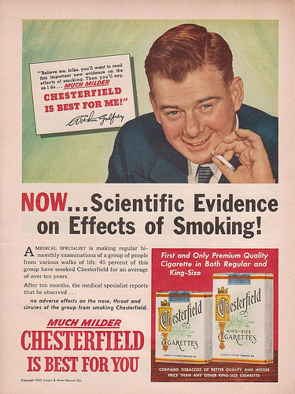
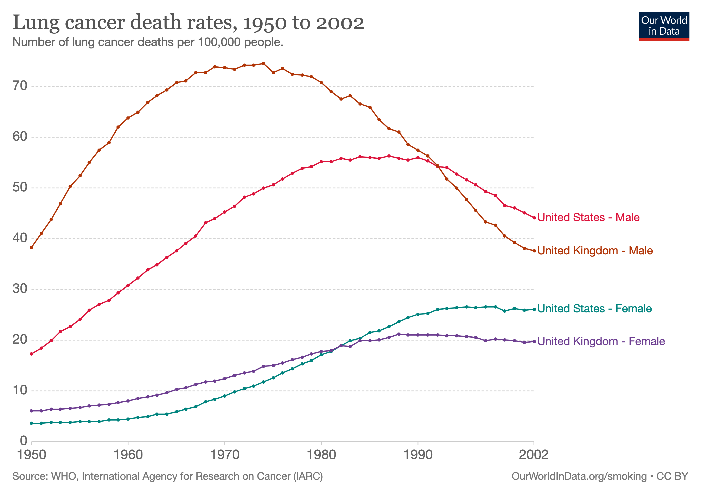

```{r}
#| label: setup
#| include: false
library(tidyverse)
library(knitr)
library(broom)
library(modelr)   # data_grid() and seq_range() in the legacy classification figures
library(ggdag)
library(patchwork)
theme_set(theme_minimal(base_size = 18))
options(knitr.table.format = "html")
options(digits = 3)
set.seed(1)
# Palette: viridis for the primary scale, magma for the second one.
v_dark <- "#440154"; v_blue <- "#31688e"; v_teal <- "#21918c"; v_green <- "#5ec962"
m_pink <- "#b73779"; m_purple <- "#8c2981"; m_orange <- "#fc8961"
# DAG helper from the legacy causality deck: an unobserved node named G (or U)
# is drawn grey with dashed edges.
DAGtoplot <- function(DAG, unobserved = c("G", "U")) {
  DAG %>%
  tidy_dagitty() %>%
  mutate(color = ifelse(name %in% unobserved, "gray", "black"),
         linetype = ifelse(name %in% unobserved, "dashed", "solid")) %>%
  ggplot(aes(x = x, y = y, xend = xend, yend = yend)) +
    geom_dag_point(size = 18, aes(color = color), show.legend = FALSE) +
    geom_dag_text(size = 10) +
    geom_dag_edges(aes(edge_linetype = linetype), edge_width = 1.5) +
  scale_color_grey() +
  theme_dag_blank()
}
# The adjustment theorem's DAG (Z -> T, Z -> Y, T -> Y) and its intervened
# version (the arrow into T removed).
dag_adjust <- function(intervened = FALSE, title = NULL) {
  s <- if (intervened) '{ Z [pos="1,1"] T [pos="0,0"] Y [pos="2,0"] Z -> Y T -> Y }' else
                       '{ Z [pos="1,1"] T [pos="0,0"] Y [pos="2,0"] Z -> T Z -> Y T -> Y }'
  dag(s) %>% tidy_dagitty() %>%
    ggplot(aes(x = x, y = y, xend = xend, yend = yend)) +
    geom_dag_point(size = 18, colour = "#e5ecf6") +
    geom_dag_text(size = 9, colour = v_dark) +
    geom_dag_edges(edge_width = 1.5) +
    expand_limits(x = c(-0.35, 2.35), y = c(-0.4, 1.45)) +
    coord_cartesian(clip = "off") +
    labs(title = title) +
    theme_dag_blank() +
    theme(plot.title = element_text(size = 16, hjust = 0.5, colour = v_dark))
}
```

## {.inverse}

::: {.notes}
Plan about 85 of 90 at week 2's rough pace (2 min a light slide, 1 a dark one; 35 light, 15 dark): over the 76 budget. Cuts 1 to 4 below bring it to about 76. Dark = rush or skip; each dark slide's note says skip or gives the compressed phrase.

Cut order: (1) ROC in one sentence, (2) Yule history in one line, (3) contours and boundaries narrated, (4) the confounding gap in one sentence (exercise 2 derives it).

Pace, no cuts: 0:23 classification summary, 0:31 threshold theorem, 0:46 Yule's regressions, 1:08 the adjustment question, 1:14 the propensity question, 1:18 proof done.

In the notebook: threshold proof (ex. 1), confounding gap (ex. 2), adjustment proof (ex. 3), this proof redone (ex. 4).
:::

### Week 3: classification, and causality (part 1)

Part 1: classification, and what a mistake costs

Part 2: causality and interventions

## Where week 2 left the target

::: {.notes}
Two minutes, written, then two people. Expected: a probability; a line leaves [0, 1]. Do not say "probability" first.
:::

::: {.retrieval}
Week 2, the optimal model theorem: under squared loss the best predictor of $Y$ from $X$ is the conditional mean, $f^\star(x) = \mathbb E[Y \mid X = x]$, and any other $f$ pays $\mathbb E[(f^\star(X) - f(X))^2]$ on top of it.
:::

Today the outcome is a label: $Y \in \{0, 1\}$.

::: {.ask}
Write down what $\mathbb E[Y \mid X = x]$ is when $Y$ takes only the values $0$ and $1$. Then write one thing a straight line $x^\top\beta$ gets wrong about it.
:::

## The target is a probability

::: {.notes}
Predicting a label is two steps: a probability, then a threshold. The threshold is the first theorem today.
:::

For a $0/1$ outcome the conditional mean is a probability:
$$
p(x) = P(Y = 1 \mid X = x) = \mathbb E[Y \mid X = x]
$$

So the optimal model theorem's target is the **class probability** $p(x)$, and a fitted model gives an estimate $\hat p(x)$

A line $x^\top\beta$ does not stay inside $[0, 1]$: that is the first thing logistic regression fixes

Notation for today: $p(x)$ the class probability, $\hat p(x)$ its estimate, and a **threshold** $c$: predict $1$ when $\hat p(x) > c$

## Classification {.inverse}

::: {.notes}
Compress: labels instead of numbers; K classes; today K = 2.
:::

- **Supervised learning** with categorical/qualitative outcomes

(in contrast to regression, with numeric outcomes)

- Often called "labels", $K$ = number of unique classes

- Binary: positive/negative or 0/1 or yes/no or success/fail etc

*Label names not mathematically important* - e.g. use $1, ..., K$

. . .

- Limitations: labels already defined (not learned from data-- that  would be unsupervised learning), $K$ is fixed

- Plots: often use color/point shape for categorical variables

## Interpretable classification

### Logistic regression

$$\mathbb E(Y| \mathbf X = \mathbf x) =  g^{-1}(\mathbf x^T \beta)$$
$$g(p) = \log{\left(\frac{p}{1-p}\right)}$$

. . .

### Generalized linear models (GLMs)

- [Various](https://en.wikipedia.org/wiki/Generalized_linear_model#General_linear_models) "link" functions $g$
- Linear regression is a special case with $g = \text{id}$
- Logistic in `R`: `glm(..., family = binomial())`
- Others: Poisson, Gamma, ..., see `?family` in `R`

## One predictor, "S curve"

```{r}
#| label: logit-data
set.seed(42)
n <- 80
Y <- rbinom(n, 1, .5)
train <- data.frame(
  y = factor(Y),
  x1 = rnorm(n) + 1.5*Y,
  x2 = rnorm(n) + 1.2*Y
)
```

```{r}
#| label: logit-1dm
#| fig-align: center
#| fig-width: 8
#| fig-height: 4.6
#| out-width: "71%"
eg1 <- ggplot(train, aes(x1, y)) +
  geom_point(aes(color = y), show.legend = FALSE, alpha = .4) +
  geom_line(
    data = augment(
      glm(y ~ x1, family = "binomial", data  = train),
      newdata = data_grid(data = train,
                          x1 = seq_range(x1, 100, expand = .1)),
      type.predict = "response"
    ),
    aes(x1, .fitted + 1),
    linewidth = 1
  ) + scale_color_viridis_d(option = "D", end = .8) +
  annotate("text", x = 0.2, y = 1.5, label = "g^{-1}", size = 6, parse = TRUE)
eg1
```

## Classifications/decisions: threshold probability

```{r}
#| label: logit-1d-class
#| fig-align: center
#| fig-width: 8
#| fig-height: 4.6
#| out-width: "71%"
eg1 +
  annotate("segment", x = .9, xend = .9, y = .8, yend  = 2.2, linetype = "dashed", linewidth = 1, color = v_blue) +
  geom_point(data =  train,
             aes(color =  y), alpha =  .4,
             show.legend = FALSE) +
  annotate("text", x = -.25, y = 2.2, color = m_pink,
           label = "false negatives", size = 6) +
  annotate("text", x = 2, y = 2.2,
           label = "true positives", size = 6) +
  annotate("text", x = -.25, y = .8,
           label = "true negatives", size = 6) +
  annotate("text", x = 2, y = .8, color = m_pink,
           label = "false positives", size = 6)
```

## Contours of GLM-predicted class probabilities

::: {.notes}
Two predictors now. Shading: fitted probability. Dashed line: where it crosses 1/2. Pink: the training points it gets wrong.
:::

```{r}
#| label: logit-contour
#| fig-align: center
#| fig-width: 8
#| fig-height: 4.6
#| out-width: "71%"
logit_model <-  glm(y ~ x1 + x2, family = "binomial", data = train)
logit_surface <- logit_model %>%
   augment(type.predict = "response",
              newdata = data_grid(data = train,
                                  x1 = seq_range(x1, 100, expand = .1),
                                  x2 = seq_range(x2, 100, expand = .1)))
ggplot(
  data = logit_surface,
  aes(x1,x2)) +
  geom_contour_filled(
    aes(z = .fitted),
    show.legend = FALSE,
    alpha = .3,
    ) +
  geom_abline(slope = -coef(logit_model)[2]/coef(logit_model)[3],
              intercept = -coef(logit_model)[1]/coef(logit_model)[3], linetype = "dashed", linewidth = 1, color = v_blue) +
  geom_point(
    data = train,
             aes(shape = y, color = y),
             size = 2, stroke = 1, alpha = .9,
             show.legend = FALSE) +
  scale_shape_manual(values=c(21, 22)) +
  scale_color_viridis_d(option = "viridis", direction = -1, end = .8) +
  scale_fill_viridis_d(option = "viridis", end = .8) +
  geom_point(
    data = augment(logit_model,
                   type.predict = "response") %>%
      mutate(yhat = as.numeric(.fitted > .5),
             class = as.numeric(y)-1 == yhat) %>%
      filter(class == FALSE),
    aes(shape = y, color = y),
             stroke = 1.5, alpha = .9,
             show.legend = FALSE,
    fill = m_pink, size = 3)
```

## Classification boundaries {.center}

::: {style="font-size: 1.15em"}
**Classification boundaries** with

### $p = 3$ predictors

Boundary = plane

### $p > 3$ predictors

Boundary = hyperplane

(In practice, "high-dimensional" = can't easily plot it)
:::

## Interpretation: coefficients

```{r}
#| echo: true
model_fit <- glm(y ~ x1 + x2, family = "binomial", data = train)
broom::tidy(model_fit)
```

Coefficient scale: log-odds? Exponentiate $\to$ odds ratios (intercept: baseline odds)

```{r}
#| echo: true
broom::tidy(model_fit, exponentiate = TRUE)
```

## Interpretation: inference and diagnostics

::: {.notes}
How glm finds the MLE (likelihood, score equations) is week 4's opener.
:::

- Fitted by maximum likelihood; how `glm` does it: next week

- MLEs $\to$ asymptotic normality for intervals/tests

`summary()`, `coef()`, `confint()`, `anova()`, etc in `R`

- "Deviance" instead of RSS

```{r}
#| echo: true
broom::glance(model_fit)
```

- Because $y$ is 0 or 1, residual plots will show patterns, not as easy to interpret geometrically

## Challenges

::: {.notes}
Why there is no finite MLE when the classes separate: week 4.
:::

#### Separable case (guaranteed if $p \ge n$ and the rows of $\mathbf X$ are linearly independent)

If classes can be perfectly separated, there is no finite MLE: the likelihood keeps increasing as $\hat \beta$ runs off to infinity along a separating direction

Awkwardly, classification is *too easy*(!?) for this probabilistic approach

. . .

#### Curse of dimensionality

With Gaussian inputs: biased MLE and wrong variance/asymp. dist. if $n/p \to \text{const}$, even if $> 1$

[See [Sur and Candès, (2019)](https://www.pnas.org/content/116/29/14516)]{.source}

## Classification summary {.inverse}

::: {.notes}
Compress: threshold p-hat at c; which c is the next five minutes.
:::

::: {.columns}
::: {.column width="48%"}
- Numeric prediction $\to$ classification

$$\hat y = \mathbb I(\hat p > c) = \begin{cases} 0 & \text{ if } \hat p \leq c \\  1 & \text{ if } \hat p > c \end{cases}$$

Log-odds function is monotonic, so (hyperplanes)

$$\hat p > c \leftrightarrow x^T \beta > c'$$
:::
::: {.column width="52%"}
- More classes: transform to binary, predict using largest $\hat p_k$
- Non-linear boundaries: transformation of predictors, or use methods other than GLMs (we'll learn more soon)
- Some classification methods output categorical classes, not probabilities (or other numeric scores)
:::
:::

## Two kinds of mistake

::: {.notes}
All on the training points: apparent performance; week 5 says what that flatters. The accuracy line is about baselines.
:::

```{r}
#| label: confusion
#| fig-height: 2.6
#| fig-width: 8
#| out-width: "60%"
#| fig-align: center
cm <- augment(logit_model, type.predict = "response") |>
  mutate(truth = as.numeric(as.character(y)), yhat = as.numeric(.fitted > 0.5)) |>
  count(truth, yhat) |>
  mutate(truth_lab = ifelse(truth == 1, "truth 1", "truth 0"),
         pred_lab = ifelse(yhat == 1, "predicted 1", "predicted 0"),
         kind = case_when(truth == 1 & yhat == 1 ~ "true positive",
                          truth == 0 & yhat == 0 ~ "true negative",
                          truth == 1 & yhat == 0 ~ "false negative (a miss)",
                          TRUE ~ "false positive (a false alarm)"),
         right = truth == yhat)
ggplot(cm, aes(pred_lab, truth_lab)) +
  geom_tile(aes(fill = right), colour = "white", linewidth = 2, show.legend = FALSE) +
  geom_text(aes(label = paste0(n, "\n", kind)), size = 5.5, colour = v_dark) +
  scale_fill_manual(values = c(`TRUE` = "#eef7ef", `FALSE` = "#fdeef4")) +
  labs(x = NULL, y = NULL, title = "Two-predictor model, c = 1/2, on its 80 training points")
```

Move $c$ and the two kinds of mistake trade against each other. The two numbers that move: the **true positive rate** (TPR, sensitivity, recall) $= \text{TP}/(\text{TP} + \text{FN})$ and the **false positive rate** (FPR, one minus specificity) $= \text{FP}/(\text{FP} + \text{TN})$

Accuracy $= (\text{TP} + \text{TN})/n$ hides the split. With 95% zeros, predicting $0$ for everyone already scores 95%

## ROC: the curve invented for radar

::: {.notes}
Second on the cut order: say "one point per threshold" and move on. The seminar builds this curve with a loop.
:::

::: {.columns}
::: {.column width="45%"}
```{r}
#| label: roc
#| fig-height: 4.2
#| fig-width: 5.2
#| out-width: "100%"
fit1 <- glm(y ~ x1, family = "binomial", data = train)
p1 <- fitted(fit1)
y01 <- as.numeric(as.character(train$y))
# every distinct fitted score is a threshold (exact empirical ROC); the 0.01 grid adds points for the cost curve
thresholds <- sort(unique(c(seq(0, 1, by = 0.01), p1)))
roc1 <- map_dfr(thresholds, function(t) {
  yhat <- as.numeric(p1 > t)
  tibble(t = t,
         tpr = sum(yhat == 1 & y01 == 1) / sum(y01 == 1),
         fpr = sum(yhat == 1 & y01 == 0) / sum(y01 == 0))
})
auc1 <- mean(outer(p1[y01 == 1], p1[y01 == 0], ">") + 0.5 * outer(p1[y01 == 1], p1[y01 == 0], "=="))
pts <- roc1 |> filter(t %in% c(0.25, 0.5, 0.75))
ggplot(roc1, aes(fpr, tpr)) +
  geom_abline(slope = 1, intercept = 0, linetype = "dotted", colour = "grey60") +
  geom_path(colour = v_blue, linewidth = 1.3) +
  geom_point(data = pts, size = 4, colour = m_pink) +
  geom_text(data = pts, aes(label = paste0("c = ", t)), nudge_x = 0.13, nudge_y = -0.04, size = 5) +
  coord_equal() +
  labs(x = "false positive rate", y = "true positive rate",
       title = paste0("Training points, AUC = ", round(auc1, 2)))
```
:::
::: {.column width="55%"}
The **receiver operating characteristic**: one point per threshold $c$, from $c = 1$ (predict $0$ for everyone, bottom left) to $c = 0$ (top right)

Lower $c$: catch more of the 1s, raise more false alarms

**AUC**, the area under it: the probability that a random 1 scores above a random 0 (a tie counts half), a ranking quality that never asks where $c$ is

Named for radar receivers in the 1940s. It does not answer the operator's question: *which* point?
:::
:::

## What does a mistake cost?

::: {.notes}
Show of hands for 1 and for 0 before saying anything. Dashed lines: the next slide's formula.
:::

Predicting $1$ when the truth is $0$ costs $c_{FP}$; predicting $0$ when the truth is $1$ costs $c_{FN}$; a correct prediction costs nothing

```{r}
#| label: cost-curve
#| fig-height: 2.7
#| fig-width: 10
#| out-width: "76%"
#| fig-align: center
cost_curve <- function(cfn, cfp) {
  roc1 |> mutate(cost = (cfn * (1 - tpr) * sum(y01 == 1) + cfp * fpr * sum(y01 == 0)) / length(y01),
                 costs = paste0("miss costs ", cfn, ", false alarm costs ", cfp))
}
cc <- bind_rows(cost_curve(1, 1), cost_curve(10, 1))
pal <- c("miss costs 1, false alarm costs 1" = v_blue, "miss costs 10, false alarm costs 1" = m_pink)
vlines <- tibble(costs = names(pal), cstar = c(1/2, 1/11))
ggplot(cc, aes(t, cost, colour = costs)) +
  geom_line(linewidth = 1.2, show.legend = FALSE) +
  geom_vline(data = vlines, aes(xintercept = cstar, colour = costs), linetype = "dashed", show.legend = FALSE) +
  scale_colour_manual(values = pal) +
  facet_wrap(~ costs, scales = "free_y") +
  labs(x = "threshold c on the fitted probability (one-predictor model)",
       y = "cost per unit", colour = NULL,
       caption = "averaged over the 80 training points; dashed: the thresholds the next slide's formula gives, 1/2 and 1/11")
```

::: {.ask}
A miss costs ten times a false alarm and the model says $\hat p = 0.3$. Predict $1$ or $0$?
:::

## Optimal threshold theorem

::: {.notes}
2 min. Ten to one: 1/11, about 0.09, so p-hat = 0.3 is "predict 1". The threshold was never a statistical question.
:::

**Optimal threshold theorem.** Let $p(x) = P(Y = 1 \mid X = x)$, and let a false positive cost $c_{FP}$ and a false negative $c_{FN}$, both $\ge 0$ and not both $0$. The rule that minimizes expected cost at $x$ predicts $1$ exactly when
$$
p(x) > c^\star = \frac{c_{FP}}{c_{FP} + c_{FN}},
$$
and at $p(x) = c^\star$ either prediction is optimal. Equal costs give $c^\star = \tfrac12$: predict the more probable class, the **Bayes classifier**.

::: {.leave}
The model gives $p$. The costs give $c^\star$, and somebody chose the costs. With $\hat p$ in place of $p$, the rule is only as good as the estimate.
:::

**Proof**: exercise 1 in the notebook, before the seminar. The same argument as week 2's optimal model theorem: minimize the expected loss one $x$ at a time.

## Causality, part 1 {.center}

::: {.notes}
Collect two or three answers. Today: why the model's answer can be wrong, and when we can do better.
:::

::: {.retrieval}
Week 1, concepts that keep coming back: prediction $\neq$ explanation $\neq$ intervention.
:::

::: {.ask}
A model predicts life expectancy from GDP per capita well on held-out countries. A minister raises GDP per capita by ten percent. What does the model say happens to life expectancy? Do you believe it?
:::

## History: from the stars to "Poor Law Statistics" {.inverse}

::: {.notes}
Compress: a century after Gauss, regressing anything; but why?
:::

- Almost a century after Gauss
- Scientists correlating/regressing anything
- Problem: what does it mean?

e.g. [Francis Galton](https://www.theguardian.com/education/2020/jun/19/ucl-renames-three-facilities-that-honoured-prominent-eugenicists) correlated numeric traits between generations of organisms...

But *why*? "[Nature versus nurture](https://en.wikipedia.org/wiki/Nature_versus_nurture)" debate (still unresolved?)

e.g. [Udny Yule](https://en.wikipedia.org/wiki/Udny_Yule) and others correlated poverty ("pauperism") with welfare ("out-relief")...

But *why*? "[Welfare](http://economistjourney.blogspot.com/2014/08/the-crazy-dream-of-george-udny-yule-is.html) [trap](https://en.wikipedia.org/wiki/Welfare_trap)" debate (still unresolved?)

## History: origin of multiple regression {.inverse}

::: {.notes}
Compress: Yule, 1897, the first multiple regression, "controlling for" age.
:::

::: {.columns}
::: {.column width="55%"}
- Udny Yule (1871-1951)

- Studied this poverty question

- First paper using multiple regression in 1897

- Association between poverty and welfare while "controlling for" age
:::
::: {.column width="45%"}
{height="380"}
:::
:::

## History: Yule, in 1897 {.inverse}

::: {.notes}
Compress: welfare, poverty, age; is the association "due to" age?
:::

> Instead of speaking of "causal relation," ... we will use the terms "correlation," ...

::: {.columns}
::: {.column width="55%"}
- Variables, roughly:
  - $Y =$ prevalence of poverty
  - $X_1 =$ generosity of welfare policy
  - $X_2 =$ age
:::
::: {.column width="45%"}
- Positive correlations:
  - $\text{cor}(Y, X_1) > 0$
  - $\text{cor}(X_2, X_1) > 0$
:::
:::

Do more people enter/stay in poverty if welfare is more generous?

Or is this association "due to" age?

## History: Yule, in 1897 {.inverse}

::: {.notes}
Skip if behind; the next slide quotes the line that matters.
:::

> The investigation of **causal relations** between economic phenomena presents many problems of peculiar difficulty, and offers many opportunities for fallacious conclusions.

> Since the statistician can seldom or never make experiments for himself, he has to accept the data of daily experience, and *discuss as best he can the relations of a whole group of changes*; he **cannot, like the physicist, narrow down the issue to the effect of one variation at a time. The problems of statistics are in this sense far more complex than the problems of physics**.

## {.center}

::: {style="font-size: 1.5em; font-weight: 600; color: #440154"}
[We] cannot [...] narrow down the issue to the effect of **one variation at a time**
:::

. . .

but... isn't this how *almost everyone* interprets regression coefficients?...

::: {style="font-size: 2em"}
🤔 🤨
:::

(yes! and they are wrong!!!!)

## {.inverse .center}

::: {.notes}
Skip if behind.
:::

Warning: don't go this way

the next slide is about some common mistakes people make when interpreting regression coefficients

(don't try to memorize the formulas)

## Interpreting regression coefficients

People *want* these things to be true:

- "The linear **model** and our **estimates** are both good"

$$\frac{\partial}{\partial x_j} \mathbb E[\mathbf y | \mathbf X] = \beta_j \approx \hat \beta_j$$

- "We can interpret $\beta_j$ as a causal parameter," i.e. **intervening**  to increase $x_j$ by 1 unit would result in conditional average of $y$ changing by $\beta_j$ units

$$
\text{If } (x_j \mapsto x_j + 1) \text{ then } (\mathbb E[y] \mapsto \mathbb E[\mathbf y | \mathbf X] + \hat \beta_j)
$$

### But this *almost never* works!

## Ceteris paribus

Many textbooks tell us something like:

> "The coefficient $\hat \beta_j$ estimates the relationship between the (conditional mean of the) outcome variable and $x_j$ *while holding all other predictors constant*"

i.e. "**ceteris paribus**" or "other things equal" (unchanged)

#### Fundamental problem of interpreting regression coefficients:

. . .

"holding all other predictors constant" is (almost) never applicable in the real world, i.e. ceteris is (almost) never paribus

Reasons we'll highlight: **causality** (today) and **nonlinearity** (the additive-models week)

## Interpreting causality

Back to Yule. What does $\hat \beta_\text{welfare}$ mean? (Simulated data below, not Yule's.)

```{r}
#| label: yule-sim
#| include: false
n <- 1000
age <- runif(n)
poverty <- age + rnorm(n)
welfare <- poverty + age/2 + rnorm(n)
```

::: {.panel-tabset}

### Poverty

```{r}
#| echo: true
lm(poverty ~ welfare + age) |> broom::tidy() |> knitr::kable()
```

### Welfare

```{r}
#| echo: true
lm(welfare ~ poverty + age) |> broom::tidy() |> knitr::kable()
```

:::

## Are these associations "causal"? {.inverse}

::: {.notes}
Compress: which is the cause, which the effect? Both? Neither? Fisher next.
:::

Yule found a positive association between `welfare` and `poverty` after "controlling for" `age`

Which is the cause and which is the effect?

Both? Neither?

## History: another important historic example {.inverse}

::: {.notes}
Compress: smoking and lung cancer, the 1950s; Fisher objected.
:::

::: {.columns}
::: {.column width="35%"}
{height="440"}
:::
::: {.column width="65%"}

**Smoking** and **lung cancer**

{height="360"}

(don't smoke)
:::
:::

## {.inverse}

::: {.notes}
Compress: two alternatives, reverse causation and a common cause (genotype).
:::

[R. A. Fisher](https://www.newstatesman.com/international/science-tech/2020/07/ra-fisher-and-science-hatred) on [smoking](https://www.york.ac.uk/depts/maths/histstat/smoking.htm) and lung cancer (in 1957)

> ... the B.B.C. gave me the opportunity of putting forward examples of the two classes of alternative theories which **any statistical association, observed without the predictions of a definite experiment**, allows--namely, (1) that the supposed effect **is really the cause**, or in this case that incipient cancer, or a pre-cancerous condition with chronic inflammation, is a factor in inducing the smoking of cigarettes, or (2) that cigarette smoking and lung cancer, though not mutually causative, are **both influenced by a common cause**, in this case the individual genotype ...

## Graphical notation for causality

```{r}
#| label: dag-smoking
#| fig-height: 3.1
#| fig-width: 5.6
#| out-width: "45%"
#| fig-align: center
dag('{
S [exposure,pos="0,0"]
C [outcome,pos="2,0"]
G [pos="1,.5"]
G -> S
G -> C
S -> C
}') %>%
 DAGtoplot()
```

Variables: vertices (or nodes)

Relationships: directed edges (arrows)

Shaded node / dashed edges: unobserved variable

## Two of Fisher's theories

::: {.columns}
::: {.column width="50%"}
Smoking causes cancer?

```{r}
#| label: dag-sc
#| fig-height: 2
#| fig-width: 5
#| fig-align: center
dag('{
S [exposure, pos="0,0"]
C [outcome, pos="1,0"]
S -> C
}') %>%
  ggdag(node_size = 18, text_size = 10) +
  theme_dag_blank()
```
:::
::: {.column width="50%"}
Genotype is a common cause?

```{r}
#| label: dag-gsc
#| fig-height: 3.6
#| fig-width: 5
#| fig-align: center
dag('{
S [exposure,pos="0,0"]
C [outcome,pos="2,0"]
G [pos="1,.5"]
G -> S
G -> C
}') %>% DAGtoplot()
```
:::
:::

## Fisher: association is not causation {.inverse .center}

::: {.notes}
Skip if behind.
:::

(He did not use graphical notation like this)

## Idea: adjusting for confounders

**Confounders**: other variables that obscure the (causal) relationship from $X$ to $Y$, e.g.

- $Y$: health outcome
- $X$: treatment dose
- $Z$: disease severity

Without considering $Z$, it might seem like larger doses of $X$ correlate with worse health outcomes

. . .

### Solution: add more variables to the model

Including (measured) confounders in the regression model may give us a more accurate estimate

## {.center}

*Confounder adjustment* is why some people think **multiple** regression is One Weird Trick that lets us make causal conclusions

It's not that simple, and DAGs can help us understand why!

## Simple models for causality

Think about **interventions** that change some target variable $T$

- Forget about the arrows pointing into $T$ (intervention makes them irrelevant)

- Change $T$, e.g. setting it to some arbitrary new value $T = t$

- This change propagates along directed paths out of $T$ to all descendant variables of $T$ in the graph, which can change their values

(All of these changes could be deterministic, but most likely in our usage they are probabilistic)

## Which variables change?

::: {.columns}
::: {.column width="50%"}
```{r}
#| label: dag-ex1
#| fig-height: 1.25
#| fig-width: 5
#| out-width: "72%"
#| fig-align: center
dag('{
X [exposure, pos="0,0"]
Y [outcome, pos="1,0"]
X -> Y
}') %>%
  tidy_dagitty() %>%
  ggplot(aes(x = x, y = y, xend = xend, yend = yend)) +
    geom_dag_point(size = 18, show.legend = FALSE) +
    geom_dag_text(size = 10) +
  scale_color_grey() +
  theme_dag_blank()
```

```{r}
#| label: dag-ex2
#| fig-height: 1.25
#| fig-width: 5
#| out-width: "72%"
#| fig-align: center
dag('{
X [exposure, pos="0,0"]
Y [outcome, pos="1,0"]
X -> Y
}') %>%
  tidy_dagitty() %>%
  ggplot(aes(x = x, y = y, xend = xend, yend = yend)) +
    geom_dag_point(size = 18, show.legend = FALSE) +
    geom_dag_text(size = 10) +
    geom_dag_edges(edge_width = 1.5) +
  scale_color_grey() +
  theme_dag_blank()
```

```{r}
#| label: dag-ex3
#| fig-height: 1.25
#| fig-width: 5
#| out-width: "72%"
#| fig-align: center
dag('{
X [exposure, pos="0,0"]
Y [outcome, pos="1,0"]
Y -> X
}') %>%
  tidy_dagitty() %>%
  ggplot(aes(x = x, y = y, xend = xend, yend = yend)) +
    geom_dag_point(size = 18, show.legend = FALSE) +
    geom_dag_text(size = 10) +
    geom_dag_edges(edge_width = 1.5) +
  scale_color_grey() +
  theme_dag_blank()
```
:::
::: {.column width="50%"}

**Exercise**: in each of these cases, if we intervene on $X$ which other variable(s) are changed as a result?

```{r}
#| label: dag-ex4
#| fig-height: 2.6
#| fig-width: 5
#| out-width: "72%"
#| fig-align: center
dag('{
X [exposure,pos="0,0"]
Y [outcome,pos="2,0"]
U [pos="1,.5"]
U -> X
U -> Y
}') %>%
  tidy_dagitty() %>%
  mutate(color = ifelse(name == "U", "gray", "black"),
         linetype = ifelse(name == "U", "dashed", "solid")) %>%
  ggplot(aes(x = x, y = y, xend = xend, yend = yend)) +
    geom_dag_point(size = 18, aes(color = color), show.legend = FALSE) +
    geom_dag_text(size = 10) +
    geom_dag_edges(aes(edge_linetype = linetype), edge_width = 1.5) +
  expand_limits(y = c(-0.15, 0.65)) +   # room for the node circles
  scale_color_grey() +
  theme_dag_blank()
```

:::
:::

## Explaining an observed correlation

We find a statistically significant correlation between $X$ and $Y$

What does it mean?

1. False positive (spurious correlation)
2. $X$ causes $Y$
3. $Y$ causes $X$
4. Both have common cause $U$ [possibly unobserved]

Cases 2 to 4 are statistically indistinguishable (without "experimental" data)

Importantly different consequences!

## Writing an intervention down

::: {.notes}
Same noise: the counterfactual for each unit. The seminar keeps the noise and recomputes.
:::

Behind a DAG is a **structural model**: one equation per variable, from its parents and its own noise. With $T$ the target, $Y$ the outcome and $Z$ the other variables that matter:
$$
T = h(Z, \varepsilon_T), \qquad Y = g(T, Z, \varepsilon_Y), \qquad Z,\ \varepsilon_T,\ \varepsilon_Y \text{ independent}
$$

**Intervene** on $T$, written $do(T = t)$: delete $T$'s equation, set $T = t$, recompute everything downstream with the *same* noise. $Z$ keeps its value

```{r}
#| label: dag-do
#| fig-height: 2.1
#| fig-width: 7
#| out-width: "52%"
#| fig-align: center
dag_adjust(FALSE, "as observed") + dag_adjust(TRUE, "under do(T = t)")
```

## Recovering the effect from what we observe

::: {.notes}
Collect two or three answers; most say "regress Y on T and Z", some "average over Z". Both are half of it.
:::

Under $do(T = t)$ the outcome is $g(t, Z, \varepsilon_Y)$, so $\mathbb E[Y \mid do(T = t)] = \mathbb E\, g(t, Z, \varepsilon_Y)$. Compare $\mathbb E[Y \mid T = t]$: the average $Y$ among the units that *happened* to have $T = t$

From observed $(T, Z, Y)$, with $Z$ observed, we can estimate conditional means such as $\mathbb E[Y \mid T = t, Z]$

::: {.ask}
Write down what you would compute from the observed data to get $\mathbb E[Y \mid do(T = t)]$, and what has to be true of $Z$ for it to work.
:::

## The confounding gap

::: {.notes}
State, do not derive: exercise 2.
:::

The same DAG, made linear: $T = \alpha Z + \varepsilon_T$, $\;Y = \tau T + \gamma Z + \varepsilon_Y$, noises independent with mean $0$
$$
\mathbb E[Y \mid do(T = 1)] - \mathbb E[Y \mid do(T = 0)] = \tau
$$
$$
\mathbb E[Y \mid T = 1] - \mathbb E[Y \mid T = 0] = \tau + \gamma\,\big(\mathbb E[Z \mid T = 1] - \mathbb E[Z \mid T = 0]\big)
$$

::: {.retrieval}
Week 2, omitted-variable bias, inputs fixed: regressing on $\mathbf x_1$ alone gives $\mathbb E\hat\beta_{\text{short}} = \beta_1 + \beta_2\hat\delta$, with $\hat\delta$ the slope of $\mathbf x_2$ on $\mathbf x_1$.
:::

::: {.leave}
The naive difference is the effect plus what $Z$ contributes through selection: omitted-variable bias, read causally. Derivation: exercise 2.
:::

## Adjustment theorem

::: {.notes}
Stated; proof is exercise 3. The condition in words is the point. Same DAG in week 8 and week 10.
:::

::: {.columns}
::: {.column width="66%"}
**Adjustment theorem.** Structural model with independent noises, $Z$ observed: $T = h(Z, \varepsilon_T)$, $Y = g(T, Z, \varepsilon_Y)$. If $P(T = t \mid Z) > 0$ with probability one (continuous $T$: positive density at $t$),
$$
\mathbb E[Y \mid do(T = t)] = \mathbb E_Z\Big[\, \mathbb E[Y \mid T = t, Z]\, \Big]
$$
:::
::: {.column width="34%"}
```{r}
#| label: dag-theorem
#| fig-height: 3.2
#| fig-width: 4.2
#| out-width: "100%"
#| fig-align: center
dag_adjust(FALSE, "as observed") / dag_adjust(TRUE, "under do(T = t)")
```
:::
:::

**Corollary** ($Z$ empty, $T$ randomized): $\mathbb E[Y \mid do(T = t)] = \mathbb E[Y \mid T = t]$.

::: {.leave}
Fix $T$ at $t$, average the conditional mean over the population's $Z$. In this model the condition, in words: $Z$ holds every common cause of $T$ and $Y$ and no consequence of $T$.
:::

**Proof**: exercise 3 in the notebook, before the seminar.

## The propensity score

::: {.notes}
pi is the first half's class probability, with T as the label. Collect two or three answers.
:::

From here on $T \in \{0, 1\}$: treated or not. The **propensity score** is the class probability from the first half of the lecture, with $T$ as the label and $Z$ as the input:
$$
\pi(z) = P(T = 1 \mid Z = z)
$$

Logistic regression of $T$ on $Z$ estimates it: `glm(T ~ Z, family = binomial())`

::: {.ask}
Suppose you can estimate $\pi(z)$ well, but you have no model for $\mathbb E[Y \mid T, Z]$. How would you use $\hat\pi$ to estimate $\mathbb E[Y \mid do(T = 1)]$?
:::

## Propensity weighting theorem

::: {.notes}
Proof on the next slide, the lecture's one proof.
:::

**Propensity weighting theorem.** Structural model with independent noises, $Z$ observed, $T \in \{0, 1\}$: $T = h(Z, \varepsilon_T)$, $Y = g(T, Z, \varepsilon_Y)$, $\pi(z) = P(T = 1 \mid Z = z)$. If $0 < \pi(Z) < 1$ with probability one,
$$
\mathbb E[Y \mid do(T = 1)] = \mathbb E\Big[\frac{T\,Y}{\pi(Z)}\Big], \qquad \mathbb E[Y \mid do(T = 0)] = \mathbb E\Big[\frac{(1 - T)\,Y}{1 - \pi(Z)}\Big]
$$

::: {.leave}
Weight each treated unit by $1/\pi(Z)$: it stands in for $1/\pi(Z)$ units with the same $Z$. The adjustment theorem needs a model for $Y$. This one needs a model for $T$, and logistic regression gives one.
:::

## Propensity weighting theorem, proof

::: {.notes}
Q1 (before click 1): why is E[T | Z, eps_Y] = pi(Z)? (eps_T independent of Z and eps_Y)

Q2 (before click 2): where is pi(Z) > 0 used? (to divide)
:::

$T$ is $0$ or $1$, and when $T = 1$ the outcome is $g(1, Z, \varepsilon_Y)$, so $T\,Y = T\,g(1, Z, \varepsilon_Y)$

. . .

$T = h(Z, \varepsilon_T)$ and $\varepsilon_T$ is independent of $(Z, \varepsilon_Y)$, so given $(Z, \varepsilon_Y)$ the chance that $T = 1$ is $\pi(Z)$:
$$
\mathbb E[T \mid Z, \varepsilon_Y] = \pi(Z)
$$

. . .

Condition on $(Z, \varepsilon_Y)$, by the tower property:
$$
\mathbb E\Big[\frac{T\,Y}{\pi(Z)}\Big] = \mathbb E\Big[\frac{\pi(Z)\, g(1, Z, \varepsilon_Y)}{\pi(Z)}\Big] = \mathbb E\big[g(1, Z, \varepsilon_Y)\big] = \mathbb E[Y \mid do(T = 1)] \qquad\blacksquare
$$
The last step: under $do(T = 1)$, $Y = g(1, Z, \varepsilon_Y)$ with $Z$ and $\varepsilon_Y$ unchanged. For $T = 0$, the same with $1 - T$ and $1 - \pi(Z)$

## Where propensity weighting fails

::: {.notes}
The seminar fits pi-hat with glm and looks at the largest weights.
:::

- $\pi(Z)$ near $0$ or $1$: a few units get huge weights, and the estimate is unstable. The condition $0 < \pi(Z) < 1$ is about the population; in a sample it shows up as extreme weights

- A common cause left out of $Z$: $\varepsilon_T$ and $\varepsilon_Y$ are dependent, and the second line of the proof breaks

- $\hat\pi$ in place of $\pi$: the weights are only as good as the logistic regression that produced them

## Conclusions {.inverse}

::: {.notes}
Compress: measuring something else and forgetting the difference.
:::

Wisdom from one of the great early statistical explorers

[Udny Yule](https://mathshistory.st-andrews.ac.uk/Biographies/Yule/quotations/):

> **Measurement does not necessarily mean progress**. Failing the possibility of measuring that which you desire, the lust for measurement may, for example, merely result in your measuring something else - and perhaps forgetting the difference - or in your ignoring some things because they cannot be measured.

Remember: regression coefficients do not necessarily mean causal relationships

## {.inverse .center}

::: {.notes}
Compress: experiments intervene; observational studies need assumptions.
:::

### Experiments

Actually do interventions while collecting data

### Observational studies

Try to infer causal relationships without interventions, by using ~~dark arts~~ more/specialized assumptions/methods that require careful interpretation

(increasingly common due to superabundance of data)

Scientific progress: be wrong in more interesting/specific ways

## Before the seminar

::: {.notes}
Exercise 4 is today's proof with the slides closed; exercise 3 is the adjustment proof.
:::

- This week: exercises 1 to 4 at the top of the notebook. The proof of the optimal threshold theorem; the confounding gap; the proof of the adjustment theorem; and today's propensity weighting proof again, with the slides closed

## Causal inference {.inverse .center}

::: {.notes}
Skip if behind.
:::

### An exciting interdisciplinary field

#### Practically important, connections to ML

> "Data scientists have hitherto only predicted the world in various ways; the point is to change it" - Joshua Loftus
